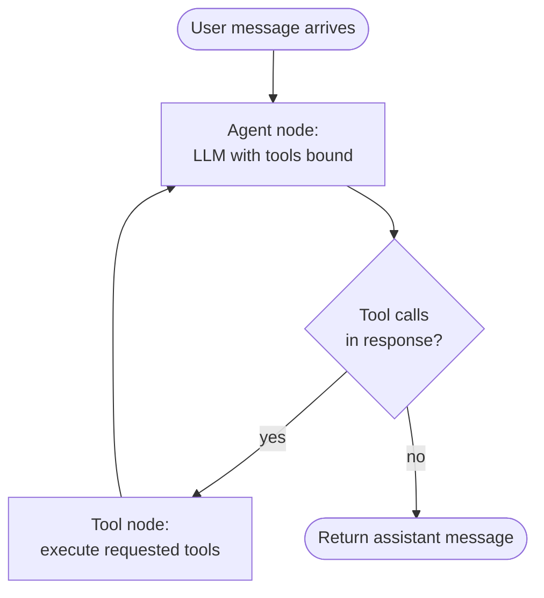

# Chapter 5 — The Execution Loop

[← Previous](./04-mcp-tools-as-protocol.md) · [Index](./README.md) · [Next →](./06-state-and-messages.md)

## The concept

The agent loop is the heartbeat of the whole system: **invoke the model → check for tool calls → execute them → append the results → invoke again → stop when the model stops asking for tools.**

This pattern has a name: **ReAct** (Reasoning + Acting). The model reasons about what to do, takes an action (tool call), observes the result, and reasons again. The loop terminates when the model decides to respond to the user with no more tool calls.

## The loop in pseudocode

```python
def run_agent(user_message: str, tools: list, max_iterations: int = 10) -> str:
    messages = [
        {"role": "system", "content": SYSTEM_PROMPT},
        {"role": "user", "content": user_message},
    ]

    for _ in range(max_iterations):
        response = llm.invoke(messages, tools=tools)
        messages.append(response)

        if not response.tool_calls:
            return response.content  # Termination: model is done acting

        for tool_call in response.tool_calls:
            try:
                result = execute_tool(tool_call.name, tool_call.arguments)
            except Exception as e:
                result = f"ERROR: {e}"
            messages.append({
                "role": "tool",
                "tool_call_id": tool_call.id,
                "content": result,
            })

    raise RuntimeError("Agent exceeded max iterations")
```

That's it. Every agent framework — LangGraph, OpenAI Assistants, Anthropic's tool use API — is wrapping this loop. Knowing the loop by heart helps you debug any framework.

## How termination actually works

The model decides when to stop. Each call returns *either*:

- **A response with tool_calls** → you execute them and loop
- **A response with just content** → the model is done; return to the user

You don't tell the model to stop. It decides based on whether the goal in the conversation is met. This is why prompt quality matters so much: a confused prompt makes the model loop forever, calling tools it doesn't need.

## Recursion limits

The model can decide wrong. It can get stuck in a loop calling the same tool over and over. **Always cap the number of iterations.** A recursion limit of 5–10 catches runaway loops without limiting legitimate multi-step reasoning.

In LangGraph this is `recursion_limit` on the graph config. In a hand-rolled loop it's the `for _ in range(max_iterations)`. Either way: set it.

## Parallel tool calls

A single response from a modern model can contain **multiple tool_calls in one assistant message**[^parallel]. If the model decides it needs both `get_weather` and `get_calendar` to answer, it can request both at once. Both providers support this; modern models are trained to use it when the calls are independent.

```python
# Pseudocode for parallel execution
import asyncio

response = llm.invoke(messages, tools=tools)
if response.tool_calls:
    # Execute all requested tools concurrently
    results = await asyncio.gather(*[
        execute_tool(tc) for tc in response.tool_calls
    ])
    for tc, result in zip(response.tool_calls, results):
        messages.append({
            "role": "tool",
            "tool_call_id": tc.id,
            "content": result,
        })
```

LangGraph's `ToolNode` does this for you: when the assistant message has multiple tool calls, ToolNode executes them in parallel and appends a `ToolMessage` for each. You don't have to wire up the concurrency.

The performance win is real. A turn that needs three independent fetches now takes one round-trip instead of three. **Don't await tool calls sequentially when they're independent.** And don't artificially serialize the model into one-tool-at-a-time turns — let it batch when the work is parallelizable.

[^parallel]: Both [OpenAI function calling](https://platform.openai.com/docs/guides/function-calling) and Anthropic tool use return arrays of tool calls. Claude 4 family includes "token-efficient tool use" which improves parallel-call efficiency further.

## Diagram — the loop in LangGraph terms



This is a 2-node, 1-conditional-edge graph. Almost every tool-using agent has this exact shape at its core. Multi-agent systems compose these shapes; they don't replace them.

## In LangGraph

```python
from langgraph.graph import StateGraph, START, END, MessagesState
from langgraph.prebuilt import ToolNode

class State(MessagesState):
    pass

def agent_node(state: State) -> dict:
    response = model.bind_tools(tools).invoke(state["messages"])
    return {"messages": [response]}

def route(state: State):
    return "tools" if state["messages"][-1].tool_calls else END

builder = StateGraph(State)
builder.add_node("agent", agent_node)
builder.add_node("tools", ToolNode(tools))
builder.add_edge(START, "agent")
builder.add_conditional_edges("agent", route, ["tools", END])
builder.add_edge("tools", "agent")
graph = builder.compile()
```

That's the LangGraph idiom for the diagram above. `MessagesState` gives you append-only message handling for free. `ToolNode` runs the requested tools in parallel.

## Framework alternatives

LangGraph isn't the only option. Several production-grade SDKs wrap this same loop with different opinions:

- **OpenAI Agents SDK** (Python and TypeScript, released March 2025) — primitives for agents, handoffs, guardrails, sessions, and tracing. Provider-agnostic despite the name. Smaller surface area than LangGraph.
- **Anthropic Claude Agent SDK** (Python and TypeScript) — built around Claude Code's agent capabilities, with structured outputs and built-in subagent support.
- **LangGraph** — graph-based, more flexible, more boilerplate. Best when you need explicit control over state transitions.
- **Hand-rolled** — for very simple agents or when you want zero framework dependency, the loop in this chapter is ~20 lines of code. Don't dismiss it.

The patterns in the rest of this guide work across all of these. Pick the framework that matches your team's preferences and existing stack; the architecture decisions matter more than the framework choice.

## Pitfalls

1. **Forgetting the recursion limit.** You will eventually have a model loop forever. Cap it.
2. **Not handling tool errors.** If a tool raises, you have to catch it and return an error string in the tool message. Otherwise the loop crashes.
3. **Mismatched tool_call_ids.** OpenAI requires every `tool_calls` entry from the assistant to have a corresponding `tool` message with matching `tool_call_id`. If they don't match, the next call errors with "tool_call_id did not have response."

## Heuristic

> **Every agent is this loop with extras.** When debugging, mentally collapse the agent to the basic loop and ask: which message would I expect at each step?

## Key takeaway

The agent loop is invoke → check → execute → append → invoke. It terminates when the model stops asking for tools. Always cap iterations. Every framework wraps this loop.

[← Previous](./04-mcp-tools-as-protocol.md) · [Index](./README.md) · [Next: State and messages →](./06-state-and-messages.md)
