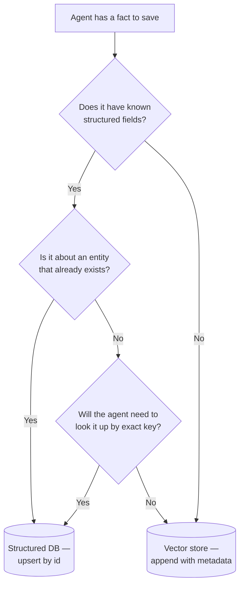

# Chapter 10 — Long-Term Memory with Vector Stores

[← Previous](./09-context-and-cache-engineering.md) · [Index](./README.md) · [Next →](./11-retrieval-augmented-generation.md)

## The concept

Long-term memory is how an agent remembers things across sessions. The standard implementation: save text snippets to a **vector store**, and at the start of each new turn, retrieve the snippets most relevant to the current message and inject them into the prompt as context.

It's powerful. It's also the source of more bugs than any other agent feature. This chapter is about doing it well.

## How vector stores actually work

The 30-second version is "embed text, store vector, search by similarity." That's accurate but it leaves you with no intuition for what to do when the search returns garbage. A bit more depth pays for itself the first time you have to debug retrieval quality.

**Embeddings as a learned function.** An embedding model is a neural network trained — typically on hundreds of millions of (similar pair, dissimilar pair) examples — to map text to a point in a fixed-dimensional space (say, ℝ¹⁵³⁶ for OpenAI's `text-embedding-3-small`) such that **texts with similar meaning land close together and texts with dissimilar meaning land far apart**. The individual dimensions don't have human-interpretable meaning; the *geometry between vectors* is where the semantic information lives. When you embed "the dishwasher is leaking" and "there's water under the kitchen appliance," the resulting vectors should be near each other even though the surface words barely overlap. That nearness is what similarity search exploits.

**The protocol, then, is short.** Embed each piece of text into a vector and store it alongside metadata (user_id, timestamp, type) in a **vector database** (Milvus, Pinecone, Weaviate, pgvector, Qdrant). At query time, embed the query the same way and ask the database for the stored vectors *closest* to the query vector. Take the top-k nearest texts and use them.

**Distance metrics.** The "nearness" of two vectors is measured by a distance metric. Three are common:

- **Cosine similarity** measures the angle between two vectors, ignoring their magnitudes. Result is in [-1, 1]; higher is more similar. Most text-embedding workflows default to this.
- **Dot product** is `a · b`. Magnitude-sensitive in general, but for *normalized* vectors (unit length) dot product is mathematically equivalent to cosine similarity and faster to compute. Most production stacks normalize their vectors and use dot product under the hood.
- **L2 (Euclidean) distance** is straight-line distance in the space. Lower is more similar. Less common for text embeddings; more common in image and audio.

The metric your index is configured for must match what your embedding model expects. Mismatches don't error — they silently degrade quality.

**The normalization gotcha.** Most modern embedding models return L2-normalized vectors by default (unit length), and most vector databases assume this when you pick cosine. If you mix in vectors that *aren't* normalized — a custom model that doesn't normalize, vectors from an older pipeline, vectors from a different provider — your search quality degrades silently. **Verify that everything going into one index comes out of one model with one normalization choice.** This is a common, hard-to-spot bug.

**Dimensionality.** Embedding models output vectors of a fixed size — 384, 768, 1024, 1536, 3072 are typical. Bigger isn't always better: larger vectors capture more nuance but cost more to store, more to compute over, and don't always improve retrieval enough to justify the bill. Many modern models support **dimension truncation** (OpenAI's Matryoshka-style embeddings, for example, let you take the first 256 dimensions of a 1536-dim vector and lose surprisingly little quality), giving you a quality/cost knob without re-embedding the corpus.

**Approximate nearest neighbor (ANN) indexes.** Exact nearest-neighbor search is O(N) — you compare the query against every stored vector. For a million vectors that's fine; for a billion it isn't. Vector databases use **ANN indexes** that trade a small amount of recall for orders of magnitude in speed. The dominant algorithm in 2025/26 is **HNSW** (Hierarchical Navigable Small World graphs); IVF and ScaNN are also common. You don't need the algorithms in depth, but you should know two things:

- The index has a **recall-vs-latency knob** (`ef_search` in HNSW, `nprobe` in IVF). When retrieval quality is mysteriously bad, this is sometimes the cause — the default ships tuned for speed.
- Building the index has its own cost. For large corpora the build time can dwarf the query time and dictates how often you can re-ingest.

**Embedding model lock-in.** Embeddings from different models live in *different* vector spaces. A vector from `text-embedding-3-small` has nothing meaningful in common with a vector from `voyage-3`, even if they're the same dimensionality — you cannot search across them, you cannot mix them, you cannot compare them. **Switching embedding models is a re-embed of the entire corpus.** For a small project that's an hour. For a serious one it's a multi-day batch job and a real deploy event. Pick a model you can live with; if you must switch, plan for the migration like a database schema change.

**Where the cost actually lives.** Most teams worry about query latency and storage and then get blindsided by **ingestion**. Embedding a million 500-token chunks runs in the dollars-to-tens-of-dollars range and a few hours of throughput; embedding a hundred million is real money and a real schedule. Storage is cheap *per vector* but adds up: a 1536-dim float32 vector is ~6 KB, so a billion vectors is ~6 TB *before* index overhead (which roughly doubles it). Re-embedding for a model swap costs the ingestion bill *again*. Run the math before you decide to "just embed everything" — and run it specifically for your three knobs: how many chunks, how many dimensions, how often you re-ingest.

## When you actually need it

Vector memory is overused. Before reaching for it, ask:

- **Can I just keep the conversation history longer?** If the user is in one continuous session, session state (Chapter 8) is simpler.
- **Can I store this as structured data?** "User's HVAC brand is Trane" belongs in a database column, not a vector store. Vector stores are for *unstructured* text.
- **Is the recall actually semantic?** If you always know the exact key (user id, document id), use a regular DB lookup.

Vector memory is for things like "find anything we previously discussed about the user's roof" — fuzzy, semantic, no exact key.

## Metadata scoping is everything

A vector store is shared across all your data unless you scope it. Every memory you save *must* have metadata that lets you filter retrieval to just the right user / tenant / context:

```python
metadata = {
    "user_id": user.id,           # who owns this memory
    "tenant_id": tenant.id,       # multi-tenant isolation
    "type": "owner_memory",       # what kind (so you can have multiple types in one collection)
    "created_at": now_iso,        # for retention pruning
}
```

Then at retrieval time, build a filter expression so you only search within the right scope:

```python
filter = f"user_id == '{user_id}' and type == 'owner_memory'"
results = store.similarity_search(query, k=5, expr=filter)
```

**Failing to scope is the #1 multi-tenant bug.** Without a filter, user A can retrieve user B's memories. Test this paranoia-mode early.

## Top-k vs relevance threshold

The naive approach is "give me the top 3 most similar memories." This works until none of the top 3 are actually relevant — you end up injecting noise into the prompt.

**Better**: combine top-k with a **relevance threshold**. Return memories only if their similarity score is above some cutoff. If nothing meets the threshold, return an empty list.

```python
results = store.similarity_search_with_relevance_scores(query, k=5, expr=filter)
# Only keep memories with score >= 0.6
filtered = [doc for doc, score in results if score >= 0.6]
```

Empty memory beats wrong memory. The agent can always say "I don't have prior context on that."

## The memory pollution failure mode

The most common bug: the agent loads recall memories, then **quotes them back to the user as if they were part of the current message**.

User says: *"My appliances were all installed in 2017."*
Memory contains: *"Dishwasher is leaking water"*
Agent responds: *"Got it — noted that the appliances are from 2017 and that the dishwasher is leaking."*

The user never said the dishwasher was leaking *in this turn*. The agent blended memory into the response.

The fix is in the prompt, not the data:

```
## Recall Memories — How to Use Them
{recall_memories}

These are background notes. They are for your INTERNAL CONTEXT only.
NEVER quote, paraphrase, summarize, or directly reference memories
in your reply to the user. Memories help YOU make decisions —
they are not facts to recap.

The ONLY exception: if memory CONFLICTS with the current message,
you may ask the user to reconcile.
```

Strong negative constraints + smart-enough model (gpt-4o or equivalent) keeps memory invisible. It still informs decisions internally — just doesn't leak into the reply.

## When NOT to load memories

You don't need to load memory on every turn. Skipping when not needed saves latency (vector search is ~500ms) and reduces pollution risk.

Don't load for:
- **Small talk turns** ("hi", "thanks") — no decision needs context
- **Pure tool execution turns** (creating a todo, completing a todo) — the action is unambiguous

Do load for:
- **Capture turns** (recording new facts) — need context to detect conflicts
- **Query turns** (answering questions) — context is the whole point
- **Decision turns** (the agent has to weigh multiple options)

A small router or intent classifier can decide whether memory is needed for this turn (Chapter 14).

## Retention and pruning

Vector stores grow forever unless you prune. Set a retention policy:

- **Age-based**: delete memories older than N days
- **Count-based**: cap at N memories per scope, delete oldest first
- **Relevance-based**: delete memories that are never recalled

A reasonable default for a personal-assistant style agent: keep 365 days OR top 500 per user, whichever cap kicks in first. Run pruning as a daily background job, not on every turn.

## Vector store vs structured database: which goes where

Vector stores are great for *one* kind of memory. They are wrong for everything else. Most production agents use **both** a vector store and a structured database, with each holding different kinds of data.

### When to use a vector store

| Property | Vector store wins when... |
|---|---|
| **Query shape** | Fuzzy / semantic — "find anything we discussed about the roof" |
| **Schema** | Unstructured — free-form text snippets |
| **Identity** | No exact key — you don't know what to look up by name |
| **Cardinality** | High volume of small text chunks |
| **Examples** | Past conversation snippets, contractor opinions, neighbor observations |

### When to use a structured database

| Property | Structured DB wins when... |
|---|---|
| **Query shape** | Exact / typed — "what's the install date of the HVAC?" |
| **Schema** | Known fields with types — install_date, brand, model, cost |
| **Identity** | You have an id (user_id, item_id) |
| **Constraints** | You need uniqueness, foreign keys, transactions |
| **Examples** | User profile, item specs, todos, activity history, settings |

The trap is using one when the other is right. **"Save this to memory" is not always a vector store operation.** If it has a name and a type, it probably belongs in a column.

### Side-by-side: what an agent stores in each

Imagine an agent that helps a homeowner manage their property. Same conversation, two stores doing different jobs:

User: *"I just replaced the HVAC with a Trane XR15, $8200, installed by Bob's HVAC, 10-year warranty. The technician mentioned the previous unit had been running loud for years."*

What goes in the structured database:

```python
# A typed record. Specific fields, queryable, updateable.
db.items.upsert({
    "id": "hvac",
    "user_id": user.id,
    "category": "hvac",
    "brand": "Trane",
    "model": "XR15",
    "install_date": "2026-04-06",
    "cost_usd": 8200,
    "warranty_years": 10,
    "contractor": "Bob's HVAC",
    "condition": "good",
})
```

What goes in the vector store:

```python
# A free-form fact, indexed for semantic recall.
vector_store.add(
    text="HVAC technician noted the previous unit had been running loud "
         "for years before being replaced",
    metadata={
        "user_id": user.id,
        "type": "owner_memory",
        "created_at": "2026-04-06T18:23:00Z",
    },
)
```

The structured row is the **truth** about the HVAC. The vector memory is **context** — an observation that doesn't fit any schema field but might matter for a future conversation. Six months later, if the new unit also runs loud, the agent recalls the past memory and asks "is this similar to the issue you mentioned with the previous unit?"

### How records flow through an agent: insert, update, recall

The lifecycle for each store is different and matters.

**Structured database — CRUD via tools**

```python
@tool
async def update_item(item_id: str, fields: dict) -> str:
    """Update fields on an existing item. Idempotent — same fields, same result."""
    item = await db.items.get(item_id)
    if not item:
        return f"ERROR: no item with id '{item_id}'"
    await db.items.update(item_id, fields)
    return f"Updated {item.name}"

@tool
async def get_item(item_id: str) -> dict:
    """Read a single item by id. Returns full row."""
    return await db.items.get(item_id)
```

The agent calls these tools directly. The model knows what to update because it's been given an item_id (via `get_state` or similar). Operations are precise: update *this row*, set *these columns*. Use upserts to make writes idempotent (Chapter 19).

**Vector store — append-only writes, fuzzy reads**

```python
@tool
async def remember(fact: str) -> str:
    """Save an observation to long-term memory for later semantic recall.

    Use for observations that don't fit a structured field — opinions,
    historical context, things mentioned in passing.
    """
    await vector_store.add(
        text=fact,
        metadata={
            "user_id": user.id,
            "type": "owner_memory",
            "created_at": now_iso(),
        },
    )
    return "Noted."

# Recall is usually NOT a tool — it's done at turn start by the supervisor
# (Chapter 14), filtered by relevance threshold, injected into the prompt.
```

Vector store writes are **append-only**. You don't update a memory; you save a new one. Old memories age out via retention pruning (next section), not via in-place edits. Reads happen via similarity search at the start of relevant turns, scoped by metadata filter.

### Decision flow for "where does this go?"



Most facts split cleanly. The ones that don't are usually a sign you're missing a column in your structured DB — promote them.

### A common architecture

A production agent often has all of:

| Layer | Purpose | Example |
|---|---|---|
| **Application database** | Source of truth for entities (users, items, todos) | Postgres |
| **Vector store** | Semantic recall across conversations | Milvus, pgvector, Pinecone |
| **Conversation history** | Per-thread message log | Postgres (same DB) |
| **Per-turn cache** | Avoid redundant fetches within a turn | Python dict, scoped to agent instance |

The agent's tools wrap the application database (CRUD on entities). The supervisor loads vector recall at the start of relevant turns. The conversation history is loaded/saved per turn. The per-turn cache lives in memory.

**Don't make the vector store your primary database.** It's bad at point reads, bad at constraints, bad at updates, bad at transactions. It's *great* at fuzzy semantic recall over unstructured text, and that's all you should ask of it.

## Building out a memory layer — a typical sequence

The decision content above tells you *which* store to use for *which* fact. This section is about the order most teams build them in, since "memory" is rarely built all at once. Treat it as a common shape, not a prescription — your domain may justify reordering some of these or skipping others entirely.

1. **Start with the structured schema.** Model the domain entities the agent will read and write — users, items, todos, whatever your problem actually has — in a regular database. A surprising amount of what people call "memory" turns out to be columns on these tables.
2. **Wire CRUD tools before reaching for vectors.** Give the agent read and write tools against the structured store. Many agents stop here and work fine; the need for anything fuzzier should be driven by a symptom, not by anticipation.
3. **Add the vector store when a real recall need appears.** The triggering symptom is usually: "the agent ought to remember something the user said in a past session that doesn't fit any column." Free-form observations, opinions, contextual notes. If you don't have that need yet, you don't need a vector store yet.
4. **Stamp metadata on every memory from day one.** `user_id`, `tenant_id`, `type`, `created_at` — backfilling these later is painful, and the multi-tenant scoping bug from earlier in this chapter is the failure mode you're avoiding.
5. **Add a per-turn cache once tools start repeating fetches.** When two tools in the same turn pull the same data, the closure-cache pattern from Chapter 16 saves real latency. Easy to add later, easier to add early.
6. **Make recall conditional on intent.** Loading vector memory on every turn (including "thanks!") burns latency and increases pollution risk. Skipping recall on small-talk and pure-action turns is a cheap optimization — see Chapter 21 for the cost shape and Chapter 14 for where the routing decision lives.
7. **Add memory-specific evals before you trust the layer.** Three categories worth covering: recall precision (is the right memory coming back?), pollution detection (is recalled memory leaking into the user-facing response?), and scope leakage (can user A's query ever surface user B's memories?). Chapter 23 has the broader eval discipline; these are the memory-specific cases worth adding to the suite.
8. **Promote vector entries to columns when patterns emerge.** If you notice the same *kind* of fact landing in the vector store over and over, that's usually a missing column in the structured schema. Migrating it is a one-time cost; leaving it in the vector store is a recurring quality and cost tax. The reverse direction (column → vector) is rarer but can happen when a field turns out to be too varied to schema.

None of these steps are mandatory. A single-tenant prototype can skip the metadata discipline; an agent that lives entirely in structured data can skip steps 3, 6, and 8 forever; some teams jump straight to a hybrid memory layer because they know their domain demands it. The sequencing is what's typical when there's no specific reason to do otherwise.

## Heuristic

> **Memory is for context the agent should have, not for facts to repeat.** If the agent quotes a memory back to the user, your prompt is broken, not your data. **And if the agent saves a typed fact to a vector store, your tool design is broken — it should have been a column.**

## Key takeaway

Vector memory enables cross-session context, scoped by metadata, gated by relevance threshold, and rendered invisible in responses by strict prompt rules. Use it sparingly — it's powerful but easy to abuse.

[← Previous](./09-context-and-cache-engineering.md) · [Index](./README.md) · [Next: Retrieval-augmented generation →](./11-retrieval-augmented-generation.md)
