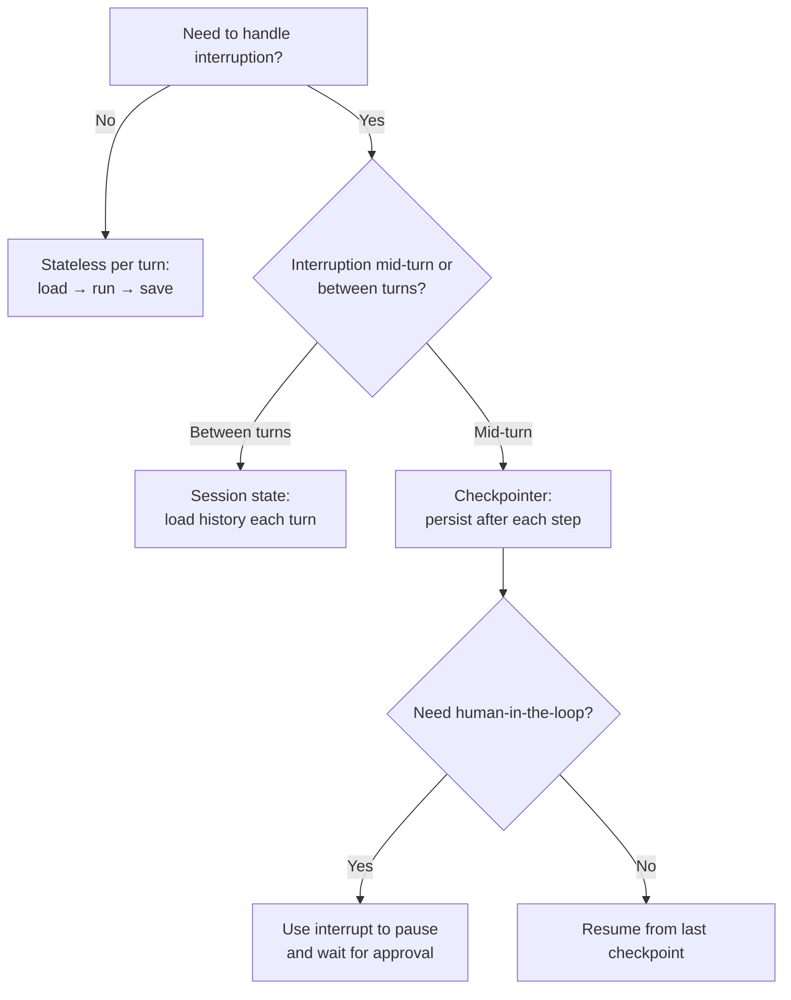

# Chapter 12 — State Recovery and Resumability

[← Previous](./11-retrieval-augmented-generation.md) · [Index](./README.md) · [Next →](./13-when-to-split.md)

## The concept

Agent turns can take seconds. Things go wrong mid-turn: the network drops, the user closes the tab, the LLM call times out, the worker crashes. **State recovery** is how you decide what should happen when execution is interrupted partway through.

Two fundamentally different design choices:

1. **Stateless per turn**: each turn is atomic. If it fails, the user retries from scratch. Simple, robust, but loses any partial work.
2. **Stateful with checkpointing**: each step in the turn persists state, so a failed turn can resume from where it stopped. More powerful, more complex.

This chapter is about when to choose which.

## Stateless per turn (the simple model)

```
Turn N starts
  ↓
Load session state from DB
  ↓
Run agent loop (in memory)
  ↓
Write final result + updated session state to DB
  ↓
Turn N ends
```

If anything in the middle fails, you discard the in-memory work and the user retries. The DB is only updated at the end.

**When this is the right choice:**
- Turns are fast (< 5 seconds)
- Tools are idempotent (so retrying the whole turn is safe)
- Users expect to "send a message and wait for a reply" — no resumption UI
- You don't need to interrupt the agent for human approval mid-turn

This is what we built in the OwnerSupervisor — and it's what 90% of agents should use. It's massively simpler than checkpointing.

## Stateful with checkpointing (LangGraph's model)

LangGraph supports **checkpointers** that save graph state after every step. If the graph is interrupted, you can resume from the last checkpoint.

```python
from langgraph.checkpoint.postgres.aio import AsyncPostgresSaver

async with AsyncPostgresSaver.from_conn_string(PG_URI) as checkpointer:
    graph = builder.compile(checkpointer=checkpointer)
    config = {"configurable": {"thread_id": "user-123-session-456"}}
    
    async for event in graph.astream(
        {"messages": [user_message]},
        config=config,
        stream_mode="messages",
    ):
        ...
```

Now the state is automatically saved after every node executes. If the process crashes, the next call with the same `thread_id` resumes from where it left off — no work lost.

**When checkpointing is worth the complexity:**
- Turns are slow (multi-minute) and you can't make the user wait through a crash
- The agent needs **human-in-the-loop** approval (pause the graph, wait for the user to approve, resume)
- The agent has **branching workflows** where you want to explore multiple paths
- You need **time-travel debugging** (replay state from any prior checkpoint)

The big LangGraph win here is `interrupt()`: you can pause the graph mid-execution, return control to the application, wait for human input, and then resume.

## The "session state" middle ground

Most agents don't need full checkpointing but do need to remember what happened in prior turns. This is the **session state** pattern from Chapter 8:

```
Turn ends:
  - Save the message history to DB keyed by thread_id

Turn starts:
  - Load message history from DB
  - Append new user message
  - Run agent (stateless within the turn)
  - Save updated history
```

This gives you cross-turn memory without the complexity of mid-turn resumption. It's the right answer for most chat-style agents.

## The decision tree



## Trade-offs

| Approach | Pros | Cons |
|---|---|---|
| **Stateless per turn** | Simple, reliable, easy to test, easy to scale horizontally | Lost work on failure, no human-in-the-loop |
| **Session state** | Cross-turn memory, simple per-turn execution | Still loses work mid-turn |
| **Full checkpointing** | Resumable, supports human-in-the-loop, debuggable | Complex, requires persistent store, harder to reason about |

## Async, durable, and long-running agents

Checkpointing is the architectural prerequisite for a category of agent that doesn't fit the request/response shape at all: **agents whose runs span minutes, hours, or days**, often waiting on external events. A pull request review agent that posts a comment, waits for a CI run to finish, then resumes. A research agent that fans out a hundred subtasks and reassembles the results overnight. An onboarding agent that pings the user once a day for a week.

The pattern in all of these is the same: the agent's *progress* lives in durable storage, and the *process* that drives it forward is replaceable. Concretely, that means three things:

- **Wake-on-event, not wait-on-process.** When the agent is waiting (for a webhook, a timer, a human approval), no Python process should be sitting there blocked. The checkpointer holds the run; an external trigger — a webhook handler, a cron, an inbox poller — looks up the paused run by ID and resumes it. This is what makes "ten minutes of waiting" cost ~$0 in compute instead of holding a worker hostage.
- **Resumption is by ID, not by reference.** The handler that resumes a run only knows the `thread_id` (or whatever the checkpointer keys on). It loads the state from durable storage and continues. The original process doesn't need to exist anymore; the original machine doesn't need to exist anymore. This is what makes deploys safe.
- **Idempotency at every step**, not just at the tools. If a wakeup arrives twice (and it will — webhooks retry, queues redeliver), the resume logic must be a no-op when the work is already done. Tag each step's effect with the step's ID and check before re-running.

In practice this looks like a queue (SQS, Cloud Tasks, Temporal, NATS) on top of a checkpointer. The agent's "loop" is no longer a Python `for`; it's "process one event, persist state, exit." The Ralph loop pattern from Chapter 29 is one extreme of this idea — durable storage holds *everything*, the LLM call is just a worker — but you can adopt the principle without going that far.

Most agents don't need any of this. The moment yours does — the moment a turn might span more than a few seconds of real wall-clock waiting — the right answer is almost never "make the user wait longer." It's checkpointing plus an external trigger that brings the agent back when there's work to do.

## A note on retries vs resumability

These are different things:

- **Retry** = "run the whole turn again" — works when tools are idempotent (Chapter 19)
- **Resume** = "continue from the step that failed" — requires checkpointing

Retry is simpler. Resume is more powerful. For most agents, **idempotent tools + retry** gets you 95% of the value of full checkpointing at 10% of the complexity.

## Heuristic

> **Default to stateless per turn. Add checkpointing only when you need either mid-turn human-in-the-loop or resumption from failure mid-turn.** Most agents need neither.

## Key takeaway

State recovery is a design choice, not a feature you must use. Stateless turns plus session state plus idempotent tools handles most cases. Checkpointers are for when you need mid-turn pause/resume — usually for human-in-the-loop workflows.

[← Previous](./11-retrieval-augmented-generation.md) · [Index](./README.md) · [Next: When to split →](./13-when-to-split.md)
