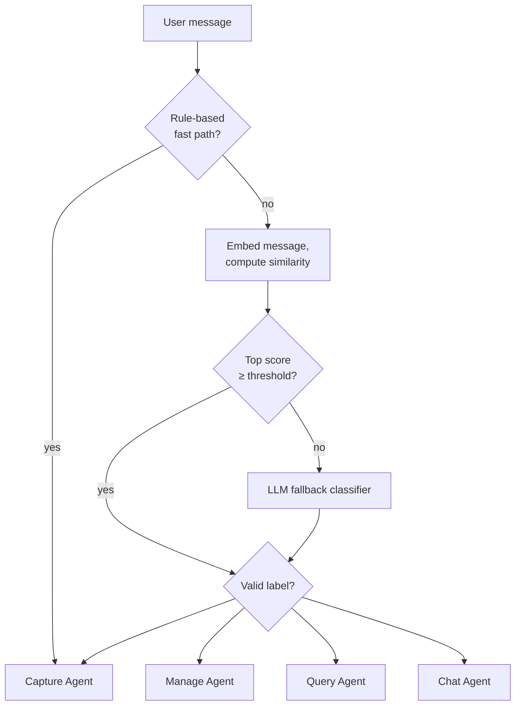

# Chapter 14 — Routing Patterns

[← Previous](./13-when-to-split.md) · [Index](./README.md) · [Next →](./15-merge-vs-split.md)

## The concept

Once you decide to split into multiple agents (Chapter 13), you need a way to get each user message to the right specialist. That's **routing**.

But routing is not one technique — it's a category. There are at least four meaningfully different approaches, and the field has *not* converged on a single best practice. The right choice depends on your latency budget, your accuracy requirements, your intent space, and how your framework handles delegation.

This chapter walks through all four, gives concrete trade-offs, and ends with a decision matrix. Pick the one that matches your constraints, not the one that sounds most impressive.

## Workflow vs agent — the framing everyone else uses

Before we get into routing, know the vocabulary. Anthropic's *Building Effective Agents* split the landscape into two shapes, and most teams now use the same words:

- **Workflow** — steps wired together in code. The LLM runs inside predefined boxes but doesn't decide the flow. Deterministic, cheap, easy to debug.
- **Agent** — the LLM decides what happens next, including which tools to call and when to stop. Flexible, more expensive, harder to trace.

Routing lives on both sides. A rule-based or embedding router is a *workflow*. An LLM classifier or an agent handoff is an *agent-style* router. When you pick a pattern below, you're also picking where on that spectrum you want to be.

The default advice everyone gives: **start with a workflow, promote to an agent only when the extra flexibility earns its cost**.

## The first question: do you actually need a separate router?

Modern frontier models can choose competently from ~7 tools without help. Anthropic's *Building Effective Agents* essay is explicit: "you should consider adding complexity only when it demonstrably improves outcomes." OpenAI's *Practical Guide to Building Agents* makes the same point: "while orchestrating via LLM is powerful, orchestrating via code makes tasks more deterministic and predictable."[^anthropic][^openai]

**Skip routing entirely when:**
- Your agent has fewer than ~7 distinct tools
- The user's intent is mostly inferable from the tool selection
- You're not seeing accuracy degradation from "one agent doing too much"
- You can use an agent handoff pattern (see Pattern 4 below) instead

**Consider routing when:**
- You have genuinely distinct intent categories that need different system prompts, different tool sets, or different models
- One unified agent's accuracy is degrading because it's trying to do too much (see Chapter 13)
- You want to use different model tiers for different intent classes (cheap for chat, smart for reasoning)

If you're not sure, start without routing. Add it when symptoms force the issue.

[^anthropic]: Anthropic, [Building Effective Agents](https://www.anthropic.com/research/building-effective-agents)
[^openai]: OpenAI, [A Practical Guide to Building Agents](https://cdn.openai.com/business-guides-and-resources/a-practical-guide-to-building-agents.pdf)

## Four routing approaches

### Pattern 1: Rule-based / code-based routing

Plain Python that inspects the message and dispatches. No model involved.

```python
def route(message: str) -> str:
    msg = message.lower().strip()
    if msg in ("hi", "hello", "thanks", "thank you", "ok"):
        return "chat"
    if any(verb in msg for verb in ["add a todo", "remind me to", "schedule"]):
        return "manage"
    if msg.endswith("?"):
        return "query"
    return None  # fall through to a smarter approach
```

| | |
|---|---|
| **Latency** | < 1 ms |
| **Cost** | Effectively zero |
| **Determinism** | Fully deterministic |
| **Best for** | Clean fast paths (greetings, exact keywords) layered on top of a smarter approach |
| **Worst for** | Anything where users phrase things naturally |

Real users say *"could you possibly add a reminder for next Tuesday?"* — that doesn't start with "remind me to." Rule-based routing alone is brittle. **Use it as a fast-path optimization on top of one of the other approaches**, not as your primary router.

### Pattern 2: Embedding-based / semantic routing

Embed each intent's description into a vector at startup. At runtime, embed the user message and dispatch to whichever intent has the highest cosine similarity. No LLM call required.

```python
import numpy as np

# At startup: embed each intent's description once
INTENT_DESCRIPTIONS = {
    "capture": "User is sharing observations or facts about their property.",
    "manage":  "User is creating, updating, or completing structured data like todos or items.",
    "query":   "User is asking a question and wants information back.",
    "chat":    "User is making small talk, greetings, or thanks.",
}

INTENT_VECTORS = {
    name: embed(desc) for name, desc in INTENT_DESCRIPTIONS.items()
}

def cosine(a, b):
    return float(np.dot(a, b) / (np.linalg.norm(a) * np.linalg.norm(b)))

async def route(message: str) -> str:
    msg_vec = await embed_async(message)
    scores = {name: cosine(msg_vec, vec) for name, vec in INTENT_VECTORS.items()}
    best = max(scores, key=scores.get)
    # Confidence threshold — fall back to safest if nothing matches well
    if scores[best] < 0.3:
        return "capture"
    return best
```

| | |
|---|---|
| **Latency** | ~50 ms (one embedding call) |
| **Cost** | ~$0.01 per 10,000 routes (embedding model is cheap) |
| **Determinism** | Deterministic given the same input |
| **Best for** | Fixed, well-defined intent sets where natural language understanding matters |
| **Worst for** | Intents that depend on conversation context or are highly ambiguous |

This is **dramatically underrated**. For a typical chat-style multi-agent system with 4–6 fixed intents, semantic routing is faster, cheaper, and more deterministic than an LLM classifier — and it's accurate enough for the vast majority of messages. It fails on:

- Messages whose meaning depends on conversation context ("yes please")
- Sarcasm and unusual phrasings the embedding model wasn't trained on
- Multi-intent messages

For those cases, use a hybrid: embedding routing first, with an LLM fallback when the top score is below your confidence threshold.

### Pattern 3: LLM-based intent classification

A small, fast LLM call whose only job is to return one of N labels. The most-discussed routing pattern, but not always the best.

```python
ROUTER_PROMPT = """You classify a user message into ONE of these intents.
Return ONLY the label.

CAPTURE - the user is sharing information
MANAGE  - the user is creating, updating, or completing structured data
QUERY   - the user is asking a question
CHAT    - small talk

Examples:
"the dishwasher is leaking" → CAPTURE
"add a todo to fix the dishwasher" → MANAGE
"what's broken right now?" → QUERY
"thanks!" → CHAT

When uncertain, default to CAPTURE.
"""

async def classify_intent(message: str, last_assistant: str | None = None) -> str:
    user_input = message
    if last_assistant:
        # Inject minimal context for follow-up disambiguation
        user_input = f"Prev assistant: {last_assistant[:200]}\n\nUser: {message}"

    response = await router_model.invoke([
        {"role": "system", "content": ROUTER_PROMPT},
        {"role": "user", "content": user_input},
    ])
    label = response.content.strip().upper().split()[0] if response.content else ""
    return label if label in VALID_INTENTS else "CAPTURE"
```

| | |
|---|---|
| **Latency** | 200–500 ms (cheap-tier LLM call) |
| **Cost** | ~$0.65 per 10,000 routes (cheap-tier model)[^cost-source] |
| **Determinism** | Non-deterministic — same input may route differently |
| **Best for** | Ambiguous inputs, fuzzy intent boundaries, conversation-context disambiguation |
| **Worst for** | High volume + tight latency budget, fixed intent sets, audit-trail requirements |

LLM routing **is** good practice in specific cases:

- The intent space is genuinely fuzzy (slang, sarcasm, multi-intent messages embedding similarity gets wrong)
- "Yes/no" follow-ups need conversation context to interpret
- The downstream LLM was running anyway, so the marginal cost of a router is trivial
- You'd rather pay for one extra LLM call than maintain embedding pipelines

LLM routing is **not** automatically the right answer. Embedding routing is faster, cheaper, and deterministic for most fixed-intent classification. Reach for the LLM when natural language nuance actually matters.

A few hardening principles when you do use it:

- **Use the cheap tier** (Chapter 21). Routing is classification, not reasoning.
- **`temperature=0`, `max_tokens=8`**. You only want one label.
- **Validate the output.** Strip punctuation, take the first word, check it's in your valid set.
- **Always have a fallback default** for when the model returns garbage.

[^cost-source]: Cost figures from public benchmarks comparing semantic-routing libraries to OpenAI gpt-4o-mini classification at the time of writing. Your numbers will vary by model and provider.

### Pattern 4: Agent handoffs (no upstream router)

Skip routing entirely. Build a "manager" agent that runs the model with all the relevant tools *plus* handoff tools that transfer execution to specialists. The manager itself decides whether to handle the message or delegate.

```python
# OpenAI Agents SDK style (illustrative)
from agents_sdk import Agent

capture_agent = Agent(name="Capture", instructions="...", tools=[save_memory])
manage_agent  = Agent(name="Manage",  instructions="...", tools=[create_todo, complete_todo])
query_agent   = Agent(name="Query",   instructions="...", tools=[get_state])

manager = Agent(
    name="Manager",
    instructions="You handle simple requests directly and hand off complex ones.",
    handoffs=[capture_agent, manage_agent, query_agent],
    # ↑ each handoff appears as a tool the manager can call to transfer execution
)

# Run the manager — it decides whether to act or delegate
result = await manager.run(user_message)
```

| | |
|---|---|
| **Latency** | Same as just running the agent (no extra round-trip) |
| **Cost** | Same as running the agent |
| **Determinism** | LLM-driven, but only one LLM call instead of two |
| **Best for** | Frameworks that natively support handoffs (OpenAI Agents SDK, similar) |
| **Worst for** | Frameworks without handoff primitives, cases where you really want a separate fast classifier |

This is the modern alternative I underweighted in earlier drafts. The OpenAI Agents SDK's [handoffs documentation](https://openai.github.io/openai-agents-python/handoffs/) treats this as the default multi-agent pattern. Anthropic's Claude Agent SDK has a similar concept via subagents.

Why it's compelling:

- **No separate routing call** — the manager sees the message and decides as part of its normal turn
- **Preserves full context** — the manager has access to the conversation history, tools, and state when deciding to delegate
- **More flexible** — the manager can chain handoffs, return to itself, or partially handle a message before delegating
- **Less code** — no router prompt, no validation layer, no separate dispatch

When to use handoffs vs upstream routing: handoffs win when the framework supports them well and your manager naturally has enough context to delegate intelligently. Upstream routing wins when you want a separate, cheaper classification step that doesn't pay the full agent's latency.

## Two more patterns worth knowing

Routing isn't the only way to compose multiple agents. Two more shapes from the Anthropic taxonomy come up constantly in production systems:

### Parallelization (fan-out / fan-in)

Split one task across several agents running at the same time, then merge the results. Two common flavors:

- **Sectioning** — break a task into independent pieces (summarize each chapter, classify each row) and run them in parallel.
- **Voting** — run the same task N times with different prompts or models and pick the best answer (majority vote, highest-confidence, a judge agent).

Use it when the pieces genuinely don't depend on each other and latency matters. Don't use it when the work is sequential — parallelizing dependent steps just adds coordination bugs.

```python
# sketch — fan out, fan in
results = await asyncio.gather(*[
    summarize_chapter(ch) for ch in chapters
])
final = merge(results)
```

### Evaluator-optimizer loop

One agent produces an output, a second agent critiques it, the first revises. Loop until the critic is satisfied or you hit a cap.

Use it when quality matters more than latency — code generation, writing, translation, anything where "a second pass catches mistakes" is true. The critic is usually a different prompt (sometimes a different model) with explicit criteria. Cap the loop at 2–3 iterations or you'll burn tokens forever.

Both of these show up in the decision matrix later, and both are first-class patterns in the Agents SDK and LangGraph. Don't treat them as exotic.

## Handoff vs tool call vs worker spawn — three ways to delegate

Multi-agent design has three structurally different ways for one agent to give work to another, and they get blurred constantly because frameworks use overlapping vocabulary. They're worth distinguishing because the trade-offs are real.

**Tool call.** Agent A calls a function whose implementation happens to be "invoke Agent B and return its answer as a string." The conversation stays with Agent A; B's work is opaque (you only see the return value); A keeps tool-calling until it's done. This is the simplest pattern and the one most chat agents end up with implicitly. Use when B's job is well-defined, returns a small structured answer, and A needs to continue reasoning afterward.

**Handoff.** Agent A *transfers* control of the conversation to Agent B, usually keeping the message history. From the user's perspective the conversation continues, but a different agent (with different tools, prompt, and possibly model) is now driving. A doesn't see B's subsequent work because A is no longer running. This is the OpenAI Agents SDK's `handoff()` and the LangGraph "supervisor with branches" pattern. Use when the right next move is "this isn't my domain, take over."

**Worker spawn.** Agent A creates a fresh, isolated agent (or several in parallel) with its own context window, runs them to completion, and integrates the results. The workers never see each other's contexts, never see A's history beyond what A passes them, and return only their final outputs. This is the Claude Code subagent pattern and the orchestrator-worker shape from Chapter 29. Use when the task decomposes into independent pieces that can run in parallel, or when you need to keep the orchestrator's context small.

| | Tool call | Handoff | Worker spawn |
|---|---|---|---|
| **Who keeps the conversation** | Caller (Agent A) | Callee (Agent B) | Caller (Agent A) |
| **Context shared** | Just the args | Whole history | Just the task brief |
| **Parallelism** | One at a time (or array of calls) | One at a time | Many in parallel |
| **Caller sees the work** | Only the return value | Not at all (A is done) | Only the final output |
| **Best for** | Bounded sub-tasks with a clean return | "Wrong specialist, try this one" | Independent, decomposable work |

The biggest mistake here is reaching for a handoff when a tool call would do — handoffs are heavier, harder to debug (the trace splits), and lose the caller's continuity. Default to tool calls; promote to handoffs only when the receiving agent really needs to own the rest of the conversation; reach for worker spawns only when parallelism is the point.

## Decision matrix

Pick the routing approach that matches your constraints:

| Your situation | Recommended approach |
|---|---|
| Fewer than ~7 tools, no clear sub-agent boundaries | **No router** — single agent with all tools |
| Fixed intents, tight latency budget, high volume | **Embedding-based** (Pattern 2) |
| Fixed intents but ambiguous natural language | **Embedding + LLM fallback** (hybrid) |
| Fuzzy intents, conversation-dependent disambiguation | **LLM classification** (Pattern 3) |
| Using OpenAI Agents SDK or similar handoff framework | **Agent handoffs** (Pattern 4) |
| Task decomposes into independent pieces | **Parallelization** (fan-out / fan-in) |
| Quality matters more than latency | **Evaluator-optimizer loop** |
| Very high volume + the cheapest possible per-turn cost | **Embedding-based**, no fallback |
| You need an audit trail of routing decisions | **Embedding-based or rule-based** (deterministic) |

There is no universal "best" routing approach. There are trade-offs you should make consciously.

## The hybrid pattern: embedding-first, LLM-fallback

For many production systems, the right answer is a hybrid:

```python
async def hybrid_route(message: str, history: list) -> str:
    # 1. Cheap fast paths
    rule = rule_based_route(message)
    if rule:
        return rule

    # 2. Embedding-based primary
    msg_vec = await embed_async(message)
    scores = {name: cosine(msg_vec, vec) for name, vec in INTENT_VECTORS.items()}
    best = max(scores, key=scores.get)

    if scores[best] >= 0.85:  # high confidence
        return best

    # 3. LLM fallback for ambiguous cases
    return await llm_classify(message, history)
```

This gives you:

- **~95% of routing** decided in <50ms by the embedding step
- **The 5% genuinely ambiguous cases** falling through to the LLM
- **Cost much closer to embedding-only** than LLM-only
- **Latency** dominated by the fast path

If your traffic distribution is heavy on clear intents, the hybrid is dramatically cheaper and faster than LLM-first routing while keeping the LLM safety net for edge cases.

## Diagram — typical hybrid dispatch



## Cost-aware routing (regardless of approach)

Whatever routing approach you pick, the principle is the same: **cheap step decides which expensive step runs.** The whole point is to save the smart-tier LLM call for the request that actually needs it.

| Component | Tier | Why |
|---|---|---|
| Router (any approach) | Embedding model or cheap-tier LLM | Classification only, not reasoning |
| Capture/Chat sub-agents | Cheap | No tools, simple jobs |
| Manage/Query sub-agents | Smart | Real tool use, multi-step reasoning |
| Final synthesis (rare) | Smart or reasoning | Quality matters |

A well-routed system saves 80–95% on the smart-tier model spend compared to running everything through the smart tier. That math works whether your router is rules, embeddings, or an LLM call.

## Routing context (the "yes please" problem)

If you go with the LLM or hybrid approach, give the router minimal conversation context — just the previous assistant message. Without it, "yes please" is unroutable; with it, the router can see *what* the user is saying yes to.

Don't dump the full conversation history into the router — that defeats its purpose (cheap, fast, focused). Two messages of context is enough for most disambiguation.

Embedding-based routers struggle more with this kind of context-dependent input. That's the case where falling through to an LLM matters.

## Sticky state should bypass the router

The "yes please" section above is about giving the router *just enough* context to disambiguate. This section is the next step beyond that: when prior state is rich enough, you don't need the router to weigh anything — the answer is already obvious and the router is wasted work.

Most intents are stateless — each turn classifies independently. But some flows are sticky: once the system has shown the user a list of available appointment slots, the next turn is overwhelmingly likely to be a slot selection ("the 3pm one", "yeah that works"), not a fresh classification. Asking the LLM router to figure that out on every turn is wasteful and error-prone — the model has to weigh "is this a slot pick?" against every other intent, when the prior turn already made the answer obvious.

The fix is a pre-router gate that fires when sticky state is present:

```
preprocess → fast_path_check → sticky_state_check → router → handler
                                       │
                                       └─ if a sticky flow is active AND
                                          the message looks like a continuation,
                                          set the intent directly and skip
                                          the LLM router entirely
```

The check is two parts. First, **state from a prior turn** — the slots that were shown, the document being collected, the wizard step being filled. Second, a **lightweight pattern match** on the current message — does it contain a time reference, a confirmation phrase, an ordinal ("the second one"). When both fire, the intent is determined and you save the LLM call.

Two reasons this matters beyond the cost savings:

- **Routing becomes deterministic for the flows that need to be deterministic.** A booking flow that occasionally misroutes "the 3pm one" into a small-talk response is worse than one that costs an extra penny per turn. State-driven gates make that misroute structurally impossible.
- **The side effect is observable at one decision point**, not buried in a handler that's reverse-engineering user intent from prose. If you want to know why a booking happened, you look at the gate, not at the LLM's reasoning.

Don't fast-path everything. The gate should only fire when the state-message combination is unambiguous. If you find yourself adding heuristics for borderline cases, those belong in the LLM router where the model can weigh history. The pre-router gate is for the cases where state genuinely makes the answer obvious — slot selection after slots were shown, "yes" after a confirmation prompt, the next field in a multi-step form.

## Heuristic

> **Routing is a set of trade-offs, not a single best practice. Pick the approach that matches your latency budget, accuracy needs, intent shape, and framework. Embedding-based routing is the most underrated option; agent handoffs are the most underrated alternative to upstream routing entirely.**

## Key takeaway

Routing has four distinct approaches: rule-based, embedding-based, LLM classification, and agent handoffs. Each has a real use case. LLM classification is *one* option — not the default. For fixed intent sets at scale, embedding routing is usually faster, cheaper, and more deterministic. For frameworks with handoff support, skipping upstream routing entirely is often the cleanest answer. Pick deliberately.

[← Previous](./13-when-to-split.md) · [Index](./README.md) · [Next: Merge vs split tightrope →](./15-merge-vs-split.md)
