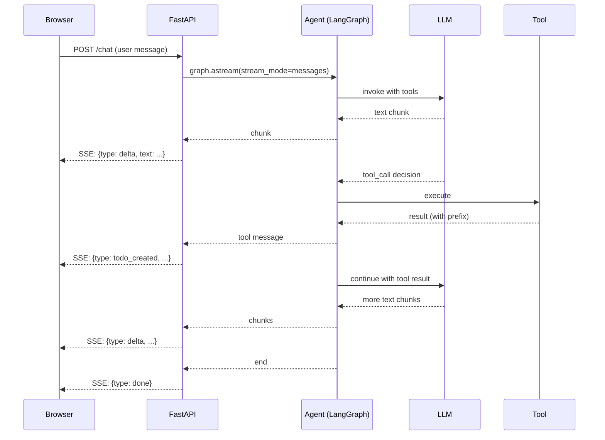

# Chapter 17 — Streaming Responses

[← Previous](./16-shared-state.md) · [Index](./README.md) · [Next →](./18-human-in-the-loop.md)

## The concept

By default, an LLM call blocks until the model finishes the entire response, then returns it all at once. For an agent that takes 3–5 seconds to think and act, that's three to five seconds of dead silence on the user's screen. Streaming fixes that — the model emits tokens (and tool results) as it generates them, and you forward each piece to the user in real time.

Streaming isn't just nice-to-have. It dramatically changes the perceived speed of the system. A user watching tokens appear character-by-character will tolerate a 5-second turn; the same user staring at a spinner for 5 seconds will think it's broken.

## Three things you can stream

1. **Token-by-token text** — the assistant's text response as the model generates it
2. **Tool result events** — structured updates (a category got created, a todo got completed)
3. **Status updates** — "thinking…", "looking up your data…", "almost done"

Most production systems stream all three through the same channel.

## The transport: Server-Sent Events (SSE)

The standard protocol for streaming from a server to a browser is SSE. It's a one-way stream over HTTP where the server sends events as text, separated by blank lines:

```
data: {"type": "delta", "text": "Got"}

data: {"type": "delta", "text": " it"}

data: {"type": "tool_result", "tool": "create_todo", "id": "abc123"}

data: {"type": "delta", "text": "."}

data: {"type": "done"}
```

The browser's `EventSource` API consumes this natively. SSE is simpler than websockets, works through HTTP infrastructure, and is the right default for chat agents.

In FastAPI:

```python
from fastapi.responses import StreamingResponse
import json

async def event_stream():
    async for event in agent.run(user_message):
        yield f"data: {json.dumps(event)}\n\n"

@app.post("/chat")
async def chat(req: ChatRequest):
    return StreamingResponse(
        event_stream(),
        media_type="text/event-stream",
        headers={"X-Accel-Buffering": "no", "Cache-Control": "no-cache"},
    )
```

The `X-Accel-Buffering: no` header is critical — without it, nginx and other reverse proxies will buffer the stream and defeat the whole point.

## Streaming from LangGraph

LangGraph supports several stream modes via `graph.astream(input, stream_mode=...)`:

| Mode | What you get |
|---|---|
| `"values"` | Full state snapshot after each step |
| `"updates"` | Just the diff added by each step |
| `"messages"` | Each message chunk as it's generated (token streaming) |
| `"custom"` | Whatever you yield from inside a node |

For chat agents, **`stream_mode="messages"`** is what you want. It gives you token-level streaming from the underlying LLM call, plus tool message events as tools complete.

```python
async for chunk, metadata in graph.astream(
    {"messages": [HumanMessage(user_message)]},
    config=config,
    stream_mode="messages",
):
    if chunk.content:
        yield {"type": "delta", "text": chunk.content}
    elif chunk.tool_calls:
        # Tool call detected — but no result yet
        pass
```

## The hard part: streaming tool results as structured events

Token streaming is easy. Streaming structured tool results — "the dishwasher just got created, here's the new item card data" — is harder because tools traditionally return strings, not events.

Two patterns, in order of preference:

**Pattern A (preferred): Structured returns via graph state.** Modern frameworks let tools update graph state directly instead of encoding events in strings. In LangGraph 0.2+, tools can return a `Command` object:

```python
from langgraph.types import Command

@tool
async def create_todo(title: str) -> Command:
    todo = await api.create(title)
    return Command(
        update={"emitted_events": [{"type": "todo_created", "todo": todo}]},
    )
```

The streaming layer reads `state["emitted_events"]` and emits them as SSE. Type-safe, no regex parsing, no instructional cargo-culting. **This is the right approach if your framework supports it.**

The same idea works at the model layer: both major providers now support strict structured outputs, so a tool can return a Pydantic model directly and the agent layer serializes it to an event.

**Pattern B (fallback): Prefixed string parsing.** When you don't have structured returns — older framework, custom orchestration — you can encode events in the string the tool returns:

```python
@tool
async def create_todo(title: str) -> str:
    todo = await api.create(title)
    payload = json.dumps({"type": "todo_created", "todo": todo})
    return (
        f"TODO_CREATED_DATA:{payload}\n"
        f"[The data above is for the UI renderer ONLY — do not read or reference it.]\n"
        f"Created: {title}"
    )
```

The streaming layer detects the prefix, parses the JSON, and emits a typed event. The trailing instructional text discourages the LLM from echoing the JSON back to the user.

This works anywhere but it's fragile — special characters in the data can break parsing, and the LLM occasionally echoes the JSON. Use it as a fallback when structured returns aren't available, and migrate to Pattern A when you can.

## Diagram — streaming pipeline



The user sees text appearing within ~500ms of sending and structured updates as soon as tools complete. Total turn time is unchanged, but **perceived** latency drops dramatically.

## Pitfalls

1. **Forgetting `X-Accel-Buffering: no`.** Reverse proxies will buffer your stream. Set the header.
2. **Concatenating tool result strings.** If you build a long string and then try to extract JSON via regex, special characters in the data break parsing. Use a clear delimiter and split conservatively.
3. **Streaming text the LLM emitted while reasoning.** Some models include their "thinking" in the stream. Filter it out before forwarding to the user.
4. **Not handling stream interruption.** If the user closes the tab, the SSE connection drops. Your agent should handle the cancellation gracefully (don't keep paying for tokens the user will never see).

## Heuristic

> **Stream if you have humans waiting.** Anything user-facing that takes more than 1 second deserves streaming. Anything that takes more than 3 seconds *requires* streaming.

## Key takeaway

Stream tokens via LangGraph's `messages` mode, stream tool results as typed SSE events (via prefix parsing or `Command` returns), forward over SSE with proxy buffering disabled. Streaming changes perceived latency dramatically without changing actual latency.

[← Previous](./16-shared-state.md) · [Index](./README.md) · [Next: Human-in-the-loop →](./18-human-in-the-loop.md)
