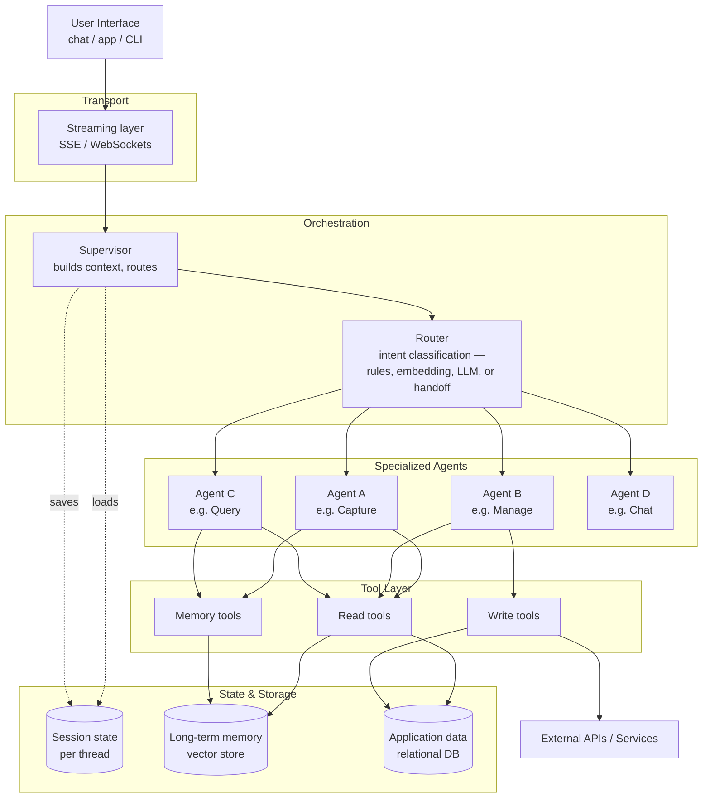

# Chapter 26 — Reference Architecture

[← Previous](./25-decision-frameworks.md) · [Index](./README.md) · [Next →](./27-shipping-checklist.md)

## The concept

This chapter assembles every previous chapter into one diagram and one description. It's the layered shape that production multi-agent systems converge on.

You don't have to build all of it. Start with the minimum (a single agent + tools), add layers as you hit the symptoms that justify them. But knowing the destination helps you make decisions that don't paint you into corners.

## The layered architecture



## Layer-by-layer responsibilities

### Transport layer
- Receives user messages over HTTP / WebSocket
- Streams responses back as SSE events
- Handles authentication, rate limiting
- Maps responses to UI events
- **Doesn't know anything about agents**, just the protocol

→ Chapter 17 (Streaming)

### Orchestration layer
The supervisor is the entry point for the agent system. Per turn it:

1. Loads session state (history) from the persistent store
2. Trims history to a reasonable window
3. Constructs the input for the router
4. Calls the router to classify intent
5. Conditionally loads other expensive context (e.g., vector memory) based on the intent
6. Dispatches to the matching specialized agent
7. Streams events back to the transport layer
8. Saves updated session state

The supervisor itself is usually just a function — not a graph, not an agent. Simplicity here pays off.

→ Chapter 12 (state recovery), Chapter 14 (routing)

### Specialized agents
Each agent is a focused tool-using loop with:
- Its own narrow system prompt (~1500-2500 tokens)
- Its own subset of tools (1–5)
- Its own per-turn cache for shared state across tools
- A graph: `agent → conditional → tools → agent → END`

Agents don't talk to each other directly. They share data via the supervisor passing immutable config and through the underlying state store.

→ Chapter 5 (loop), Chapter 13 (when to split), Chapter 16 (shared state)

### Tool layer
Tools are async functions closed over config. Three rough categories:

- **Read tools**: fetch fresh state from DB or external systems. Idempotent. Cached per turn.
- **Write tools**: mutate state. Most should be idempotent (upserts, status patches). The non-idempotent ones (creates) need extra care around retries and dedup.
- **Memory tools**: save and search long-term memory. Owner-scoped via metadata filters.

All tools validate inputs, return clear error messages on failure, and use a shared retry helper for idempotent ones.

→ Chapter 3 (tools), Chapter 4 (MCP), Chapter 10 (memory), Chapter 19 (reliability)

### State and storage
Three independent stores, each with a different lifecycle:

- **Session state**: keyed by thread/session id. Holds message history. Loaded at the start of each turn, saved at the end. Postgres or Redis.
- **Long-term memory**: vector store (Milvus, Pinecone, pgvector). Owner-scoped by metadata. Pruned by age + count policy.
- **Application data**: the actual domain database. The agents are *clients* of this data, not its source of truth. Direct user actions in the UI also write here.

→ Chapter 8 (kinds of state), Chapter 9 (context engineering), Chapter 10 (memory), Chapter 11 (RAG), Chapter 12 (recovery)

### External APIs
Whatever your agent calls out to: Stripe, SendGrid, your own internal services. Wrapped behind tools so the agent has a clean interface.

## Cross-cutting concerns

Some things span all the layers:

- **Logging / observability** — request_id propagated through every layer (Chapter 22)
- **Cost tracking** — token counts logged per LLM call, aggregated per turn (Chapter 21)
- **Eval suite** — runs the supervisor against fixed inputs to detect regressions (Chapter 23)
- **Guardrails** — input/output/tool-call checks for safety and prompt injection (Chapter 20)
- **Configuration** — model selection, retry counts, memory thresholds — all in one place

## Per-turn data flow

For one user message, here's what flows where:

```
1. Transport receives POST with message + session token
2. Auth resolves user_id; session_id loaded
3. Supervisor loads session history from DB (last N turns)
4. Supervisor builds router input (current msg + last assistant msg)
5. Router calls cheap LLM, returns intent label
6. Supervisor conditionally loads memory from vector store
7. Supervisor instantiates the matching agent with config
8. Agent enters its tool loop:
   a. Smart LLM invoked with current messages + tools
   b. Tool calls executed (with retry, validation, cache)
   c. Tool results appended to messages
   d. Loop until LLM emits text without tool calls
9. Supervisor streams events to transport throughout
10. Supervisor persists updated session state
11. Transport sends final SSE "done" event
12. UI updates with the streamed text and structured events
```

Total wall time: 1–5 seconds. Total LLM cost: cents to a few cents. The user sees text appear within 500ms of sending.

## What this architecture doesn't include

This is a chat-style agent reference. Some things are explicitly *out of scope*:

- **Human-in-the-loop pause/resume**: needs a checkpointer (Chapter 12) and the patterns in Chapter 18. Add when you have approval flows.
- **Multi-modal input**: photos, voice, files. A different shape — usually a separate "ingestion" agent before the conversational ones.
- **Background workers**: proactive agents that run on a schedule. Different trigger model entirely.
- **Multi-tenant access control**: belongs in the auth and tools layers, not the agent layer.
- **Knowledge graph**: a more structured alternative to vector memory. Worth considering at scale.

When you need any of these, add them as new layers without disturbing the core.

## How to start building this

Don't build the full architecture on day one. Build the smallest version that solves your problem, then add layers as symptoms force them:

| Stage | What you have |
|---|---|
| **Day 1** | One agent, 1–3 tools, hand-rolled tool loop, no streaming |
| **Week 1** | LangGraph for the loop, recursion limit, basic logging |
| **Week 2** | Streaming via SSE, structured tool returns |
| **Month 1** | Session state persisted, retry on idempotent calls, cost tracking |
| **Month 2** | Long-term memory if cross-session context matters |
| **Month 3** | Router + 2-3 specialized agents if one agent is overloaded |
| **Month 6** | Eval suite, structured logging with request IDs, observability dashboards |

Premature architecture is wasted effort. Build what you need; let usage drive what comes next.

## Heuristic

> **The reference architecture is the destination, not the starting point. Build the simplest version that solves your problem, and add layers when symptoms tell you to.**

## Key takeaway

A production agent system has clear layers: transport → orchestration → agents → tools → state. Each layer has one job. They communicate through immutable config and explicit state objects. Build the layers as you need them, not before.

[← Previous](./25-decision-frameworks.md) · [Index](./README.md) · [Next: Shipping checklist →](./27-shipping-checklist.md)
