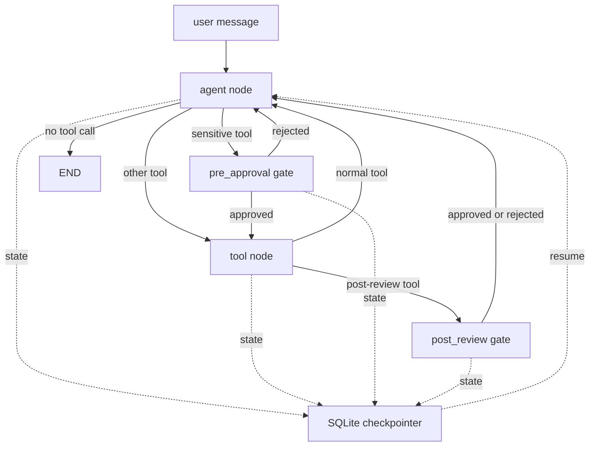
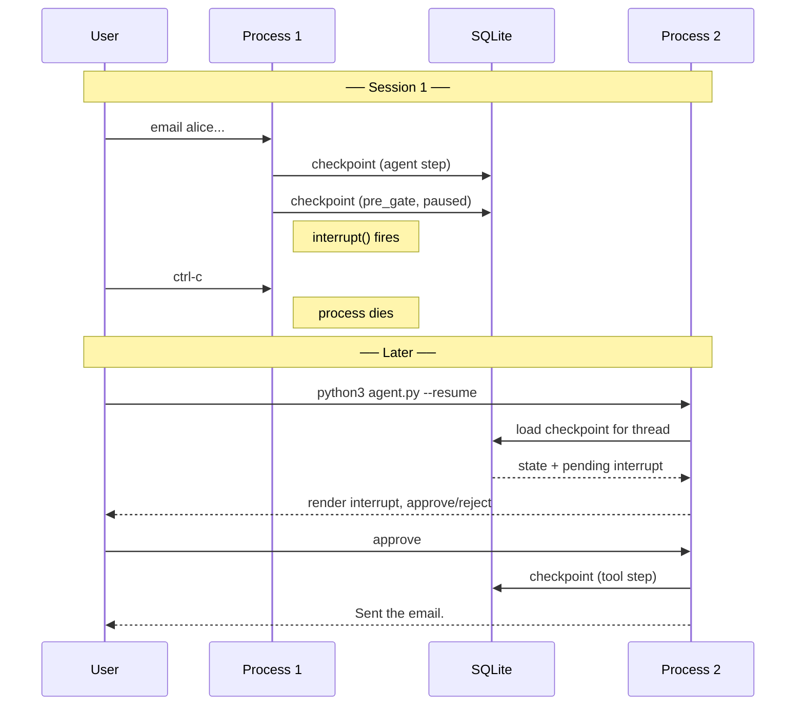

# Shared Lab — Human-in-the-Loop, End to End

[← Index](../../README.md) · [Chapter 18: Human-in-the-Loop](../../18-human-in-the-loop.md)

> _Builds a messaging agent that pauses before sending, survives a process crash mid-pause, and resumes cleanly. Walk it with a partner or solo — stop at each callout, run the command, then read on._

**Four parts, ~20 min each:** (1) scaffold and orient, (2) graph and two gate types, (3) crash-resume, (4) run all scenarios. **Prerequisites:** Python 3.11+, OpenAI API key, terminal.

> **🧪 Try it** — run and observe. **🤔 Predict** — answer before reading on. **💬 Discuss** — pair prompt. **🎓 Teacher note** — presenter aside.

---

# Part 1 — Scaffold and orient

> **Goal.** Draw the agent's control flow on a napkin: where the LLM call happens, where the tool executes, where the gate pauses, where the checkpointer writes.

## What we're building

A terminal messaging agent. User types *"email alice@example.com about the deadline"*; the agent drafts, then calls `send_message`. Before `send_message` runs, a **pre-approval gate** pauses and shows the human what's about to send. For bulk campaigns, `generate_campaign_list` runs first, then a **post-review gate** pauses and shows the generated list. Every step writes a checkpoint to SQLite. If the process dies mid-approval, `python3 agent.py --resume` picks up from the last checkpoint.

Concepts in scope: LangGraph agent loop ([Ch 5](../../05-execution-loop.md)), `interrupt()` ([Ch 18](../../18-human-in-the-loop.md)), pre-approval and post-review gates, policy-driven gate selection, SQLite checkpointer ([Ch 12](../../12-state-recovery.md)), six tagged scenarios, verbose tracing. Out of scope: multi-user scoping, actual email sending, production approval UIs, mid-stream cancel.

## Setup

```bash
python3 scaffold.py ./hitl-agent
cd ./hitl-agent
python3 -m venv .venv && source .venv/bin/activate
pip install langchain-openai langgraph langgraph-checkpoint-sqlite pyyaml
export OPENAI_API_KEY=sk-...
```

```bash
# ── scripted scenarios (repeatable, good for presentations) ──
python3 scenarios.py                             # all 6 scenarios, summary table
python3 scenarios.py -v                          # all 6, verbose trace
python3 scenarios.py --only s1 -v                # routine (no gate)
python3 scenarios.py --only s2 -v                # happy-path pre-approval
python3 scenarios.py --only s3 -v                # rejection
python3 scenarios.py --only s4 -v                # timeout / default-reject
python3 scenarios.py --only s5 -v                # crash-resume (marquee)
python3 scenarios.py --only s6 -v                # post-review gate

# ── interactive REPL ──
python3 agent.py                                 # new conversation
python3 agent.py -v                              # new conversation, verbose
python3 agent.py --thread mytest                 # named thread
python3 agent.py --resume --thread mytest        # resume a paused thread
```

**Suggested presentation order:** `s1 → s2 → s3 → s5 → s6 → s4`.

> **🧪 Try it.** After scaffolding:
>
> ```bash
> ls hitl-agent/
> head -3 hitl-agent/*.py
> cat hitl-agent/policy.py
> cat hitl-agent/scenarios.yaml
> ```
>
> `policy.py` is the shortest file. `scenarios.yaml` is the test plan. Describe each file in one sentence before running anything.

## How the pieces fit together



Dashed lines = the checkpointer. It's not a node; it's a storage layer that writes after *every* step automatically when you compile with `checkpointer=...`.

> **🎓 Teacher note.** People new to LangGraph think checkpointing is opt-in per call. Emphasize: once attached, *nothing is ever in memory only*.

---

## The shared pieces

### Verbose tracing

The tracing module uses labeled, color-coded banners for each event type — single-line format for short content, multi-line with opening/closing banners for long content. Every gate decision, LLM call, tool execution, DB write, and checkpoint operation is visible when `-v` is on.

```python
# tracing.py
# ---------------------------------------------------------------------------
# Terminal-formatted verbose tracing for the HITL agent.
#
# Labeled, color-coded blocks that make the invisible visible during
# demos and walkthroughs. Every function is a no-op when
# VERBOSE is False, so the performance cost of leaving trace calls in the
# code is zero.
# ---------------------------------------------------------------------------
from __future__ import annotations

import json
import os
import sys
from typing import Any

# Module-level flag. Set by agent.py or scenarios.py at startup.
VERBOSE = False

BANNER_WIDTH = 76

# ANSI colors — auto-disable when piping or NO_COLOR is set.
_USE_COLOR = os.isatty(1) and not os.environ.get("NO_COLOR")
_CYAN    = "\033[36m" if _USE_COLOR else ""   # user input
_GREEN   = "\033[32m" if _USE_COLOR else ""   # AI / approved
_YELLOW  = "\033[33m" if _USE_COLOR else ""   # tools / gates
_RED     = "\033[31m" if _USE_COLOR else ""   # rejected
_MAGENTA = "\033[35m" if _USE_COLOR else ""   # checkpoints
_DIM     = "\033[2m"  if _USE_COLOR else ""   # DB / meta
_BOLD    = "\033[1m"  if _USE_COLOR else ""
_RESET   = "\033[0m"  if _USE_COLOR else ""

# Label → color mapping. Unlisted labels render in default white.
_LABEL_COLORS = {
    "USER":          _CYAN,
    "SYSTEM PROMPT": _DIM,
    "LLM CALL":     _DIM,
    "LLM RESPONSE":  _GREEN,
    "TOOL CALL":     _YELLOW,
    "TOOL RESULT":   _YELLOW,
    "DB WRITE":      _DIM,
    "DB STATE":      _DIM,
    "GATE:PRE":      _BOLD + _YELLOW,
    "GATE:POST":     _BOLD + _YELLOW,
    "GATE:DECISION": _GREEN,
    "GATE:REJECTED": _RED,
    "CHECKPOINT":    _MAGENTA,
    "RESUME":        _BOLD + _MAGENTA,
    "THREAD":        _DIM,
}


def _banner(label: str, opening: bool = True) -> str:
    tag = f" {label} " if opening else f" /{label} "
    pad = max(BANNER_WIDTH - len(tag), 4)
    left = pad // 2
    right = pad - left
    return ("=" * left) + tag + ("=" * right)


def section(label: str, body: str) -> None:
    """Print a labeled, color-coded block. Short content stays on one line;
    long content gets opening/closing banners."""
    if not VERBOSE:
        return
    body = body.rstrip()
    color = _LABEL_COLORS.get(label, "")
    reset = _RESET if color else ""

    # Single-line compact format for short bodies
    if "\n" not in body and len(body) + len(label) + 5 <= BANNER_WIDTH:
        print(f"{color}{label:<16} | {body}{reset}")
        return

    # Multi-line with banners
    print(f"{color}{_banner(label)}")
    print(body)
    print(f"{_banner(label, opening=False)}{reset}")
    print()


# ─────────────────────────── convenience wrappers ──────────────────────────

def trace_thread(thread_id: str) -> None:
    section("THREAD", f"thread_id = {thread_id!r}")


def trace_system_prompt(prompt: str) -> None:
    """Show the system prompt (first turn only — it's static)."""
    preview = prompt[:400] + ("..." if len(prompt) > 400 else "")
    section("SYSTEM PROMPT", f"({len(prompt)} chars)\n{preview}")


def trace_llm_call(messages_count: int, last_user_msg: str) -> None:
    section("LLM CALL", f"sending {messages_count} messages to gpt-4o\n"
                         f"  last user/tool msg: {last_user_msg[:120]}")


def trace_llm_response(tool_calls: list, text: str,
                       prompt_tokens: int, completion_tokens: int) -> None:
    if tool_calls:
        calls = ", ".join(f"{tc['name']}({_brief(tc['args'])})" for tc in tool_calls)
        section("LLM RESPONSE", f"tool_calls: [{calls}]\n"
                f"  tokens: {prompt_tokens} prompt + {completion_tokens} completion")
    else:
        preview = text[:200] + ("..." if len(text) > 200 else "")
        section("LLM RESPONSE", f"text: {preview}\n"
                f"  tokens: {prompt_tokens} prompt + {completion_tokens} completion")


def trace_tool_call(name: str, args: dict) -> None:
    section("TOOL CALL", f"{name}({_brief(args)})")


def trace_tool_result(name: str, result: Any) -> None:
    preview = str(result)
    if len(preview) > 300:
        preview = preview[:297] + "..."
    section("TOOL RESULT", f"{name} returned:\n  {preview}")


def trace_db_write(table: str, row: dict) -> None:
    """Show a full row dump after a DB write."""
    cols = "\n".join(f"  {k:<14} = {v!r}" for k, v in row.items())
    section("DB WRITE", f"INSERT INTO {table}:\n{cols}")


def trace_db_state(table: str, rows: list[dict]) -> None:
    """Show full rows from a table (e.g. sent_log after send)."""
    if not rows:
        section("DB STATE", f"{table}: (empty)")
        return
    lines = []
    for r in rows:
        lines.append("  " + "  ".join(f"{k}={v!r}" for k, v in r.items()))
    section("DB STATE", f"{table} ({len(rows)} rows):\n" + "\n".join(lines))


def trace_gate(kind: str, payload: dict) -> None:
    """Show the interrupt payload surfaced to the human."""
    label = "GATE:PRE" if kind == "pre_approval" else "GATE:POST"
    body_lines = [f"kind: {kind}", f"tool: {payload.get('tool')}"]
    if kind == "pre_approval":
        preview = payload.get("preview") or payload.get("args") or {}
        for k, v in preview.items():
            line = f"  {k:<12} {v!r}"
            if len(line) > 72:
                line = line[:69] + "..."
            body_lines.append(line)
    else:
        result = payload.get("result") or {}
        for k, v in result.items():
            if k == "full_list":
                body_lines.append(f"  full_list: [{len(v)} items]")
                continue
            line = f"  {k:<12} {v!r}"
            if len(line) > 72:
                line = line[:69] + "..."
            body_lines.append(line)
    section(label, "\n".join(body_lines))


def trace_gate_decision(kind: str, tool: str, decision: str,
                        reason: str = "") -> None:
    label = "GATE:DECISION" if decision == "approve" else "GATE:REJECTED"
    msg = f"{kind} / {tool} → {decision}"
    if reason:
        msg += f" ({reason})"
    section(label, msg)


def trace_checkpoint(step: int, thread_id: str,
                     state_keys: list[str]) -> None:
    section("CHECKPOINT", f"wrote step {step} → thread_id={thread_id!r}\n"
            f"  state keys: {state_keys}")


def trace_resume(thread_id: str, state_keys: list[str]) -> None:
    section("RESUME", f"loaded checkpoint for thread_id={thread_id!r}\n"
            f"  state keys: {state_keys}")


def _brief(args: dict) -> str:
    return ", ".join(f"{k}={v!r}" for k, v in list(args.items())[:3])
```

### Agent state

```python
# state.py
"""Agent state schema. Each field has a comment explaining when it's set,
what reads it, and when it's cleared."""
from __future__ import annotations

from typing import Annotated, Any, Optional, TypedDict

from langgraph.graph.message import add_messages


class AgentState(TypedDict, total=False):
    # Chat and tool-call history. add_messages reducer appends; every node
    # return can yield new messages without rebuilding the full list.
    messages: Annotated[list, add_messages]

    # Set by agent_node when the LLM produces a tool_call. Read by
    # pre_approval_gate (to build the interrupt payload) and tool_node
    # (to execute). Cleared by tool_node after execution, or by
    # pre_approval_gate on reject.
    pending_tool_call: Optional[dict]
    pending_tool_call_id: Optional[str]

    # Written by tool_node. Read by post_review_gate to show the human
    # the tool's output. Survives after the gate (audit trail).
    last_tool_result: Optional[dict]
    last_tool_name: Optional[str]

    # Append-only audit trail of gate decisions: {kind, tool, decision, reason}.
    approval_decisions: list

    # Purely diagnostic — not read by any node.
    trace: Any
```

### Database

One SQLite file, three business tables. The checkpointer uses the same file but manages its own tables — they don't interfere.

```python
# db.py
"""SQLite business state. The checkpointer shares the same file but manages
its own tables automatically — no conflict."""
from __future__ import annotations

import sqlite3
import time
import uuid
from pathlib import Path

import tracing

DB_PATH = Path("hitl.sqlite")


def init_db() -> None:
    """Create tables and seed contacts on first run."""
    conn = sqlite3.connect(DB_PATH)
    conn.executescript("""
        CREATE TABLE IF NOT EXISTS drafts (
            draft_id   TEXT PRIMARY KEY,
            recipient  TEXT NOT NULL,
            subject    TEXT NOT NULL,
            body       TEXT NOT NULL,
            created_at REAL NOT NULL,
            status     TEXT NOT NULL DEFAULT 'drafted'
        );
        CREATE TABLE IF NOT EXISTS contacts (
            email     TEXT PRIMARY KEY,
            name      TEXT NOT NULL,
            segments  TEXT NOT NULL
        );
        CREATE TABLE IF NOT EXISTS sent_log (
            message_id TEXT PRIMARY KEY,
            draft_id   TEXT NOT NULL,
            sent_at    REAL NOT NULL
        );
    """)
    cur = conn.execute("SELECT COUNT(*) FROM contacts")
    if cur.fetchone()[0] == 0:
        conn.executemany(
            "INSERT INTO contacts (email, name, segments) VALUES (?, ?, ?)",
            [
                ("alice@example.com",  "Alice Chen",    "waitlist,q3"),
                ("bob@example.com",    "Bob Martinez",  "waitlist,q2"),
                ("carol@example.com",  "Carol Singh",   "active,q3"),
                ("dave@example.com",   "Dave Johnson",  "inactive,q3"),
                ("erin@example.com",   "Erin O'Reilly", "inactive,q3"),
                ("frank@example.com",  "Frank Liu",     "inactive,q2"),
                ("legal@example.com",  "Legal Team",    "internal"),
            ],
        )
    conn.commit()
    conn.close()


def new_id(prefix: str) -> str:
    return f"{prefix}_{uuid.uuid4().hex[:6]}"


def now() -> float:
    return time.time()


def connect() -> sqlite3.Connection:
    return sqlite3.connect(DB_PATH)


def dump_rows(table: str, where: str = "", params: tuple = ()) -> list[dict]:
    """Fetch rows as dicts for verbose tracing."""
    conn = connect()
    try:
        sql = f"SELECT * FROM {table}"
        if where:
            sql += f" WHERE {where}"
        cur = conn.execute(sql, params)
        cols = [d[0] for d in cur.description]
        return [dict(zip(cols, row)) for row in cur.fetchall()]
    finally:
        conn.close()
```

### The four tools

Two non-sensitive, two sensitive. Tools emit `tracing.trace_*` calls for every DB write; the gate logic lives in the graph, not here.

```python
# tools.py
"""Four tools. Each emits tracing calls so verbose mode shows DB writes
and full row state. Sensitive tools do NOT contain gate logic — the graph
decides when to pause via policy.py."""
from __future__ import annotations

from typing import Optional

from langchain_core.tools import tool

import tracing
from db import connect, dump_rows, init_db, new_id, now


@tool
def list_contacts(query: Optional[str] = None) -> list[dict]:
    """Search the user's contact list. Returns matching contacts.

    Use this when the user references people by name or segment.

    Args:
        query: Substring to match against name, email, or segments.
    """
    init_db()
    tracing.trace_tool_call("list_contacts", {"query": query})
    conn = connect()
    try:
        if query:
            rows = conn.execute(
                "SELECT email, name, segments FROM contacts "
                "WHERE email LIKE ? OR name LIKE ? OR segments LIKE ? "
                "LIMIT 20",
                (f"%{query}%", f"%{query}%", f"%{query}%"),
            ).fetchall()
        else:
            rows = conn.execute(
                "SELECT email, name, segments FROM contacts LIMIT 20"
            ).fetchall()
        result = [{"email": e, "name": n, "segments": s.split(",")}
                  for (e, n, s) in rows]
        tracing.trace_tool_result("list_contacts", result)
        return result
    finally:
        conn.close()


@tool
def draft_message(recipient: str, subject: str, body: str) -> dict:
    """Create a local draft of a message. Nothing is sent.

    Always draft before sending — composition (cheap) before transmission
    (irreversible). Returns the draft_id for send_message.

    Args:
        recipient: Email address.
        subject: Subject line.
        body: Message body.
    """
    init_db()
    tracing.trace_tool_call("draft_message",
                            {"recipient": recipient, "subject": subject})
    draft_id = new_id("d")
    conn = connect()
    try:
        conn.execute(
            "INSERT INTO drafts (draft_id, recipient, subject, body, created_at) "
            "VALUES (?, ?, ?, ?, ?)",
            (draft_id, recipient, subject, body, now()),
        )
        conn.commit()
    finally:
        conn.close()

    # Verbose: show the full row just written.
    row = {"draft_id": draft_id, "recipient": recipient,
           "subject": subject, "body": body, "status": "drafted"}
    tracing.trace_db_write("drafts", row)

    result = {"draft_id": draft_id, "recipient": recipient, "subject": subject}
    tracing.trace_tool_result("draft_message", result)
    return result


@tool
def send_message(draft_id: str) -> dict:
    """Send a previously drafted message. IRREVERSIBLE.

    The pre-approval gate fires BEFORE this runs — by the time we get here,
    the human has already approved.

    Args:
        draft_id: From an earlier draft_message call.
    """
    init_db()
    tracing.trace_tool_call("send_message", {"draft_id": draft_id})
    conn = connect()
    try:
        row = conn.execute(
            "SELECT recipient, subject, body FROM drafts WHERE draft_id = ?",
            (draft_id,),
        ).fetchone()
        if not row:
            result = {"status": "error", "reason": f"no draft {draft_id}"}
            tracing.trace_tool_result("send_message", result)
            return result
        message_id = new_id("m")
        conn.execute(
            "INSERT INTO sent_log (message_id, draft_id, sent_at) "
            "VALUES (?, ?, ?)",
            (message_id, draft_id, now()),
        )
        conn.execute(
            "UPDATE drafts SET status = 'sent' WHERE draft_id = ?",
            (draft_id,),
        )
        conn.commit()
    finally:
        conn.close()

    # Verbose: show sent_log row and updated draft.
    tracing.trace_db_write("sent_log",
                           {"message_id": message_id, "draft_id": draft_id})
    tracing.trace_db_state("sent_log", dump_rows("sent_log",
                           "draft_id = ?", (draft_id,)))

    result = {"status": "sent", "message_id": message_id,
              "recipient": row[0], "subject": row[1]}
    tracing.trace_tool_result("send_message", result)
    return result


@tool
def generate_campaign_list(segment_query: str) -> dict:
    """Generate a recipient list for a bulk campaign.

    The post-review gate fires AFTER this runs — the human sees the list
    before anything downstream uses it.

    Args:
        segment_query: e.g. "inactive users from Q3".
    """
    init_db()
    tracing.trace_tool_call("generate_campaign_list",
                            {"segment_query": segment_query})
    tokens = [t.strip().lower() for t in segment_query.split() if t.strip()]
    conn = connect()
    try:
        rows = conn.execute(
            "SELECT email, name, segments FROM contacts"
        ).fetchall()
    finally:
        conn.close()
    matches = []
    for email, name, segments in rows:
        combined = (name + " " + segments + " " + email).lower()
        if all(tok in combined for tok in tokens):
            matches.append({"email": email, "name": name})
    result = {
        "list_id": new_id("L"),
        "segment": segment_query,
        "count": len(matches),
        "sample": matches[:5],
        "full_list": matches,
    }
    tracing.trace_tool_result("generate_campaign_list", result)
    return result
```

### Gate policy

```python
# policy.py
"""Which tools trigger which gate. One hardcoded map — swap for a function
when you need amount thresholds, compliance tiers, or time-of-day rules."""
from __future__ import annotations

from typing import Literal, Optional

GateKind = Literal["pre_approval", "post_review"]

GATE_POLICY: dict[str, GateKind] = {
    "send_message":           "pre_approval",
    "generate_campaign_list": "post_review",
}


def gate_for(tool_name: str) -> Optional[GateKind]:
    return GATE_POLICY.get(tool_name)
```

> **🧪 Try it.** Run the baseline — a simple contact lookup with no gate:
>
> ```bash
> python3 scenarios.py --only s1 -v
> ```
>
> Read the verbose output top-to-bottom. You should see: `THREAD`, `LLM CALL`, `LLM RESPONSE` (with tool_calls), `TOOL CALL`, `TOOL RESULT`, `LLM RESPONSE` (final text), and `CHECKPOINT` lines. No gate lines — `list_contacts` is not in the policy map.

---

# Part 2 — The graph and the two gates

> **Goal.** Explain what `interrupt()` does to a running graph, why pre-approval and post-review are structurally different, and how the policy map makes adding a new sensitive tool a one-line change.

> **🤔 Predict.** Without a gate, the agent calls `send_message` and the tool runs immediately. Is this a cost problem (too many emails) or a correctness problem (wrong email to wrong person)? Which one would you sleep better knowing was impossible?

## The graph

```python
# graph.py
"""LangGraph StateGraph for the HITL messaging agent.

Flow: START -> agent -> [pre_gate | tool] -> [tool | post_gate] -> agent -> END
Every node emits tracing calls. The checkpointer writes after every step.
"""
from __future__ import annotations

from langchain_core.messages import AIMessage, ToolMessage
from langchain_openai import ChatOpenAI
from langgraph.checkpoint.sqlite import SqliteSaver
from langgraph.graph import END, START, StateGraph
from langgraph.types import interrupt

import tracing
from policy import gate_for
from state import AgentState
from tools import (
    draft_message,
    generate_campaign_list,
    list_contacts,
    send_message,
)

TOOLS = [list_contacts, draft_message, send_message, generate_campaign_list]
TOOLS_BY_NAME = {t.name: t for t in TOOLS}

SYSTEM_PROMPT = """You are a careful messaging assistant.

Tools:
  list_contacts          - search contacts
  draft_message          - create a local draft (not sent)
  send_message           - send a draft (IRREVERSIBLE)
  generate_campaign_list - build a recipient list for a campaign

Always draft before sending. For campaigns, generate the list and wait
for review before proceeding. Be concise."""

llm = ChatOpenAI(model="gpt-4o", temperature=0).bind_tools(TOOLS)
_shown_system_prompt = False


# ─────────────────────── nodes ─────────────────────────────────────────────

def agent_node(state: AgentState) -> dict:
    """One LLM call. Produces either a tool call or a final answer."""
    global _shown_system_prompt
    messages = state.get("messages", [])

    # If the last gate rejected, inject a note so the LLM apologises.
    decisions = state.get("approval_decisions", []) or []
    if decisions and decisions[-1].get("decision") == "rejected" \
            and not decisions[-1].get("_agent_handled"):
        decisions[-1]["_agent_handled"] = True
        messages = messages + [
            AIMessage(content=(
                f"(Human rejected my {decisions[-1]['tool']!r} action. "
                f"Acknowledge and offer alternatives.)"
            )),
        ]

    # Trace: show system prompt on first call only (it's static).
    if not _shown_system_prompt:
        tracing.trace_system_prompt(SYSTEM_PROMPT)
        _shown_system_prompt = True

    # Trace: what we're sending.
    last_msg = ""
    for m in reversed(messages):
        c = getattr(m, "content", "")
        if c:
            last_msg = c[:120]
            break
    tracing.trace_llm_call(len(messages) + 1, last_msg)  # +1 for system

    response = llm.invoke(
        [{"role": "system", "content": SYSTEM_PROMPT}] + messages
    )

    # Trace: what came back.
    usage = (response.response_metadata or {}).get("token_usage", {}) or {}
    tracing.trace_llm_response(
        tool_calls=response.tool_calls or [],
        text=response.content or "",
        prompt_tokens=usage.get("prompt_tokens", 0),
        completion_tokens=usage.get("completion_tokens", 0),
    )

    out: dict = {"messages": [response]}
    if getattr(response, "tool_calls", None):
        tc = response.tool_calls[0]
        out["pending_tool_call"] = {"name": tc["name"], "args": tc["args"]}
        out["pending_tool_call_id"] = tc["id"]
    else:
        out["pending_tool_call"] = None
        out["pending_tool_call_id"] = None
    return out


def tool_node(state: AgentState) -> dict:
    """Execute the pending tool call and append a ToolMessage."""
    pending = state["pending_tool_call"]
    tool_id = state["pending_tool_call_id"]
    tool = TOOLS_BY_NAME[pending["name"]]

    # Tool functions emit their own trace_tool_call / trace_tool_result.
    result = tool.invoke(pending["args"])

    return {
        "messages": [ToolMessage(
            content=str(result),
            tool_call_id=tool_id,
            name=pending["name"],
        )],
        "last_tool_result": result if isinstance(result, dict) else {"raw": result},
        "last_tool_name": pending["name"],
        "pending_tool_call": None,
        "pending_tool_call_id": None,
    }


def pre_approval_gate(state: AgentState) -> dict:
    """Pause BEFORE a sensitive tool runs.

    IMPORTANT: this node runs TWICE across a pause/resume cycle.
    First pass: interrupt() pauses the graph. Second pass (after resume):
    interrupt() returns the decision dict. Everything above interrupt() is
    idempotent — reading state and building a payload has no side effects.
    """
    pending = state["pending_tool_call"]
    payload = {
        "kind": "pre_approval",
        "tool": pending["name"],
        "args": pending["args"],
        "preview": _preview_for(pending),
    }
    tracing.trace_gate("pre_approval", payload)

    # ← graph pauses here. On resume, returns the decision dict.
    decision = interrupt(payload)

    tracing.trace_gate_decision("pre_approval", pending["name"],
                                decision.get("action"),
                                decision.get("reason", ""))

    decisions = list(state.get("approval_decisions") or [])
    decisions.append({
        "kind": "pre_approval",
        "tool": pending["name"],
        "decision": decision.get("action"),
        "reason": decision.get("reason", ""),
    })

    if decision.get("action") == "approve":
        # Don't clear pending_tool_call — tool_node reads it next.
        return {"approval_decisions": decisions}

    # Rejected. Emit a ToolMessage so the LLM's tool_call_id has a
    # matching response (required by the API).
    return {
        "approval_decisions": decisions,
        "messages": [ToolMessage(
            content=f"Human rejected. Reason: {decision.get('reason') or 'none'}.",
            tool_call_id=state["pending_tool_call_id"],
            name=pending["name"],
        )],
        "pending_tool_call": None,
        "pending_tool_call_id": None,
    }


def post_review_gate(state: AgentState) -> dict:
    """Pause AFTER a post-review tool returned its result.

    Same idempotency rules as pre_approval_gate. The tool already ran —
    rejecting here doesn't undo the side effect; it tells the agent not
    to use the output in downstream steps."""
    payload = {
        "kind": "post_review",
        "tool": state["last_tool_name"],
        "result": state["last_tool_result"],
    }
    tracing.trace_gate("post_review", payload)

    decision = interrupt(payload)

    tracing.trace_gate_decision("post_review", state["last_tool_name"],
                                decision.get("action"),
                                decision.get("reason", ""))

    decisions = list(state.get("approval_decisions") or [])
    decisions.append({
        "kind": "post_review",
        "tool": state["last_tool_name"],
        "decision": decision.get("action"),
        "reason": decision.get("reason", ""),
    })

    if decision.get("action") == "approve":
        return {"approval_decisions": decisions}

    return {
        "approval_decisions": decisions,
        "messages": [AIMessage(content=(
            f"(Human rejected {state['last_tool_name']!r} result. "
            f"Do not proceed with downstream action.)"
        ))],
    }


# ─────────────────────── routing ───────────────────────────────────────────

def route_after_agent(state: AgentState) -> str:
    pending = state.get("pending_tool_call")
    if not pending:
        return "end"
    if gate_for(pending["name"]) == "pre_approval":
        return "pre_gate"
    return "tool"


def route_after_pre_gate(state: AgentState) -> str:
    last = (state.get("approval_decisions") or [])[-1]
    return "tool" if last["decision"] == "approve" else "agent"


def route_after_tool(state: AgentState) -> str:
    if gate_for(state.get("last_tool_name") or "") == "post_review":
        return "post_gate"
    return "agent"


def route_after_post_gate(_state: AgentState) -> str:
    return "agent"


# ─────────────────────── helpers ───────────────────────────────────────────

def _preview_for(pending: dict) -> dict:
    if pending["name"] == "send_message":
        from db import connect
        draft_id = pending["args"].get("draft_id", "")
        conn = connect()
        try:
            row = conn.execute(
                "SELECT recipient, subject, body FROM drafts WHERE draft_id = ?",
                (draft_id,),
            ).fetchone()
        finally:
            conn.close()
        if row:
            return {"to": row[0], "subject": row[1], "body": row[2]}
    return pending["args"]


# ─────────────────────── graph builder ─────────────────────────────────────

def build_graph(checkpointer=None):
    g = StateGraph(AgentState)
    g.add_node("agent", agent_node)
    g.add_node("tool", tool_node)
    g.add_node("pre_gate", pre_approval_gate)
    g.add_node("post_gate", post_review_gate)

    g.add_edge(START, "agent")
    g.add_conditional_edges("agent", route_after_agent, {
        "pre_gate": "pre_gate", "tool": "tool", "end": END,
    })
    g.add_conditional_edges("pre_gate", route_after_pre_gate, {
        "tool": "tool", "agent": "agent",
    })
    g.add_conditional_edges("tool", route_after_tool, {
        "post_gate": "post_gate", "agent": "agent",
    })
    g.add_conditional_edges("post_gate", route_after_post_gate, {
        "agent": "agent",
    })

    return g.compile(checkpointer=checkpointer) if checkpointer \
        else g.compile()
```

### The two gate payloads side by side

| Field | Pre-approval | Post-review |
|---|---|---|
| `kind` | `"pre_approval"` | `"post_review"` |
| `tool` | Tool about to run | Tool that just ran |
| `args` | Proposed call args | — |
| `preview` | Rendered side-effect summary | — |
| `result` | — (no result yet) | Tool's actual output |
| Human decides based on | "Do I want this to happen?" | "Is this output correct?" |
| Cost of rejection | Zero — tool never ran | Tool's cost (already incurred) |

> **🧪 Try it.** Run the happy-path pre-approval:
>
> ```bash
> python3 scenarios.py --only s2 -v
> ```
>
> Watch for `GATE:PRE` showing the payload, `GATE:DECISION` showing `approve`, then `TOOL CALL` + `TOOL RESULT` + `DB WRITE` + `DB STATE` for the actual send. Every step is visible.

> **🧪 Try it.** Now the rejection:
>
> ```bash
> python3 scenarios.py --only s3 -v
> ```
>
> Same `GATE:PRE` payload, but `GATE:REJECTED` this time. Watch the next `LLM CALL` — the agent sees a ToolMessage with the rejection reason and responds gracefully instead of retrying.

> **🧪 Try it.** The post-review gate:
>
> ```bash
> python3 scenarios.py --only s6 -v
> ```
>
> This time the gate fires *after* the tool. The `GATE:POST` payload contains the tool's `result` (a recipient list), not `preview`. Compare the two payload shapes against the table above.

> **🎓 Teacher note.** Choosing the wrong gate for a tool is the most common HITL bug. Pre-approval for irreversible actions (can't unsend). Post-review for outputs the human needs to verify before downstream steps use them.

---

# Part 3 — Durable pause and resume

> **Goal.** Explain in two sentences how `interrupt()` + checkpointer let a graph survive a process crash.

## The agent REPL

```python
# agent.py
"""Interactive REPL with verbose mode.

python3 agent.py                  # normal
python3 agent.py -v               # verbose — see everything
python3 agent.py --resume         # resume paused thread from SQLite
"""
from __future__ import annotations

import argparse
import sys

from langgraph.checkpoint.sqlite import SqliteSaver
from langgraph.types import Command

import tracing
from graph import build_graph


def _pending_interrupts(snap) -> list:
    """Get pending interrupts from a StateSnapshot — portable across
    LangGraph versions (0.2+ uses .interrupts; older uses .tasks)."""
    direct = getattr(snap, "interrupts", None)
    if direct:
        return list(direct)
    out = []
    for t in getattr(snap, "tasks", ()) or ():
        out.extend(getattr(t, "interrupts", ()) or ())
    return out


def render_interrupt(payload: dict) -> None:
    """Print the gate payload in a human-readable box."""
    print()
    print("+" + "-" * 74 + "+")
    print(f"| {'APPROVAL REQUIRED':^74}|")
    print("+" + "-" * 74 + "+")
    print(f"| kind: {payload.get('kind'):<67}|")
    print(f"| tool: {payload.get('tool'):<67}|")
    if payload.get("kind") == "pre_approval":
        for k, v in (payload.get("preview") or {}).items():
            line = f"| {k:10} {v}"
            if len(line) > 74:
                line = line[:71] + "..."
            print(f"{line:<75}|")
    else:
        for k, v in (payload.get("result") or {}).items():
            if k == "full_list":
                continue
            line = f"| {k:10} {v}"
            if len(line) > 74:
                line = line[:71] + "..."
            print(f"{line:<75}|")
    print("+" + "-" * 74 + "+")


def prompt_decision() -> dict:
    while True:
        ans = input("  approve / reject > ").strip().lower()
        if ans in ("a", "approve"):
            return {"action": "approve"}
        if ans in ("r", "reject"):
            reason = input("  reason (optional) > ").strip()
            return {"action": "reject", "reason": reason}
        print("  (type 'approve' or 'reject')")


def run_until_done(graph, thread_id: str, invoke_args=None) -> dict:
    config = {"configurable": {"thread_id": thread_id}}
    tracing.trace_thread(thread_id)

    if invoke_args is not None:
        state = graph.invoke(invoke_args, config=config)
    else:
        state = graph.invoke(None, config=config)

    while True:
        snap = graph.get_state(config)
        interrupts = _pending_interrupts(snap)
        if not interrupts:
            break
        render_interrupt(interrupts[0].value)
        decision = prompt_decision()
        state = graph.invoke(Command(resume=decision), config=config)

    return state


def main():
    ap = argparse.ArgumentParser()
    ap.add_argument("-v", "--verbose", action="store_true",
                    help="Show LLM calls, tool I/O, gates, checkpoints, DB writes.")
    ap.add_argument("--resume", action="store_true")
    ap.add_argument("--thread", default="demo")
    args = ap.parse_args()

    tracing.VERBOSE = args.verbose

    with SqliteSaver.from_conn_string("hitl.sqlite") as ckpt:
        graph = build_graph(checkpointer=ckpt)

        if args.resume:
            print(f"Resuming thread={args.thread!r}...")
            tracing.trace_resume(args.thread, ["(loading...)"])
            state = run_until_done(graph, args.thread)
            _print_final(state)
            return

        print(f"Messaging Agent | thread={args.thread}  (blank line to exit)\n")
        while True:
            try:
                msg = input("you > ").strip()
            except (EOFError, KeyboardInterrupt):
                print()
                return
            if not msg:
                return
            tracing.section("USER", msg)
            state = run_until_done(
                graph, args.thread,
                invoke_args={"messages": [{"role": "user", "content": msg}]},
            )
            _print_final(state)


def _print_final(state: dict) -> None:
    msgs = state.get("messages", [])
    if msgs:
        content = getattr(msgs[-1], "content", "") or ""
        if content:
            print(f"agent > {content}\n")
    decisions = state.get("approval_decisions") or []
    if decisions:
        summary = ", ".join(f"{d['tool']}:{d['decision']}" for d in decisions)
        print(f"  [decisions: {summary}]\n")


if __name__ == "__main__":
    main()
```

> **🧪 Try it.** Run the REPL in verbose mode:
>
> ```bash
> python3 agent.py -v --thread test-verbose
> ```
>
> Type: `email alice@example.com with subject 'deadline' and body 'review is due friday'`
>
> Watch the full trace: `SYSTEM PROMPT` (first call only) → `LLM CALL` → `LLM RESPONSE` (tool_calls: draft_message) → `TOOL CALL` → `DB WRITE` (drafts row) → `TOOL RESULT` → `LLM CALL` → `LLM RESPONSE` (tool_calls: send_message) → `GATE:PRE` (the interrupt payload) → approval prompt. Type `approve`. Watch: `GATE:DECISION` → `TOOL CALL` → `DB WRITE` (sent_log) → `DB STATE` (sent_log rows) → `TOOL RESULT` → final `LLM RESPONSE`.

## The crash-resume mechanic

> **🧪 Watch for three things** in the crash-resume demo:
> 1. The `GATE:PRE` payload in process 1 *before* the crash.
> 2. The *identical* payload in process 2 *after* resume — loaded from disk, not regenerated.
> 3. The `CHECKPOINT` and `DB STATE` lines showing the SQLite file as the only bridge.

> **🧪 Try it (manual crash-resume).**
>
> ```bash
> # Step 1: start and trigger the gate
> python3 agent.py -v --thread crash-demo
> ```
>
> Type: `email alice@example.com with subject 'deadline' and body 'review is due friday'`
>
> When you see the approval prompt, **hit ctrl-c**:
> ```
> ^C
> ```
>
> The process is gone. The SQLite file has everything.
>
> ```bash
> # Step 2: resume from a fresh process
> python3 agent.py -v --resume --thread crash-demo
> ```
>
> The same interrupt payload reappears. Type `approve`. Watch the send complete. Verify:
>
> ```bash
> sqlite3 hitl.sqlite "SELECT * FROM sent_log ORDER BY sent_at DESC LIMIT 3"
> ```

> **🧪 Try it (scripted version).**
>
> ```bash
> python3 scenarios.py --only s5 -v
> ```
>
> The harness simulates the crash by spawning a child process. Watch for `SIMULATED CRASH` followed by the child process resuming with the same payload.

> **💬 Discuss.** Why does the checkpointer write *before* the gate node? What bug would you have if it wrote only after?



---

# Part 4 — Run all scenarios

> **Goal.** Every scenario passes. You can name each one's gate type and expected outcome from memory.

## Scenarios

```yaml
# scenarios.yaml
cases:
  - id: s1
    tag: routine
    message: "who is in my contact list matching 'Alice'?"
    expect:
      gates_fired: []
      final_status: completed

  - id: s2
    tag: happy-path
    message: "email alice@example.com with subject 'review' and body 'the review is due friday'"
    approval: approve
    expect:
      gates_fired: [pre_approval]
      final_status: completed
      sent: true

  - id: s3
    tag: reject
    message: "email legal@example.com with subject 'terms' and body 'here are the new terms'"
    approval: reject
    approval_reason: "not ready to send yet"
    expect:
      gates_fired: [pre_approval]
      final_status: completed
      sent: false

  - id: s4
    tag: timeout
    message: "email alice@example.com with subject 'update' and body 'quick status update'"
    approval_timeout: true
    timeout_seconds: 2
    expect:
      gates_fired: [pre_approval]
      final_status: timed_out
      sent: false

  - id: s5
    tag: crash-resume
    message: "email alice@example.com with subject 'update' and body 'quick status update'"
    crash_before_approval: true
    approval_after_resume: approve
    expect:
      gates_fired: [pre_approval]
      final_status: completed
      sent: true

  - id: s6
    tag: post-review
    message: "generate a recipient list for the inactive q3 users"
    review: approve
    expect:
      gates_fired: [post_review]
      final_status: completed
```

## The scenario harness

```python
# scenarios.py
"""Run scripted HITL scenarios. Each scenario's approval behavior is
scripted in YAML; the harness drives the graph and scores the result.

python3 scenarios.py                   # all scenarios, summary
python3 scenarios.py -v                # verbose trace
python3 scenarios.py --only s5 -v      # one scenario, verbose
"""
from __future__ import annotations

import argparse
import subprocess
import sys
import textwrap
import time
from pathlib import Path

import yaml
from langgraph.checkpoint.sqlite import SqliteSaver
from langgraph.types import Command

import tracing
from graph import build_graph

DIM, RESET = "\033[2m", "\033[0m"
GREEN, RED, YELLOW, CYAN = "\033[32m", "\033[31m", "\033[33m", "\033[36m"

_RUN_SUFFIX = f"{int(time.time())}"
THREAD_FOR = lambda sid: f"scenario-{sid}-{_RUN_SUFFIX}"


def _pending_interrupts(snap) -> list:
    direct = getattr(snap, "interrupts", None)
    if direct:
        return list(direct)
    out = []
    for t in getattr(snap, "tasks", ()) or ():
        out.extend(getattr(t, "interrupts", ()) or ())
    return out


def h(text: str, ch: str = "-") -> str:
    return f"{ch * 3} {text} {ch * max(3, 72 - len(text))}"


def run_scenario(case: dict, checkpointer, verbose: bool) -> dict:
    sid = case["id"]
    tag = case["tag"]
    thread_id = THREAD_FOR(sid)
    config = {"configurable": {"thread_id": thread_id}}
    graph = build_graph(checkpointer=checkpointer)

    if verbose:
        print()
        print(h(f"scenario={sid}  |  tag={tag}", "="))
        print(f"  message: {case['message']!r}")
        tracing.trace_thread(thread_id)

    result = {"id": sid, "tag": tag, "gates_fired": [], "status": "running"}

    try:
        state = graph.invoke(
            {"messages": [{"role": "user", "content": case["message"]}]},
            config=config,
        )
    except Exception as e:
        result["status"] = f"error: {e}"
        return result

    interrupts_handled = 0
    while interrupts_handled < 5:
        snap = graph.get_state(config)
        interrupts = _pending_interrupts(snap)
        if not interrupts:
            break
        payload = interrupts[0].value
        kind = payload.get("kind")
        result["gates_fired"].append(kind)

        decision = _decide(case, kind, interrupts_handled)
        if decision == "__crash__":
            if verbose:
                print(f"  {YELLOW}SIMULATED CRASH{RESET}")
            return _resume_in_child(case, thread_id, verbose)
        if decision == "__timeout__":
            t = case.get("timeout_seconds", 2)
            if verbose:
                print(f"  {YELLOW}TIMEOUT ({t}s) -> default reject{RESET}")
            time.sleep(t)
            decision = {"action": "reject", "reason": "approval timed out"}
        if verbose:
            print(f"  resume with: {decision}")
        state = graph.invoke(Command(resume=decision), config=config)
        interrupts_handled += 1

    result["status"] = "timed_out" if case.get("approval_timeout") else "completed"
    result["sent"] = _did_send()
    if verbose:
        color = GREEN if result["status"] in ("completed", "timed_out") else RED
        print(f"  {color}status={result['status']}  "
              f"gates={result['gates_fired']}  sent={result['sent']}{RESET}")
    return result


def _decide(case, kind, idx):
    if case.get("crash_before_approval") and idx == 0:
        return "__crash__"
    if case.get("approval_timeout"):
        return "__timeout__"
    if kind == "pre_approval":
        a = case.get("approval")
        if a == "approve":
            return {"action": "approve"}
        if a == "reject":
            return {"action": "reject", "reason": case.get("approval_reason", "")}
    if kind == "post_review":
        a = case.get("review")
        if a == "approve":
            return {"action": "approve"}
        if a == "reject":
            return {"action": "reject", "reason": case.get("review_reason", "")}
    return {"action": "reject", "reason": "no scripted response"}


def _resume_in_child(case, thread_id, verbose):
    if verbose:
        print(f"  {CYAN}spawning child process to resume{RESET}")
    action = case.get("approval_after_resume", "approve")
    cmd = [sys.executable, __file__,
           "--resume-scenario", case["id"],
           "--resume-thread", thread_id,
           "--resume-action", action]
    if verbose:
        cmd.append("-v")
    proc = subprocess.run(cmd, capture_output=True, text=True)
    if verbose:
        sys.stdout.write(textwrap.indent(proc.stdout, "  | "))
    return {
        "id": case["id"], "tag": case["tag"],
        "gates_fired": ["pre_approval"],
        "status": "completed" if proc.returncode == 0 else "child_failed",
        "sent": _did_send(),
    }


def _resume_entry(sid, thread_id, action, verbose):
    config = {"configurable": {"thread_id": thread_id}}
    with SqliteSaver.from_conn_string("hitl.sqlite") as ckpt:
        graph = build_graph(checkpointer=ckpt)
        snap = graph.get_state(config)
        interrupts = _pending_interrupts(snap)
        if not interrupts:
            print(f"(no pending interrupt for {thread_id!r})")
            return 1
        if verbose:
            tracing.trace_resume(thread_id,
                                 list(snap.values.keys()) if hasattr(snap, "values") else [])
        state = graph.invoke(Command(resume={"action": action}), config=config)
        msgs = state.get("messages", [])
        if msgs:
            c = getattr(msgs[-1], "content", "")
            if c:
                print(f"agent > {c}")
    return 0


def _did_send() -> bool:
    import sqlite3
    try:
        conn = sqlite3.connect("hitl.sqlite")
        row = conn.execute(
            "SELECT COUNT(*) FROM sent_log WHERE sent_at >= ?",
            (float(_RUN_SUFFIX),),
        ).fetchone()
        conn.close()
        return (row[0] or 0) > 0
    except Exception:
        return False


def summary_table(results):
    print()
    print(h("SUMMARY", "="))
    print(f"{'id':<4} {'tag':<14} {'gates':<18} {'status':<14} {'sent':<6}")
    print("-" * 60)
    for r in results:
        gates = ",".join(r["gates_fired"]) or "-"
        ok = r["status"] in ("completed", "timed_out")
        color = GREEN if ok else RED
        print(f"{r['id']:<4} {r['tag']:<14} {gates:<18} "
              f"{color}{r['status']:<14}{RESET} {str(r.get('sent')):<6}")


def main():
    ap = argparse.ArgumentParser()
    ap.add_argument("-v", "--verbose", action="store_true")
    ap.add_argument("--only")
    ap.add_argument("--resume-scenario", help=argparse.SUPPRESS)
    ap.add_argument("--resume-thread", help=argparse.SUPPRESS)
    ap.add_argument("--resume-action", default="approve", help=argparse.SUPPRESS)
    args = ap.parse_args()

    if args.resume_scenario:
        tracing.VERBOSE = args.verbose
        return _resume_entry(args.resume_scenario, args.resume_thread,
                             args.resume_action, args.verbose)

    tracing.VERBOSE = args.verbose

    cases = yaml.safe_load(Path("scenarios.yaml").read_text())["cases"]
    if args.only:
        cases = [c for c in cases if c["id"] == args.only]
        if not cases:
            print(f"No scenario matches id={args.only!r}")
            return 1

    results = []
    with SqliteSaver.from_conn_string("hitl.sqlite") as ckpt:
        for case in cases:
            results.append(run_scenario(case, ckpt, args.verbose))
    summary_table(results)
    return 1 if any(r["status"] not in ("completed", "timed_out") for r in results) else 0


if __name__ == "__main__":
    sys.exit(main())
```

> **🧪 Try it.** Run the timeout scenario:
>
> ```bash
> python3 scenarios.py --only s4 -v
> ```
>
> The harness waits 2 seconds, then defaults to reject. The chapter's rule: *"A 'yes' that arrives after the user's context is gone is not a real 'yes.'"*

> **🧪 Try it.** Run all six:
>
> ```bash
> python3 scenarios.py -v
> ```
>
> Read top-to-bottom. Every scenario produces its own section. The summary table at the end should show `completed` or `timed_out` for every row.

---

## Extending

- **Add `schedule_message(draft_id, send_at)`** — decide: pre-approval (commits a send) or post-review (timestamp needs verification)? Add one line to `policy.py`, add a scenario.
- **Replace the policy map with a function** — `gate_for(tool_name, args) -> GateKind | None`. Gate only when recipient is external or body contains "$".
- **Swap SQLite for Postgres** — `pip install langgraph-checkpoint-postgres`. Change one import and the connection string.
- **Add mid-stream cancel** — not covered in this lab. The rough shape: wrap `graph.invoke` in a thread, signal `KeyboardInterrupt` from a handler, restart from the last completed checkpoint.

## Debug checklist

1. **API key set?** `echo $OPENAI_API_KEY` should return `sk-...`.
2. **SQLite file exists?** `ls -la hitl.sqlite`. Created on first run; must be writable.
3. **Checkpoints for your thread?** `sqlite3 hitl.sqlite "SELECT DISTINCT thread_id FROM checkpoints LIMIT 20"`.
4. **Right YAML field?** Pre-approval uses `approval:`. Post-review uses `review:`.
5. **Stale state?** `sqlite3 hitl.sqlite "SELECT * FROM sent_log ORDER BY sent_at DESC LIMIT 5"`.

## What you should be able to explain

- [ ] **What `interrupt()` does.** Why does the graph pause? What does the checkpointer hold at that moment?
- [ ] **Pre vs post gate.** What's the one question that determines which gate a tool needs?
- [ ] **Durable execution.** What links the paused process to the resuming one?
- [ ] **Idempotent gates.** Why does everything above `interrupt()` run twice?
- [ ] **Default-reject.** Why does the chapter argue for this, and what failure mode would default-approve create?

---

[← Index](../../README.md) · [Chapter 18: Human-in-the-Loop](../../18-human-in-the-loop.md)
