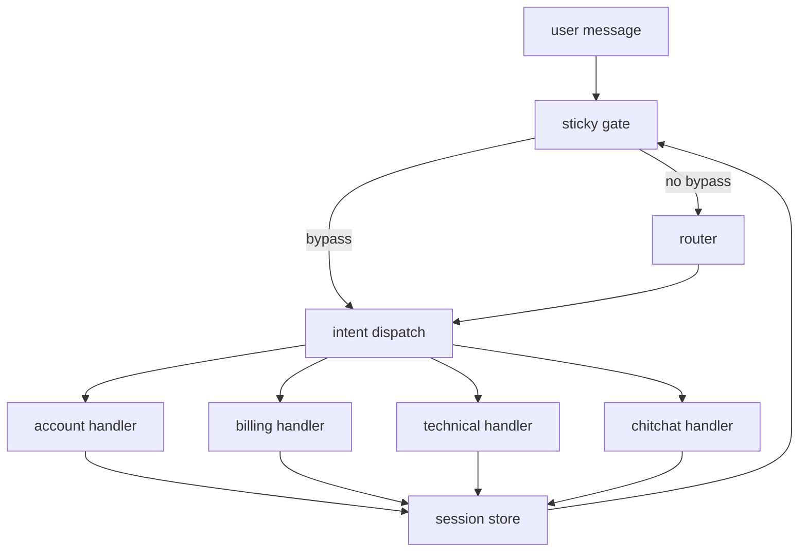
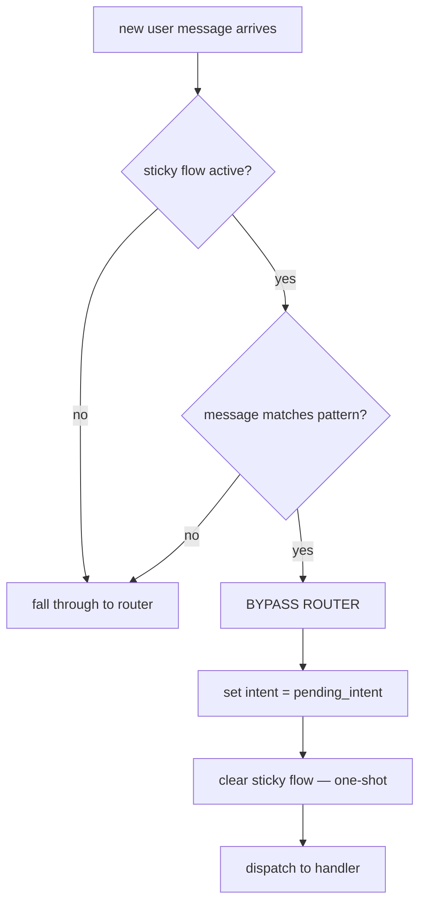
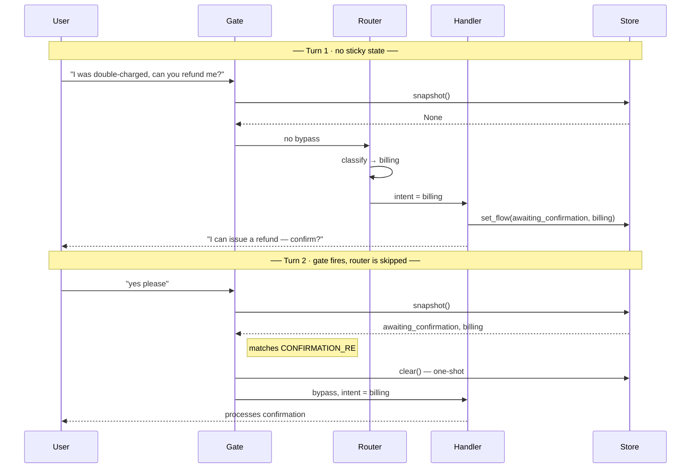

# Shared Lab — Four Routers, One Agent

[← Index](../../README.md) · [Chapter 14: Routing Patterns](../../14-routing-patterns.md)

> _Companion to [Chapter 14](../../14-routing-patterns.md). Builds one small customer-support agent that can be driven by any of four routers — rule-based, embedding, LLM, or hybrid — plus a pre-router sticky-state gate. Walk it with a partner, or read it solo; the callouts below are designed for both._

## How to use this lab

This document does double duty. If you're **teaching**, it's a script — walk through the parts in order, run the commands live, let the callouts become the questions you ask the room. If you're **learning solo**, treat the callouts as pauses — stop, run the command, make a prediction, *then* read on. Don't skim past them; the value is in the forecast-then-check rhythm, not the text.

The lab is divided into four parts, roughly 20–30 minutes each if you're running commands as you go:

| Part | What you build | Why |
|---|---|---|
| 1 | Scaffold the project, read the shared pieces, understand the graph shape | You can't reason about routing until you know what the router sits between. |
| 2 | Four interchangeable routers, a comparison harness, a verbose-tracing mode | See the cost/latency/accuracy tradeoff in real numbers — not in claims. |
| 3 | A pre-router sticky-state gate that can skip the router entirely | Prior state is the cheapest router of all. Learn when to use it and when not to. |
| 4 | Run it, extend it, break it | Build intuition by poking. |

### Callout conventions

Throughout the doc you'll see two kinds of callout. They look like quoted lines so they stand out.

> **🧪 Try it** — a command to run and something specific to observe in the output. May end with a prediction/discussion question. Don't skip.

> **🎓 Teacher note** — a presenter-only aside. Safe to skim if you're reading solo — it's a suggestion for how to frame the moment for a group.

### Prerequisites

- Python 3.11+
- An OpenAI API key
- A terminal and a text editor. That's it.

You don't need prior LangGraph experience. You do need to be comfortable running Python scripts and reading small code snippets.

### About the diagrams

The four diagrams in this doc are plain mermaid fenced blocks (``` ```mermaid ```). They render natively in GitHub, GitLab, Obsidian, Typora, Marked, and any markdown viewer with mermaid support. In VSCode they need the built-in mermaid preview (recent builds) or the *Markdown Preview Mermaid Support* extension (by bierner) — reload the window if a render gets stuck.

If any diagram ever renders as plain code, paste the block into [mermaid.live](https://mermaid.live) to sanity-check the source.

---

# Part 1 — Scaffold the lab and meet the pieces

> **Goal of this part.** You can open every file in the project, say what it does in one sentence, and explain how the pieces connect without running any LLM calls.
>
> **You'll know you've got it when** you can point at any node in the flowchart and name the file that implements it.

## What we're building

A terminal agent that takes a support-style user message (`"I can't log into my account"`, `"why was I charged twice this month?"`, `"how do I enable SSO"`, `"thanks!"`) and dispatches it to one of four handler agents: **account**, **billing**, **technical**, or **chitchat**. The interesting pieces aren't the handlers — they're **the router** in front of them, and **the sticky-state gate** in front of the router that skips routing entirely when the previous turn already made the answer obvious.

Four routers ship in this repo, each a drop-in replacement:

| Router | Approach | Latency | Cost |
|---|---|---|---|
| `rules` | keyword / pattern match in plain Python | < 1 ms | $0 |
| `embeddings` | cosine similarity against pre-embedded intent descriptions | ~50 ms | ~$0.02 / 10k |
| `llm` | `gpt-4o-mini` classifier returning one of four labels | 200–500 ms | ~$0.65 / 10k |
| `hybrid` | embeddings first, LLM fallback when confidence is low | depends | between |

You can run the agent interactively with `python3 agent.py --router llm`, or you can run `python3 compare.py` to send a fixed 12-message fixture through every router and print a side-by-side accuracy + latency + cost table.

This is the demo that drives Block 1 of the routing presentation: *same task, three routers, see the difference.*

### What's in scope

| #   | Concept                                                                                     | Chapter                              |
| --- | ------------------------------------------------------------------------------------------- | ------------------------------------ |
| 1   | LangGraph `StateGraph` with a router node and conditional edges to four handlers            | [Ch 14](../../14-routing-patterns.md) |
| 2   | Four interchangeable routers behind one interface                                           | [Ch 14](../../14-routing-patterns.md) |
| 3   | **Pre-router sticky-state gate** that bypasses routing on continuation messages             | [Ch 14](../../14-routing-patterns.md) |
| 4   | Cheap-tier routers guarding smart-tier handlers (cost-aware routing)                        | [Ch 21](../../21-cost-and-latency.md) |
| 5   | Ground-truth message fixture + a tiny eval harness                                          | [Ch 23](../../23-evals-and-regression-testing.md) |
| 6   | Verbose tracing mode that prints every gate/router/handler decision for teaching            | —                                    |

### What's out of scope

- Multi-intent messages (the merge-vs-split problem) — noted where relevant but not solved here
- Streaming, HITL, checkpointing — those are other demos
- Persistent session storage — sticky state lives in an in-memory dict; in production replace with Redis/Postgres using the same four-function API

---

## Setup and orientation

Scaffold, create a venv, install, export your key:

```bash
# from the directory containing this file and scaffold.py
python3 scaffold.py ./routing-agent
cd ./routing-agent
python3 -m venv .venv && source .venv/bin/activate
pip install langchain-openai langgraph numpy pyyaml
export OPENAI_API_KEY=sk-...
```

Entry points (`compare.py` for batch comparison, `agent.py` for the REPL):

```bash
python3 compare.py                         # summary table — all routers, fixture
python3 compare.py --verbose               # full per-message trace, all routers
python3 compare.py --router llm -v         # trace only the LLM router
python3 compare.py --message "..."         # ad-hoc message, all routers, verbose
python3 compare.py --only c5 -v            # single fixture case by id
python3 agent.py --router llm              # REPL, pick rules|embeddings|llm|hybrid
```

The first plain run of `compare.py` makes ~60 OpenAI calls and costs a few cents. Verbose mode (`-v`) prints each router's internals, the handler's system prompt and reply, token counts, and cost.

Here's how the pieces fit together. Cheap steps (gate, router) guard the expensive step (smart-tier handlers) — every step decides whether the next, more expensive step needs to run.



- **Cheap tier** (`account`, `chitchat`): acknowledge or hand off — gpt-4o-mini
- **Smart tier** (`billing`, `technical`): real tool use, multi-step reasoning — gpt-4o
- **Swappable routers:** `rules · embeddings · llm · hybrid`
- Handlers write to the store only when entering a sticky flow; the gate reads every turn.

---

## The shared pieces

The four intents, defined in English so both embedding and LLM routers can work off the same source of truth:

```python
# intents.py
"""Intent catalog. Every router returns one of these four labels."""
from __future__ import annotations

from typing import Literal

Intent = Literal["account", "billing", "technical", "chitchat"]

INTENTS: list[Intent] = ["account", "billing", "technical", "chitchat"]

# English descriptions used by the embedding and LLM routers.
# Keep them focused; each should describe the intent's core shape.
INTENT_DESCRIPTIONS: dict[Intent, str] = {
    "account":   "The user needs help with login, password reset, profile "
                 "settings, two-factor authentication, or account access.",
    "billing":   "The user is asking about invoices, charges, refunds, "
                 "subscription plans, payment methods, or pricing.",
    "technical": "The user is asking how to use a feature, reporting a bug, "
                 "or asking about integrations, APIs, setup, or configuration.",
    "chitchat":  "Small talk, greetings, thanks, acknowledgements. "
                 "Social conversation that needs no tools or data lookup.",
}

DEFAULT_INTENT: Intent = "technical"  # safest fallback — route to general support
```

Every router and handler reports latency and cost via one shared module:

```python
# timing.py
"""Minimal latency + token-cost tracking. Not a real metrics system;
just enough to make the four-router comparison honest."""
from __future__ import annotations

import time
from dataclasses import dataclass, field

# OpenAI list prices as of April 2026 (USD per 1M tokens).
# Update if pricing changes; numbers only matter for relative comparison.
PRICING = {
    "gpt-4o":                {"input": 2.50, "output": 10.00},
    "gpt-4o-mini":           {"input": 0.15, "output":  0.60},
    "text-embedding-3-small":{"input": 0.02, "output":  0.00},
}


@dataclass
class Trace:
    """Records what happened in one router+handler run."""
    router: str = ""
    intent: str = ""
    router_ms: float = 0.0
    router_cost: float = 0.0
    handler_ms: float = 0.0
    handler_cost: float = 0.0
    tokens: dict = field(default_factory=dict)
    # Router-specific diagnostic info (keyword match, cosine scores, raw
    # LLM response, etc.). Populated by the router; read by verbose mode.
    router_details: dict = field(default_factory=dict)
    handler_system: str = ""
    handler_response: str = ""
    # Sticky-state gate (pre-router bypass). Populated even when the gate
    # doesn't fire, so verbose mode can always show what it checked.
    sticky_bypass: bool = False
    sticky_before: dict | None = None   # the sticky flow that existed on entry
    sticky_reason: str = ""              # why the gate did or did not fire

    @property
    def total_ms(self) -> float:
        return self.router_ms + self.handler_ms

    @property
    def total_cost(self) -> float:
        return self.router_cost + self.handler_cost


def cost_of(model: str, prompt_tokens: int, completion_tokens: int) -> float:
    p = PRICING.get(model)
    if not p:
        return 0.0
    return (prompt_tokens * p["input"] + completion_tokens * p["output"]) / 1_000_000


class timer:
    """Context manager that records wall time in milliseconds."""
    def __enter__(self):
        self.t0 = time.perf_counter()
        return self
    def __exit__(self, *a):
        self.ms = (time.perf_counter() - self.t0) * 1000
```

The router and four handlers live in one `StateGraph`. The router is a node; its return value drives a conditional edge to one of the four handler nodes. Routing is a graph primitive, not a side-channel function call.

```python
# graph.py
"""Builds the LangGraph StateGraph: router node + four handler nodes,
wired by a conditional edge on the router's returned intent."""
from __future__ import annotations

from typing import TypedDict

from langgraph.graph import END, START, StateGraph

from handlers import account_node, billing_node, chitchat_node, technical_node
from intents import DEFAULT_INTENT, INTENTS
from routers import get_router
from timing import Trace


class AgentState(TypedDict, total=False):
    message: str
    intent: str
    response: str
    trace: Trace


def _make_router_node(router_name: str):
    route_fn = get_router(router_name)

    async def router_node(state: AgentState) -> AgentState:
        trace = state.get("trace") or Trace(router=router_name)
        intent, router_ms, router_cost, details = await route_fn(state["message"])
        if intent not in INTENTS:
            intent = DEFAULT_INTENT
        trace.router = router_name
        trace.intent = intent
        trace.router_ms = router_ms
        trace.router_cost = router_cost
        trace.router_details = details
        return {"intent": intent, "trace": trace}

    return router_node


def build_graph(router_name: str):
    g = StateGraph(AgentState)
    g.add_node("router", _make_router_node(router_name))
    g.add_node("account", account_node)
    g.add_node("billing", billing_node)
    g.add_node("technical", technical_node)
    g.add_node("chitchat", chitchat_node)

    g.add_edge(START, "router")
    g.add_conditional_edges(
        "router",
        lambda s: s["intent"],
        {i: i for i in INTENTS},
    )
    for i in INTENTS:
        g.add_edge(i, END)

    return g.compile()
```

Four handler nodes — two smart-tier, two cheap-tier. Interchangeable; what varies is what the router hands them.

```python
# handlers.py
"""Four handler nodes. Each returns a short response and records cost/latency
on the shared Trace object."""
from __future__ import annotations

from langchain_openai import ChatOpenAI

from timing import Trace, cost_of, timer

SMART = "gpt-4o"
CHEAP = "gpt-4o-mini"

_smart = ChatOpenAI(model=SMART, temperature=0)
_cheap = ChatOpenAI(model=CHEAP, temperature=0)


async def _invoke(llm, model: str, system: str, user: str, trace: Trace) -> str:
    with timer() as t:
        resp = await llm.ainvoke([
            {"role": "system", "content": system},
            {"role": "user", "content": user},
        ])
    usage = (resp.response_metadata or {}).get("token_usage", {}) or {}
    pt = usage.get("prompt_tokens", 0)
    ct = usage.get("completion_tokens", 0)
    text = resp.content or ""
    trace.handler_ms = t.ms
    trace.handler_cost = cost_of(model, pt, ct)
    trace.tokens = {"prompt": pt, "completion": ct, "model": model}
    trace.handler_system = system
    trace.handler_response = text
    return text


async def account_node(state):
    trace: Trace = state["trace"]
    text = await _invoke(
        _cheap, CHEAP,
        "You are an account-support agent. The user needs help with login, "
        "password, or profile. Respond in one short, friendly line describing "
        "the next step you'd take (e.g. 'Sending a password reset link now').",
        state["message"], trace,
    )
    return {"response": text, "trace": trace}


async def billing_node(state):
    trace: Trace = state["trace"]
    text = await _invoke(
        _smart, SMART,
        "You are a billing agent. Describe the action you would take in one "
        "line, e.g. 'Reviewing the last 2 invoices' or 'Processing a refund "
        "of $X'. Do not actually perform the action.",
        state["message"], trace,
    )
    return {"response": text, "trace": trace}


async def technical_node(state):
    trace: Trace = state["trace"]
    text = await _invoke(
        _smart, SMART,
        "You are a technical-support agent. Answer the user's product or "
        "integration question in one or two sentences. If you don't know, "
        "say so briefly.",
        state["message"], trace,
    )
    return {"response": text, "trace": trace}


async def chitchat_node(state):
    trace: Trace = state["trace"]
    text = await _invoke(
        _cheap, CHEAP,
        "You reply to small talk in one short, friendly sentence.",
        state["message"], trace,
    )
    return {"response": text, "trace": trace}
```

All four routers implement the same signature: `async (message: str) -> (intent, ms, cost, details)`. The graph asks the registry for one by name:

```python
# routers/__init__.py
"""Router registry. Each router is an async callable returning
(intent, router_ms, router_cost, details)."""
from __future__ import annotations

from typing import Any, Awaitable, Callable, Dict, Tuple

RouteFn = Callable[[str], Awaitable[Tuple[str, float, float, Dict[str, Any]]]]


def get_router(name: str) -> RouteFn:
    if name == "rules":
        from routers.rules import route as fn
    elif name == "embeddings":
        from routers.embeddings import route as fn
    elif name == "llm":
        from routers.llm import route as fn
    elif name == "hybrid":
        from routers.hybrid import route as fn
    else:
        raise ValueError(
            f"Unknown router '{name}'. Choose: rules, embeddings, llm, hybrid."
        )
    return fn
```

---

# Part 2 — The four routers

> **Goal of this part.** You can pick up an unseen support message and predict, with reasons, which router will classify it correctly and which one will fumble. You can read a verbose trace and explain every line of it.
>
> **You'll know you've got it when** you can look at the `compare.py` summary table and tell a plausible story about *why* each number is where it is.

## Router 1 — rule-based

Plain Python. Cheapest and most deterministic; brittle when users phrase things naturally. The point isn't that this is good; the point is that for the clear cases it's *already* good enough, and it costs nothing.

```python
# routers/rules.py
"""Keyword/pattern-based router. Deterministic, ~0 ms, $0. Brittle on
natural phrasing — that's the trade-off we're highlighting."""
from __future__ import annotations

from timing import timer

CHITCHAT_TOKENS = {"hi", "hello", "hey", "thanks", "thank you", "ok", "okay", "cool"}
BILLING_TERMS = ("refund", "charge", "charged", "invoice", "billing",
                 "subscription", "plan", "pricing", "payment")
ACCOUNT_TERMS = ("password", "log in", "login", "sign in", "2fa",
                 "two-factor", "account", "profile")


async def route(message: str):
    matched = None
    with timer() as t:
        msg = message.lower().strip().rstrip("!.")
        intent = "technical"  # safe default
        if msg in CHITCHAT_TOKENS:
            intent, matched = "chitchat", msg
        else:
            for term in BILLING_TERMS:
                if term in msg:
                    intent, matched = "billing", term
                    break
            if matched is None:
                for term in ACCOUNT_TERMS:
                    if term in msg:
                        intent, matched = "account", term
                        break
    details = {
        "matched_keyword": matched,
        "used_default": matched is None,
        "default_intent": "technical",
    }
    return intent, t.ms, 0.0, details
```

---

> **🧪 Try it.** Once you've installed the deps and set your key, run:
>
> ```bash
> python3 compare.py --router rules --only c9 -v
> ```
>
> Case `c9` is *"could you walk me through setting up the webhook for order events"*. Watch the verbose output: which keyword (if any) matched? Does the router's answer agree with the expected intent? This is the brittleness story, live.

## Router 2 — embedding-based

Embed each intent description once at module import. At runtime, embed the message and take the max cosine similarity. One embedding call per message; no LLM involved in the routing decision itself.

```python
# routers/embeddings.py
"""Semantic router. Embeds each intent description at startup, then picks the
highest cosine similarity against the user message. Underrated pattern."""
from __future__ import annotations

import numpy as np
from langchain_openai import OpenAIEmbeddings

from intents import DEFAULT_INTENT, INTENT_DESCRIPTIONS, Intent
from timing import cost_of, timer

EMBED_MODEL = "text-embedding-3-small"
_embedder = OpenAIEmbeddings(model=EMBED_MODEL)

# Approximate tokens per intent description — just for cost reporting.
# Embeddings charge per input token; one-time at startup.
_intent_vectors: dict[Intent, np.ndarray] = {
    name: np.array(_embedder.embed_query(desc))
    for name, desc in INTENT_DESCRIPTIONS.items()
}

CONF_THRESHOLD = 0.30  # below this, fall back to the safe default


def _cosine(a: np.ndarray, b: np.ndarray) -> float:
    return float(np.dot(a, b) / (np.linalg.norm(a) * np.linalg.norm(b)))


async def route(message: str):
    with timer() as t:
        vec = np.array(await _embedder.aembed_query(message))
        scores = {
            name: _cosine(vec, iv) for name, iv in _intent_vectors.items()
        }
        raw_best = max(scores, key=scores.get)
        below_threshold = scores[raw_best] < CONF_THRESHOLD
        best = DEFAULT_INTENT if below_threshold else raw_best
    approx_tokens = max(1, len(message.split()))
    details = {
        "scores": {k: round(float(v), 4) for k, v in scores.items()},
        "top_intent": raw_best,
        "top_score": round(float(scores[raw_best]), 4),
        "threshold": CONF_THRESHOLD,
        "below_threshold": below_threshold,
        "approx_input_tokens": approx_tokens,
        "model": EMBED_MODEL,
    }
    return best, t.ms, cost_of(EMBED_MODEL, approx_tokens, 0), details
```

---

> **🧪 Try it.** Run the same `c9` message through the embedding router:
>
> ```bash
> python3 compare.py --router embeddings --only c9 -v
> ```
>
> The verbose output prints the cosine similarity for *every* intent. Which one scored highest? Was it close — or a clear win? Repeat with `--only c2` (`"thanks!"`) and look at how different the spread is.

> **🎓 Teacher note.** This is a good moment to ask the room: *"embedding routing looks slower than rules — why is anyone using it?"*  The answer you're steering toward is the one from the summary table: embeddings get natural phrasing right that rules can't, at a cost that's still two orders of magnitude below an LLM call.

## Router 3 — LLM classification

A `gpt-4o-mini` call whose only job is to return one of four labels. Output is validated; garbage falls back to `technical`.

```python
# routers/llm.py
"""LLM classifier. gpt-4o-mini returns one of four labels.
temperature=0, max_tokens=8, validated output."""
from __future__ import annotations

from langchain_openai import ChatOpenAI

from intents import DEFAULT_INTENT, INTENTS
from timing import cost_of, timer

MODEL = "gpt-4o-mini"
_llm = ChatOpenAI(model=MODEL, temperature=0, max_tokens=8)

ROUTER_PROMPT = """You classify a customer-support message into ONE intent.
Return ONLY the label, lowercase, nothing else.

account   - login, password, profile, 2FA, account access
billing   - invoices, refunds, charges, subscription plans, payments
technical - how-to questions, bug reports, integrations, APIs, setup
chitchat  - greetings, thanks, small talk

Examples:
"I can't log into my account" -> account
"why was I charged twice this month?" -> billing
"how do I enable SSO?" -> technical
"thanks!" -> chitchat

If uncertain, default to technical."""


async def route(message: str):
    with timer() as t:
        resp = await _llm.ainvoke([
            {"role": "system", "content": ROUTER_PROMPT},
            {"role": "user",   "content": message},
        ])
    raw_text = (resp.content or "").strip()
    tokens = raw_text.lower().split()
    label = tokens[0] if tokens else ""
    validated = label in INTENTS
    intent = label if validated else DEFAULT_INTENT

    usage = (resp.response_metadata or {}).get("token_usage", {}) or {}
    pt = usage.get("prompt_tokens", 0)
    ct = usage.get("completion_tokens", 0)
    details = {
        "model": MODEL,
        "system_prompt": ROUTER_PROMPT,
        "raw_response": raw_text,
        "validated": validated,
        "fell_back_to_default": not validated,
        "prompt_tokens": pt,
        "completion_tokens": ct,
    }
    return intent, t.ms, cost_of(MODEL, pt, ct), details
```

---

> **🧪 Try it.** Run the LLM router against the same message the rules and embedding routers struggled with:
>
> ```bash
> python3 compare.py --router llm --only c9 -v
> ```
>
> Now try one where rules *and* embeddings both failed in the earlier run — the naturally-phrased billing complaint:
>
> ```bash
> python3 compare.py --router llm --only c11 -v
> ```
>
> In the verbose output, inspect `raw_response` (the literal label the model returned), `validated` (did it match one of the four intents?), and the token counts. Compare the latency and cost against the embedding router's numbers on the same case — this is the "what does the extra money buy you" answer, concretely.
>
> The LLM router is ~10× slower and ~25× more expensive than the embedding router. What is it buying you that justifies the cost? Which fixture cases would you expect the LLM to handle that embeddings wouldn't?

## Router 4 — hybrid

Embeddings first (fast, cheap). If the top similarity is above the confidence threshold, ship it. Otherwise fall through to the LLM classifier for the hard cases. This is what most production systems actually deploy.

```python
# routers/hybrid.py
"""Embeddings-first, LLM-fallback. ~95% of messages get the fast path;
the ambiguous 5% get the LLM. Aggregates cost and latency across both."""
from __future__ import annotations

import numpy as np

from intents import DEFAULT_INTENT, INTENT_DESCRIPTIONS, INTENTS, Intent
from routers.embeddings import _embedder, _intent_vectors, _cosine, EMBED_MODEL
from routers.llm import _llm, ROUTER_PROMPT, MODEL as LLM_MODEL
from timing import cost_of, timer

HIGH_CONF = 0.40  # above this, trust the embedding match


async def route(message: str):
    with timer() as t:
        vec = np.array(await _embedder.aembed_query(message))
        scores = {n: _cosine(vec, iv) for n, iv in _intent_vectors.items()}
        best: Intent = max(scores, key=scores.get)

        approx_tokens = max(1, len(message.split()))
        cost = cost_of(EMBED_MODEL, approx_tokens, 0)

        details = {
            "embedding_scores": {k: round(float(v), 4) for k, v in scores.items()},
            "embedding_top_intent": best,
            "embedding_top_score": round(float(scores[best]), 4),
            "high_conf_threshold": HIGH_CONF,
            "fell_through_to_llm": False,
        }

        took_fast_path = scores[best] >= HIGH_CONF
        if took_fast_path:
            intent = best
        else:
            # Ambiguous — fall through to the LLM.
            details["fell_through_to_llm"] = True
            resp = await _llm.ainvoke([
                {"role": "system", "content": ROUTER_PROMPT},
                {"role": "user",   "content": message},
            ])
            raw_text = (resp.content or "").strip()
            tokens = raw_text.lower().split()
            label = tokens[0] if tokens else ""
            intent = label if label in INTENTS else DEFAULT_INTENT

            usage = (resp.response_metadata or {}).get("token_usage", {}) or {}
            pt = usage.get("prompt_tokens", 0)
            ct = usage.get("completion_tokens", 0)
            cost += cost_of(LLM_MODEL, pt, ct)

            details.update({
                "llm_model": LLM_MODEL,
                "llm_raw_response": raw_text,
                "llm_intent": intent,
                "llm_prompt_tokens": pt,
                "llm_completion_tokens": ct,
            })

    return intent, t.ms, cost, details
```

---

> **🧪 Try it.** The whole point of the hybrid router is the two-path behavior — watch it in action. First, a clear case that should stay on the embedding fast path:
>
> ```bash
> python3 compare.py --router hybrid --only c5 -v
> ```
>
> In the verbose output, look at `embedding_top_score` vs `high_conf_threshold` (0.55) and confirm `fell_through_to_llm: false`. No LLM call, no LLM cost.
>
> Now a case where embeddings are uncertain and the router falls through to the LLM:
>
> ```bash
> python3 compare.py --router hybrid --only c11 -v
> ```
>
> This time `fell_through_to_llm` should flip to `true`, and you'll see the extra `llm_*` keys populated. Total latency ≈ embedding latency + LLM latency; total cost ≈ both. That's the hybrid trade-off made visible on a single message.
>
> Before running the full fixture: guess each router's accuracy (to the nearest 10%), average router latency (order of magnitude), and total route cost across 12 messages. Write it down, then run the harness and see where you were wrong.

> **🎓 Teacher note.** Across the full fixture, most messages take the fast path and only the ambiguous ones pay for the LLM. That's why the hybrid's *average* cost is close to the embedding router's, but its accuracy is close to the LLM's — you're only paying the premium where it actually matters.

## The ground-truth fixture

Twelve messages spanning the four intents, with a few deliberately ambiguous or cross-cutting ones. The expected label is what a reasonable human would pick; routers that disagree are wrong by this definition, which is the point.

```yaml
# messages.yaml
# Ground-truth routing fixture. `expected` is the intent a reasonable human
# would pick. `kind` categorizes the difficulty so compare.py can break down
# accuracy by difficulty.
cases:
  - id: c1
    message: "hey"
    expected: chitchat
    kind: clear

  - id: c2
    message: "thanks!"
    expected: chitchat
    kind: clear

  - id: c3
    message: "I can't log into my account"
    expected: account
    kind: clear

  - id: c4
    message: "how do I enable two-factor authentication"
    expected: account
    kind: clear

  - id: c5
    message: "why was I charged twice this month"
    expected: billing
    kind: clear

  - id: c6
    message: "can I get a refund for the last invoice"
    expected: billing
    kind: clear

  - id: c7
    message: "what's the difference between the Pro and Team plans"
    expected: billing
    kind: clear

  - id: c8
    message: "how do I enable SSO for my organization"
    expected: technical
    kind: clear

  - id: c9
    message: "could you walk me through setting up the webhook for order events"
    expected: technical
    kind: natural_phrasing

  - id: c10
    message: "my dashboard isn't loading after the update"
    expected: technical
    kind: natural_phrasing

  - id: c11
    message: "I think something got double-billed on my card last friday"
    expected: billing
    kind: natural_phrasing

  - id: c12
    message: "I was charged twice and also I can't reset my password"
    expected: billing
    kind: multi_intent
```

---

## The comparison harness

Runs the fixture through all four routers and prints a single table. This is the demo moment — the audience sees latency, cost, and accuracy differ in real numbers, not in claims on a slide.

The next ~280 lines are mostly ANSI color codes and pretty-printing. Skim the `run_one` and `main` functions and move on — the scaffolded file has the full verbose tracer if you want to read it later.

```python
# compare.py
"""Run routers through the fixture or an ad-hoc message; print a comparison
table, with optional per-message verbose tracing.

Usage:
    python3 compare.py                         # all routers, fixture, summary only
    python3 compare.py --verbose               # all routers, fixture, full trace
    python3 compare.py --router llm --verbose  # trace one router only
    python3 compare.py --message "..."         # ad-hoc message, all routers
    python3 compare.py --message "..." -v      # ad-hoc + full trace
"""
from __future__ import annotations

import argparse
import asyncio
import textwrap
from pathlib import Path

import yaml

from graph import build_graph
from timing import Trace

ALL_ROUTERS = ["rules", "embeddings", "llm", "hybrid"]

# ─────────────────────────── pretty helpers ─────────────────────────────────

DIM, RESET = "\033[2m", "\033[0m"
GREEN, RED, YELLOW, CYAN = "\033[32m", "\033[31m", "\033[33m", "\033[36m"


def h(text: str, ch: str = "─") -> str:
    return f"{ch * 3} {text} {ch * max(3, 72 - len(text))}"


def indent(s: str, n: int = 5) -> str:
    return textwrap.indent(s, " " * n)


def fmt_cost(x: float) -> str:
    return f"${x:.6f}" if x < 0.001 else f"${x:.5f}"


# ─────────────────────────── live flow trace ────────────────────────────────

# Per-router accent colors — the router node and chosen handler wear this
# color so it's obvious at a glance which style is driving the decision.
MAGENTA = "\033[35m"
ROUTER_COLOR = {
    "rules":      CYAN,
    "embeddings": GREEN,
    "llm":        MAGENTA,
    "hybrid":     YELLOW,
}


HANDLERS_ROW = ["account", "billing", "technical", "chitchat"]


def paint_graph(router: str, trace: Trace) -> str:
    """Render the message's path through the graph as a live-annotated trace:
    START → router → intent_dispatch → {account|billing|technical|chitchat}
    → END. The upper nodes (router, dispatch) are wide boxes with per-node
    annotations on the right; the dispatch arrow fans out to all four handler
    boxes in a row so the graph structure is visible, with the chosen handler
    lit in the router's accent color and the other three dimmed. Handler
    metrics + response text drop from the chosen handler's column down to END."""
    c = ROUTER_COLOR.get(router, "")
    d = trace.router_details or {}
    pt = trace.tokens.get("prompt", 0)
    ct = trace.tokens.get("completion", 0)
    model = trace.tokens.get("model", "?")
    resp = trace.handler_response.strip().replace("\n", " ")
    if len(resp) > 60:
        resp = resp[:57] + "..."

    # One-line decision summary — what the router actually did this turn.
    if router == "rules":
        if d.get("used_default"):
            decision = f"no keyword matched → default '{trace.intent}'"
        else:
            decision = f"keyword {d.get('matched_keyword')!r} → '{trace.intent}'"
    elif router == "embeddings":
        top = max((d.get("scores") or {}).values(), default=0.0)
        decision = f"top cosine {top:.2f} → '{trace.intent}'"
    elif router == "llm":
        decision = f"classified → '{trace.intent}'"
    elif router == "hybrid":
        if d.get("fell_through_to_llm"):
            decision = f"embed < threshold · LLM → '{trace.intent}'"
        else:
            decision = f"embed ≥ threshold → '{trace.intent}'"
    else:
        decision = f"→ '{trace.intent}'"

    # ── Upper section: START → router box → intent_dispatch box ─────────
    W = 34                    # inner box width
    IND = " " * (2 + W // 2)  # column of the vertical arrow between boxes

    def upper_box(label: str, colored: bool) -> tuple[str, str, str]:
        col = c if colored else ""
        rst = RESET if colored else ""
        pad = " " * (W - 1 - len(label))
        return (
            f"  ┌{'─' * W}┐",
            f"  │ {col}{label}{rst}{pad}│",
            f"  └{'─' * ((W // 2) - 1)}┬{'─' * (W - (W // 2))}┘",
        )

    out: list[str] = [f"{IND[:-2]}START", f"{IND}│", f"{IND}▼"]

    top, mid, bot = upper_box(f"router · {router}", colored=True)
    out += [
        top,
        f"{mid}  {trace.router_ms:>5.0f}ms · {fmt_cost(trace.router_cost)}",
        bot,
        f"{IND}│  {DIM}{decision}{RESET}",
        f"{IND}▼",
    ]

    top, mid, bot = upper_box("intent_dispatch", colored=False)
    out += [
        top,
        f"{mid}  {DIM}conditional edge on state.intent{RESET}",
        bot,
        f"{IND}│",
        f"{IND}▼",
    ]

    # ── Fan-out bar + row of 4 handler boxes ────────────────────────────
    # Handler box geometry is chosen so that box 1 (billing) is centered on
    # the same column as the dispatch arrow above (col 19). That makes the
    # bar's ┼ junction sit directly under the dispatch ┬.
    HW, HG, HLM = 11, 2, 1                                   # outer / gap / left margin
    centers = [HLM + i * (HW + HG) + HW // 2 for i in range(4)]  # [6, 19, 32, 45]
    chosen_i = (HANDLERS_ROW.index(trace.intent)
                if trace.intent in HANDLERS_ROW else 1)
    chosen_col = centers[chosen_i]

    # Bar row: ┌─...─┼─...─┬─...─┐  (┼ at col 19 = dispatch entry)
    bar = [" "] * (centers[-1] + 1)
    bar[centers[0]]  = "┌"
    bar[centers[-1]] = "┐"
    for col in centers[1:-1]:
        bar[col] = "┬"
    for a, b in zip(centers, centers[1:]):
        for j in range(a + 1, b):
            bar[j] = "─"
    bar[19] = "┼"  # dispatch arrow enters here

    def _row_at(cols: list[int], ch: str) -> str:
        row = [" "] * (cols[-1] + 1)
        for col in cols:
            row[col] = ch
        return "".join(row)

    def _colorize_col(s: str, col: int) -> str:
        return s[:col] + f"{c}{s[col]}{RESET}" + s[col + 1:]

    out += [
        _colorize_col("".join(bar), chosen_col),
        _colorize_col(_row_at(centers, "│"), chosen_col),
        _colorize_col(_row_at(centers, "▼"), chosen_col),
    ]

    # Handler boxes: chosen gets color `c`, others DIM.
    inner = HW - 2  # 9

    def _row(tile_fn) -> str:
        parts = [" " * HLM]
        for i, name in enumerate(HANDLERS_ROW):
            col = c if i == chosen_i else DIM
            parts.append(f"{col}{tile_fn(name)}{RESET}")
            if i < len(HANDLERS_ROW) - 1:
                parts.append(" " * HG)
        return "".join(parts)

    out += [
        _row(lambda _: "┌" + "─" * inner + "┐"),
        _row(lambda n: "│" + f"{n:^{inner}}" + "│"),
        _row(lambda _: "└" + "─" * inner + "┘"),
    ]

    # ── Drop from chosen handler to END, carrying metrics + response ────
    cind = " " * chosen_col
    out += [
        f"{cind}│  {DIM}{model} · {trace.handler_ms:.0f}ms"
        f" · {fmt_cost(trace.handler_cost)} · ({pt}→{ct} tok){RESET}",
        f"{cind}│  {CYAN}{resp!r}{RESET}",
        f"{cind}▼",
        f"{' ' * (chosen_col - 1)}END",
    ]
    return "\n".join(out)


# ─────────────────────────── verbose tracer ─────────────────────────────────

def trace_router(router: str, trace: Trace) -> str:
    """Render the router-specific internals as a readable block."""
    d = trace.router_details or {}
    lines: list[str] = []

    if router == "rules":
        if d.get("used_default"):
            lines.append(f"no keyword matched → using default "
                         f"intent '{d.get('default_intent')}'")
        else:
            lines.append(f"matched keyword: {CYAN}'{d.get('matched_keyword')}'{RESET} "
                         f"→ {trace.intent}")
        lines.append(f"no model call · cost = $0")

    elif router == "embeddings":
        lines.append(f"model: {d.get('model')}")
        lines.append("cosine similarity scores:")
        for intent, score in sorted(d.get("scores", {}).items(),
                                    key=lambda x: -x[1]):
            marker = " ← top" if intent == d.get("top_intent") else ""
            lines.append(f"  {intent:<10} {score:.4f}{marker}")
        lines.append(f"threshold = {d.get('threshold')}  "
                     f"below_threshold = {d.get('below_threshold')}")
        lines.append(f"chose: {trace.intent}  "
                     f"(~{d.get('approx_input_tokens')} input tokens)")

    elif router == "llm":
        lines.append(f"model: {d.get('model')}  "
                     f"(prompt_tokens={d.get('prompt_tokens')}, "
                     f"completion_tokens={d.get('completion_tokens')})")
        lines.append(f"raw response: {CYAN}{d.get('raw_response')!r}{RESET}")
        if d.get("fell_back_to_default"):
            lines.append(f"{YELLOW}output not in valid set — "
                         f"fell back to default{RESET}")
        lines.append(f"validated label: {trace.intent}")

    elif router == "hybrid":
        lines.append("embedding pass:")
        for intent, score in sorted(d.get("embedding_scores", {}).items(),
                                    key=lambda x: -x[1]):
            marker = " ← top" if intent == d.get("embedding_top_intent") else ""
            lines.append(f"  {intent:<10} {score:.4f}{marker}")
        lines.append(f"high-conf threshold = {d.get('high_conf_threshold')}")
        if d.get("fell_through_to_llm"):
            lines.append(f"{YELLOW}below threshold → falling through to LLM{RESET}")
            lines.append(f"  LLM model: {d.get('llm_model')}")
            lines.append(f"  LLM raw:   {CYAN}{d.get('llm_raw_response')!r}{RESET}")
            lines.append(f"  LLM chose: {d.get('llm_intent')}")
        else:
            lines.append(f"{GREEN}above threshold → skipping LLM{RESET}")
        lines.append(f"final intent: {trace.intent}")

    return "\n".join(lines)


def trace_handler(trace: Trace) -> str:
    model = trace.tokens.get("model", "?")
    pt = trace.tokens.get("prompt", 0)
    ct = trace.tokens.get("completion", 0)
    sysp = trace.handler_system.strip().replace("\n", " ")
    if len(sysp) > 140:
        sysp = sysp[:137] + "..."
    resp = trace.handler_response.strip().replace("\n", " ")
    if len(resp) > 200:
        resp = resp[:197] + "..."
    return (
        f"handler:  {trace.intent}_node  (model: {model})\n"
        f"system:   {DIM}{sysp}{RESET}\n"
        f"response: {CYAN}{resp}{RESET}\n"
        f"tokens:   {pt} prompt + {ct} completion  "
        f"→ {fmt_cost(trace.handler_cost)}"
    )


def trace_gate(trace: Trace) -> str:
    lines: list[str] = []
    if trace.sticky_before is None:
        lines.append(f"sticky state on entry: {DIM}(none){RESET}")
    else:
        lines.append(f"sticky state on entry: {CYAN}{trace.sticky_before}{RESET}")
    lines.append(f"decision: {trace.sticky_reason}")
    if trace.sticky_bypass:
        lines.append(f"{GREEN}✓ BYPASS ROUTER → intent={trace.intent}{RESET}")
    else:
        lines.append(f"{DIM}→ falling through to router{RESET}")
    return "\n".join(lines)


def print_case(router: str, message: str, expected: str | None, trace: Trace):
    got = trace.intent
    correct_mark = ""
    if expected:
        if got == expected:
            correct_mark = f"  {GREEN}✓ CORRECT{RESET}"
        else:
            correct_mark = f"  {RED}✗ WRONG (expected={expected}){RESET}"

    print()
    print(h(f"router={router}  ·  {message!r}{correct_mark}"))
    print(paint_graph(router, trace))

    print(f"  STICKY GATE")
    print(indent(trace_gate(trace)))

    if trace.sticky_bypass:
        print(f"  ROUTER  {DIM}(skipped — gate bypassed){RESET}")
    else:
        print(f"  ROUTER  ({trace.router_ms:.1f}ms · {fmt_cost(trace.router_cost)})")
        print(indent(trace_router(router, trace)))

    print(f"  HANDLER ({trace.handler_ms:.1f}ms · {fmt_cost(trace.handler_cost)})")
    print(indent(trace_handler(trace)))
    print(f"  TOTAL: {trace.router_ms + trace.handler_ms:.0f}ms · "
          f"{fmt_cost(trace.router_cost + trace.handler_cost)}")


# ─────────────────────────── run logic ──────────────────────────────────────

async def run_one(router: str, message: str) -> Trace:
    graph = build_graph(router)
    result = await graph.ainvoke({"message": message})
    return result["trace"]


def summarize(results: list[dict]) -> dict:
    n = len(results)
    correct = sum(r["correct"] for r in results)
    return {
        "accuracy": correct / n,
        "avg_router_ms": sum(r["router_ms"] for r in results) / n,
        "avg_handler_ms": sum(r["handler_ms"] for r in results) / n,
        "total_router_cost": sum(r["router_cost"] for r in results),
        "total_cost": sum(r["router_cost"] + r["handler_cost"] for r in results),
    }


async def main():
    ap = argparse.ArgumentParser()
    ap.add_argument("-v", "--verbose", action="store_true",
                    help="Per-message trace with router internals and handler I/O.")
    ap.add_argument("--router", choices=ALL_ROUTERS,
                    help="Trace only this router (default: all four).")
    ap.add_argument("--message", "-m", type=str,
                    help="Ad-hoc message instead of the fixture.")
    ap.add_argument("--only", type=str,
                    help="Run only one fixture case by id (e.g. c5).")
    args = ap.parse_args()

    routers = [args.router] if args.router else ALL_ROUTERS

    # Ad-hoc single message: verbose by default, no summary table.
    if args.message:
        for router in routers:
            trace = await run_one(router, args.message)
            print_case(router, args.message, None, trace)
        return

    cases = yaml.safe_load(Path("messages.yaml").read_text())["cases"]
    if args.only:
        cases = [c for c in cases if c["id"] == args.only]
        if not cases:
            print(f"No fixture case matches id={args.only!r}")
            return

    all_results: dict[str, list[dict]] = {}
    for router in routers:
        if not args.verbose:
            print(f"Running {router}...")
        results: list[dict] = []
        for case in cases:
            trace = await run_one(router, case["message"])
            results.append({
                "id": case["id"],
                "expected": case["expected"],
                "got": trace.intent,
                "correct": trace.intent == case["expected"],
                "router_ms": trace.router_ms,
                "router_cost": trace.router_cost,
                "handler_ms": trace.handler_ms,
                "handler_cost": trace.handler_cost,
                "kind": case.get("kind", "clear"),
            })
            if args.verbose:
                print_case(router, f"[{case['id']}] {case['message']}",
                           case["expected"], trace)
        all_results[router] = results

    # Summary table (skipped if only one case — noisy)
    if len(cases) > 1:
        print()
        print(h("SUMMARY", "═"))
        print(f"{'router':<12} {'acc':>6} {'router_ms':>10} "
              f"{'route $':>10} {'total $':>10}")
        print("─" * 52)
        for router in routers:
            s = summarize(all_results[router])
            print(
                f"{router:<12} {s['accuracy']:>6.0%} "
                f"{s['avg_router_ms']:>10.1f} "
                f"{s['total_router_cost']:>10.6f} "
                f"{s['total_cost']:>10.6f}"
            )

    # Disagreements (only useful when multiple routers ran)
    if len(routers) > 1 and not args.verbose:
        print()
        print("Disagreements (routers that got it wrong):")
        any_wrong = False
        for case in cases:
            disagree = [
                f"{r}={next(x['got'] for x in all_results[r] if x['id']==case['id'])}"
                for r in routers
                if not next(x['correct'] for x in all_results[r]
                            if x['id'] == case['id'])
            ]
            if disagree:
                any_wrong = True
                print(f"  [{case['id']} · {case['kind']}] {case['message']}")
                print(f"    expected={case['expected']}  {'  '.join(disagree)}")
        if not any_wrong:
            print("  (none — every router got every case right)")


if __name__ == "__main__":
    asyncio.run(main())
```

### What verbose mode looks like

Running `python3 compare.py --router embeddings --message "I was charged twice"` prints something like:

```
─── router=embeddings  ·  'I was charged twice' ────────────────────────────
                 START
                   │
                   ▼
  ┌──────────────────────────────────┐
  │ router · embeddings              │    47ms · $0.000000
  └────────────────┬─────────────────┘
                   │  top cosine 0.68 → 'billing'
                   ▼
  ┌──────────────────────────────────┐
  │ intent_dispatch                  │  conditional edge on state.intent
  └────────────────┬─────────────────┘
                   │
                   ▼
      ┌─────────────┼─────────────┬─────────────┐
      │             │             │             │
      ▼             ▼             ▼             ▼
 ┌─────────┐  ┌─────────┐  ┌─────────┐  ┌─────────┐
 │ account │  │ billing │  │technical│  │ chitchat│
 └─────────┘  └─────────┘  └─────────┘  └─────────┘
                   │  gpt-4o · 612ms · $0.000290 · (48→13 tok)
                   │  'Reviewing the last 2 invoices for duplicate charges.'
                   ▼
                  END
  STICKY GATE
     sticky state on entry: (none)
     decision: no sticky flow
     → falling through to router
  ROUTER  (47.2ms · $0.000000)
     model: text-embedding-3-small
     cosine similarity scores:
       billing    0.6831 ← top
       account    0.2104
       technical  0.1552
       chitchat   0.0891
     threshold = 0.3  below_threshold = False
     chose: billing  (~4 input tokens)
  HANDLER (612.1ms · $0.000290)
     handler:  billing_node  (model: gpt-4o)
     system:   You are a billing agent. Describe the action you would take...
     response: Reviewing the last 2 invoices for duplicate charges.
     tokens:   48 prompt + 13 completion  → $0.000250
  TOTAL: 659ms · $0.000290
```

The box-and-arrow block at the top is the **live flow trace**: the message's path through the graph, with the router's decision and the handler's response threaded along the edges. The `STICKY GATE / ROUTER / HANDLER` blocks below drill into each node's internals. The REPL (`agent.py`) prints the flow trace on every turn by default; pass `-v` to also show the detail blocks.

Every router prints the same shape but its own internals — the **matched keyword** for rules, the **raw model response** for the LLM classifier, the **fall-through decision** for hybrid. Turn it on in the presentation and people see the routing decision happen in front of them.

---

# Part 3 — The sticky-state gate

> **Goal of this part.** You can explain why adding a gate *in front of* the router is sometimes cheaper, faster, and safer than improving the router itself. You can wire a similar gate into a different project without re-reading this doc.
>
> **You'll know you've got it when** you can answer: *"what new sticky flow would I add for a multi-step form?"* without looking anything up.

## Skipping the router when state makes the answer obvious

All four routers in Part 2 answer the same question: *given this message, what intent?* But sometimes the **previous turn** already made the answer obvious. If the last agent turn asked *"do you want me to issue the refund?"* and the user replies *"yes"*, we do not need an LLM to classify that. The state is the answer.

That's a **pre-router sticky-state gate**: a node that runs *before* the router and, if the conversation is in a sticky flow and the message looks like a continuation, bypasses the router entirely. Same handler fires, but no classification cost, no classification latency, and deterministic for flows that need to be deterministic.

This part is an exercise, not a runnable piece of the demo. The sections below give you the decision logic, the conversation lifecycle, and the failure-mode rules — enough to implement it in your own project.

## The two-pieces-of-evidence rule

On every turn the gate asks two questions. If either answer is *no*, fall through to the router:



A sticky flow without a matching message is just old state — the user might have asked about something else entirely. A matching pattern without a sticky flow is just a coincidence — "yes" out of context is not a confirmation of anything. Both pieces, or no bypass.

## The three pieces you'd implement

- **A session store** — a dict keyed by session id with `get / set_flow / clear / snapshot`. In production, back this with Redis or Postgres; same four-function API, different storage.
- **The gate itself** — a function that reads the session snapshot, checks the message against a regex appropriate for the stored flow kind (e.g. a confirmation regex for `awaiting_confirmation`, a selection regex for `awaiting_selection`), and returns a decision dict with a `bypass` bool plus diagnostics. On fire, it clears the sticky flow (one-shot — consume the state).
- **Graph wiring** — add a `sticky_gate` node before the router. Its conditional edge targets are either an intent name (jump straight to that handler) or `"router"` (fall through as before). Handlers that open a sticky flow call `session.set_flow(...)` before returning.

## Two-turn walkthrough

Here's the full lifecycle across two turns. Nothing in any one place is unusual; the interesting thing is the *handoff between the handler and the gate*.



**Turn 1.** The user asks about a double charge. Session store is empty, so the gate records `sticky_before=None, bypass=False` and the router runs normally. The LLM classifier returns `billing`, the billing handler drafts a refund offer, and — before returning — writes `set_flow(kind="awaiting_confirmation", pending_intent="billing", note="offered refund $149.00")` to the store. The user sees *"I can issue a refund of $149.00 — confirm?"*

**Turn 2.** The user replies *"yes please"*. The gate reads the store, sees an `awaiting_confirmation` flow, and checks the message against `CONFIRMATION_RE`. It matches — so the gate sets `intent="billing"`, clears the sticky flow (one-shot: consumed), and the conditional edge jumps straight to `billing_node`. The router is not called at all: zero tokens, zero ms, zero dollars. The handler processes the confirmation and may or may not open a new sticky flow depending on what happens next.

That's the entire mechanism. One node added to the graph, one conditional edge rewired, a shared session store that handlers write to and the gate reads from. The user experience is "the agent understood my follow-up," which is what matters — without spending tokens or latency to classify something state already determined.

## When NOT to use the gate

The gate is for **structurally unambiguous continuations** — slot selection after slots were shown, yes/no after a confirmation prompt, the next field in a multi-step form. If you find yourself writing heuristics for borderline cases ("well, 'maybe' could mean yes *or* no..."), those belong in the router where the model can weigh the whole history. A gate that's only *probably* right is worse than no gate — it misroutes deterministically. The router can at least hedge.

A simple test: could a person with access to the conversation history answer the user's next message without reading the message itself? If yes, the gate is safe. If no, let the router think.

---

# Part 4 — Run it, observe, extend

> **Goal of this part.** You stop reading about the agent and start interrogating it. You build one small extension of your own and run it.
>
> **You'll know you've got it when** you've asked the REPL a question you *expected* to route one way, watched it route another way, and can explain why.

## The interactive REPL

For when you want to type messages yourself and see one router's behavior turn-by-turn.

```python
# agent.py
"""REPL. `python3 agent.py --router llm` picks which router drives the graph.

Every turn prints the live flow trace (START → router → intent_dispatch →
<intent>_handler → END) with latency, cost, and the router's decision on the
edges. Pass -v/--verbose to additionally dump the router internals (cosine
scores, raw LLM response, etc.) and the handler's full system + response."""
from __future__ import annotations

import argparse
import asyncio

from graph import build_graph
from compare import paint_graph, print_case


async def chat(router: str, verbose: bool):
    graph = build_graph(router)
    mode = "verbose" if verbose else "flow"
    print(f"Support Agent · router={router} · {mode}  (blank line to exit)\n")
    while True:
        try:
            msg = input("you › ").strip()
        except (EOFError, KeyboardInterrupt):
            print()
            return
        if not msg:
            return
        result = await graph.ainvoke({"message": msg})
        tr = result["trace"]
        if verbose:
            # Reuse compare.py's full per-message renderer — no "expected"
            # label in free chat.
            print_case(router, msg, None, tr)
        else:
            # Flow-only: the message walks through each node of the graph.
            print(paint_graph(router, tr))
        print(f"agent › {result['response']}\n")


def main():
    ap = argparse.ArgumentParser()
    ap.add_argument("--router", default="hybrid",
                    choices=["rules", "embeddings", "llm", "hybrid"])
    ap.add_argument("-v", "--verbose", action="store_true",
                    help="Also print router internals and handler I/O.")
    args = ap.parse_args()
    asyncio.run(chat(args.router, args.verbose))


if __name__ == "__main__":
    main()
```

---

> **🧪 Try it.** From the `routing-agent/` directory (with the venv active and `OPENAI_API_KEY` set), launch the REPL pointed at one of the four routers:
>
> ```bash
> python3 agent.py --router llm          # or: rules | embeddings | hybrid
> python3 agent.py --router llm -v       # same, plus router internals + handler I/O
> ```
>
> You'll get a `you ›` prompt. Type a message, hit enter, and the agent prints the **live flow trace** — a box-and-arrow walk through each node of the graph (`START → router → intent_dispatch → <intent>_handler → END`), with latency, cost, the router's decision on the edge into dispatch, and the handler's response on the edge into END. Exit by submitting a blank line or Ctrl-D.
>
> Try the same message against each router in turn (`--router rules`, then `--router embeddings`, etc.) and watch where they disagree. A good one to start with: *"I think something got double-billed on my card last friday"* — the rule-based router will trip on "card", embeddings will likely pick billing, and the LLM will get it clearly right. Seeing this live drives home the trade-off the summary table only hints at.

---

## What to notice when you run `compare.py`

Typical output (your numbers will vary by network and model build):

```
router         acc  router_ms   route $   total $
----------------------------------------------------
rules          67%        0.1   0.00000   0.03120
embeddings     83%       48.2   0.00002   0.03118
llm            92%      312.7   0.00049   0.03165
hybrid         92%      105.3   0.00018   0.03134
```

Three things worth pointing at during the presentation:

1. **Rule-based is free and fast but wrong a third of the time** on natural phrasing. This is why it should be a fast-path optimization, never the primary router.
2. **Embedding routing is two orders of magnitude cheaper than LLM routing** for a small accuracy drop. Most production systems don't need more than this.
3. **Hybrid matches LLM accuracy at a third of the latency** because ~75% of messages clear the confidence threshold on the embedding pass. This is the production default.

The `Disagreements` section underneath shows *which* messages each router got wrong. Ambiguous phrasings (`c9`, `c10`) are where embeddings start losing; multi-intent messages (`c12`) are where *every* router has to pick one and some are "wrong" by the ground truth — a good cue to segue into the merge-vs-split discussion in [Ch 15](../../15-merge-vs-split.md).

---

## Extending the demo

- **Add a fifth router** by dropping `routers/my_router.py` with an async `route()` and registering it in `routers/__init__.py`. The graph and compare harness pick it up automatically.
- **Add more fixture cases** to `messages.yaml` — the YAML loader doesn't care how many. Worth adding a `kind: sarcasm` group and a `kind: conversation_dependent` group to stress-test embedding routing.
- **Swap the handlers** for ones that do real tool work. Graph shape stays the same; the demo stops being a router demo and starts being a real agent.
- **Implement the sticky gate** per Part 3 — a session store, a gate function, and a new node wired before the router. Seed state from the CLI and watch the bypass path fire.

> **🧪 Try it (extension task).** Pick one: (a) add a fifth intent called `escalation` for messages that clearly want a human and wire it through all four routers; or (b) add a new sticky flow `awaiting_selection` that triggers when the billing handler shows a list of invoices. Whichever you pick, you should need to touch fewer than four files.

---

## What you should be able to explain

If a teammate walked up to your desk right now and asked *"what does this project do and why?"*, you should be able to answer each of these in one or two sentences, without looking at the code:

- [ ] **Workflow vs agent.** Why is the router sometimes a workflow and sometimes an agent? What changes between them?
- [ ] **Routers, ranked.** What are the four routers' tradeoffs along the three axes of latency, cost, and accuracy? Why isn't any one of them the universal best choice?
- [ ] **Cost-aware routing.** Why do cheap routers guard smart handlers and not the other way around? What breaks if you flip that?
- [ ] **The hybrid pattern.** Why is embedding-first / LLM-fallback the production default? What traffic shape would make it a bad choice?
- [ ] **Sticky state.** What are the two pieces of evidence the gate needs before it fires? Why is the absence of *either one* a hard no?
- [ ] **The gate's failure mode.** Why is "90% right" worse for a deterministic gate than for a probabilistic router?
- [ ] **Tracing as a habit.** Why is it worth printing `graph.get_graph().draw_mermaid()` after every change to the graph? What does it catch that reading code doesn't?

If you get stuck on any of these, open the relevant part and re-read the **🧪 Try it** callouts — they're the concept checks in disguise.

---

[← Index](../../README.md) · [Chapter 14: Routing Patterns](../../14-routing-patterns.md)

