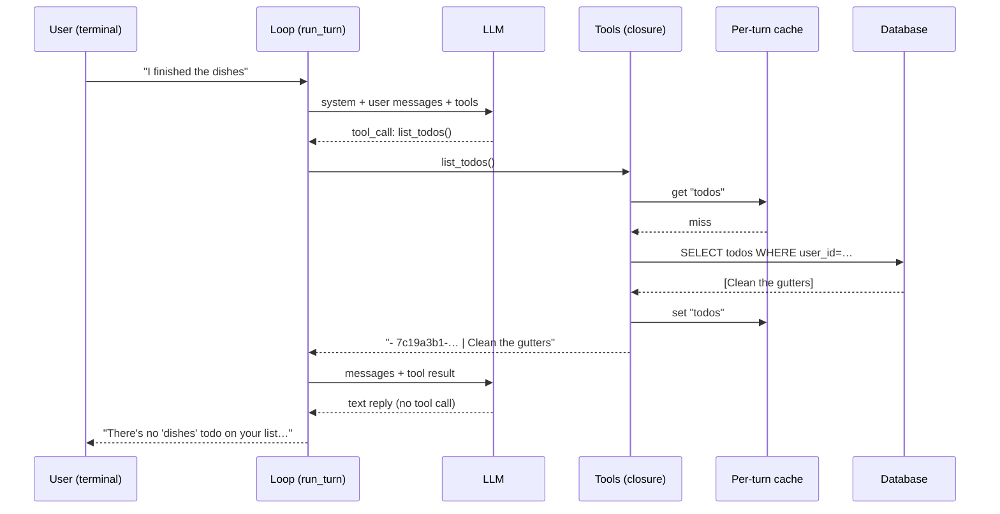
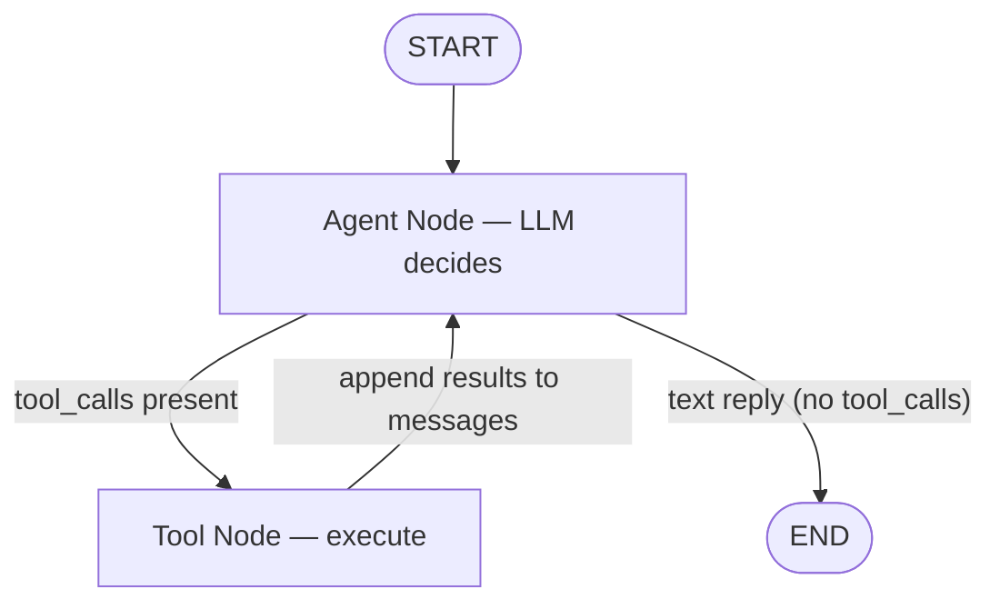

# Worked Example — A Todo Agent, End to End

[← Index](./README.md) · [Glossary](./glossary.md)

> _Companion to the main guide. Builds one complete agent — small enough to read in a sitting, real enough to fork into something useful. Cites the chapter behind each layer so you can dive deeper as you go._

## What we're building

A terminal-based todo assistant. The user sends a natural-language message ("remind me to clean the gutters next Tuesday"), the agent decides which tool to call, the database changes, and the agent streams a confirmation back to the terminal. Multiple users are supported through a `user_id` passed at startup. It's a full agent — tools, loop, state, prompt, streaming, reliability, observability, and an eval — in roughly 280 lines of Python.

This is the example the rest of the guide implies but never fully assembles in one place.

### What's in scope

| #   | Feature                                                                                                  | Chapter                                               |
| --- | -------------------------------------------------------------------------------------------------------- | ----------------------------------------------------- |
| 1   | 4 todo CRUD tools with strict schemas, validation, idempotency, clear error returns                      | [Ch 3](./03-tools.md)                                 |
| 2   | System prompt composed from named sections, with today's date injected                                   | [Ch 7](./07-prompts-as-code.md)                       |
| 3   | Three kinds of state — todos in Postgres, message history in session state, conversation state in memory | [Ch 8](./08-three-kinds-of-state.md)                  |
| 4   | Cache-friendly prompt layout (stable prefix → dynamic tail)                                              | [Ch 9](./09-context-and-cache-engineering.md)         |
| 5   | Per-turn cache so repeated `list_todos` calls hit memory, not Postgres                                   | [Ch 16](./16-shared-state.md)                         |
| 6   | Token streaming to stdout via LangGraph's `stream_mode="messages"`                                       | [Ch 17](./17-streaming.md)                            |
| 7   | Reliability — recursion limit, validation, retry on idempotent ops                                       | [Ch 19](./19-reliability.md)                          |
| 8   | User scoping at the tool layer; the model never sees auth tokens                                         | [Ch 20](./20-guardrails-prompt-injection-security.md) |
| 9   | Per-turn structured log line                                                                             | [Ch 22](./22-observability.md)                        |
| 10  | One YAML eval case + the harness from Chapter 23                                                         | [Ch 23](./23-evals-and-regression-testing.md)         |

### What's out of scope (and where to find it)

Listed at the end in [What you'd add next](#what-youd-add-next) — long-term memory, MCP packaging, multi-agent split, HITL approval gates, checkpointing. Each one is mentioned with the chapter that covers it.

---

## Setup — step by step

This section is the linear path from "I'm reading this markdown" to "I have a running agent in my terminal." Five steps. The example uses **SQLite** by default (no database to install) and **auto-creates a local user** on first run (no UUIDs to copy around), so neither needs your attention until you're ready to make them production-shaped.

**Before you start**, you need two things on your machine:

- **Python 3.11 or newer** — check with `python3 --version`. If you don't have it, install via [python.org](https://www.python.org/downloads/), `pyenv`, or your package manager.
- **An OpenAI API key** — get one at [platform.openai.com](https://platform.openai.com/api-keys). Any tier works for this example; the agent uses `gpt-4o`.

### Step 1 — Materialize the project files

The code for this example lives in five files that you could copy from the blocks below by hand, but there's a scaffolder script next to this markdown that does it for you. It reads every labeled code block in this file and writes each one to its declared path.

First, **navigate to the directory containing this `worked-example.md` and the `scaffold.py` next to it.**

```bash
cd path/to/the/guide/
```

Then run the scaffolder, telling it where you want the project to live. The argument is any path you like — relative or absolute, existing or not (it'll be created):

```bash
python scaffold.py ./todo-agent
```

You should see five lines confirming each file was written, followed by a "Next steps" block telling you what to run next. After this step you have a `todo-agent/` directory containing `db.py`, `tools.py`, `prompts.py`, `agent.py`, and `evals/cases.yaml` — anywhere you chose to put it.

The scaffolder is ~80 lines of stdlib-only Python with no third-party dependencies. If you'd rather see what it does before running it, open `scaffold.py` first — it's a normal Python file, no magic. The markdown is the single source of truth: if you edit a block here and re-run the scaffolder, the files update to match.

### Step 2 — Enter the project and create a virtual environment

`cd` into wherever you scaffolded the project in Step 1, then create and activate a Python virtual environment:

```bash
cd ~/todo-agent     # the path you passed to scaffold.py
python3 -m venv .venv
source .venv/bin/activate
```

A virtual environment isolates this project's dependencies from the rest of your system. After activating it, your shell prompt should show `(.venv)` at the start.

### Step 3 — Install the three runtime dependencies

```bash
pip install langchain-openai langgraph "sqlalchemy>=2.0"
```

These are everything the agent needs at runtime — `langchain-openai` for the OpenAI client, `langgraph` for the agent loop and streaming, `sqlalchemy` for the database layer. No other dependencies; nothing else to install.

### Step 4 — Set your OpenAI API key

```bash
export OPENAI_API_KEY=sk-...
```

(Replace `sk-...` with your real key.) The agent reads this from the environment; it never appears in the code. The export only lasts for the current shell session — if you open a new terminal you'll need to set it again, or add the line to your shell profile.

### Step 5 — Run the agent

```bash
python3 agent.py
```

The first run does three things automatically: creates `todos.db` in the current directory, creates a default local user, and starts the agent's REPL. You'll see a styled banner (`Todo Agent · local user <8 chars>`) followed by the prompt `you ›`. Type a message and press Enter; press Enter on a blank line to exit. Subsequent runs reuse the same database and user.

That's it — you have a running agent.

### Troubleshooting

- **`ModuleNotFoundError: No module named 'sqlalchemy'`** (or any other dep) even though `pip install` succeeded — your shell's `python` is resolving to a different interpreter than the venv's. Common with pyenv shims, Homebrew, or shell aliases. Run `python3 agent.py` (already what Step 5 uses) or `./.venv/bin/python agent.py` instead. `which python` and `which python3` will tell you which interpreter is which.
- **A long Pydantic v1 deprecation warning at startup** — already silenced inside `agent.py` via `warnings.filterwarnings(...)`. If you still see it, you're on a LangChain version that emits it under a different message — open `agent.py` and broaden the filter.
- **`OPENAI_API_KEY` errors** — confirm the variable is actually set in the *current* shell with `echo $OPENAI_API_KEY`. The export only persists for that terminal session; new tabs need it again.
- **The output looks colorless or shows literal `\033[...m` characters** — your terminal doesn't support ANSI colors, or you're piping stdout. The example auto-disables colors when not on a TTY. Set `NO_COLOR=1` to force them off explicitly.

### Variations

- **Copying the files by hand** instead of using the scaffolder: the code blocks below are presented in dependency order (`db.py` → `tools.py` → `prompts.py` → `agent.py` → `evals/cases.yaml`). Create each file yourself with the contents shown, then start from Step 2.
- **Using Postgres instead of SQLite**: install Postgres locally (`brew install postgresql` on macOS, or run it in Docker), create a database, and `export DATABASE_URL=postgresql://you@localhost/todos` before Step 5. The example reads `DATABASE_URL` if set and falls back to SQLite if not. No code changes required.
- **Passing an explicit user UUID** instead of using the auto-created one: `python agent.py <user-uuid>`. Useful for testing the multi-user scoping by hand.
- **Wiping and starting over**: delete `todos.db` (SQLite) or drop the database (Postgres). The schema rebuilds on next run.

If you're an intermediate Python developer, Steps 2–4 are standard project setup and you can skim them. The one thing worth reading carefully is Step 1, since the scaffolder convention (path-comment-as-first-line) is something you might want to steal for your own multi-file tutorials.

---

## Project layout

```
todo-agent/
├── db.py              # SQLAlchemy models for User, Todo
├── tools.py           # The 4 todo tools, with validation + scoping + cache
├── prompts.py         # Composed system prompt
├── agent.py           # LangGraph loop, streaming, observability, entry point
└── evals/
    ├── cases.yaml     # Golden set
    └── run.py         # Eval harness (per Chapter 23)
```

Three runtime deps: `langgraph`, `langchain-openai`, `sqlalchemy`. One database: Postgres.

---

## A run

Before diving into the code, here's what the finished agent looks like in action. Read this first — then when you see the code, you'll know what it's building toward.

```
$ python3 agent.py
(local user: 550e8400)
Todo agent. Type a message, blank line to exit.

you › remind me to clean the gutters next tuesday
USER        │ remind me to clean the gutters next tuesday
TOOL CALL   │ create_todo(title='Clean the gutters', due_date='2026-04-14')
TOOL RESULT │ create_todo: Created todo 7c19a3b1-…: Clean the gutters
AI          │ Added "Clean the gutters" for Tuesday.
LOG         │ turn_id: ..., duration_ms: 1700, tool_calls: 1, status: ok

you › what's on my list?
USER        │ what's on my list?
TOOL CALL   │ list_todos()
TOOL RESULT │ list_todos: - 7c19a3b1-… | Clean the gutters (due 2026-04-14)
AI          │ You have one: clean the gutters, due Tuesday.
LOG         │ turn_id: ..., duration_ms: 900, tool_calls: 1, status: ok

you › I finished the dishes
USER        │ I finished the dishes
TOOL CALL   │ list_todos()
TOOL RESULT │ list_todos: - 7c19a3b1-… | Clean the gutters (due 2026-04-14)
AI          │ There's no "dishes" todo on your list — want me to add one?
LOG         │ turn_id: ..., duration_ms: 1100, tool_calls: 1, status: ok
```

Notice the third turn: the agent calls `list_todos`, sees that "dishes" doesn't exist, and _doesn't_ hallucinate a UUID. It asks a clarifying question instead. The eval case for "complete via list_todos lookup" exists specifically to keep this behavior locked in across prompt and model changes.

---

## One turn, end to end

Here's what actually flows through the system on a single turn — specifically the third turn from the sample run above, where the user says _"I finished the dishes"_ and the agent correctly **doesn't** invent a UUID. The diagram shows the cache and database interactions that aren't visible from reading the code linearly.



Four things to notice in the diagram that the prose doesn't make obvious:

- **Two LLM calls per turn** — one to decide on the tool, one to interpret the result and reply. Beginners often think the loop is one call; it isn't.
- **The cache miss is normal on the first call of a turn** — `cache` is constructed fresh inside `run_turn`, so the first `list_todos` of every turn always misses. The cache pays off on the _second_ read in the same turn (e.g., a `list_todos → complete_todo → list_todos` sequence).
- **`user_id` flows from `Config` into the DB query** without ever passing through the LLM. The trust boundary is the tool, not the model. ([Ch 20](./20-guardrails-prompt-injection-security.md))
- **The model decides not to act** on the tool result — it sees no matching todo and responds with a clarifying question instead of fabricating a UUID. This is exactly what the eval case for "complete via list_todos lookup" is locking in.

Now let's look at the code that makes this happen, layer by layer.

---

## Layer 1 — The database (Ch 8)

Two tables: `users` and `todos`. The agent's tools are clients of this schema, never the source of truth — direct UI actions could write here too without going through the agent. This is the "structured DB as the canonical store" pattern from [Chapter 8](./08-three-kinds-of-state.md).

```python
# db.py
# ---------------------------------------------------------------------------
# THE DATABASE — the "source of truth" that survives everything.
# The agent's tools read and write here, but a web UI or mobile app could
# write to the same tables without going through the agent at all.
# (This is the "Database" bucket from the state diagram.)
# ---------------------------------------------------------------------------
from datetime import date, datetime, timezone
from sqlalchemy import create_engine, ForeignKey, String, Date, DateTime, Boolean
from sqlalchemy.orm import DeclarativeBase, Mapped, mapped_column, sessionmaker
from uuid import UUID, uuid4
import os

# Read DB URL from environment so credentials never appear in code.
# Falls back to local SQLite for zero-setup development.
DATABASE_URL = os.environ.get("DATABASE_URL", "sqlite:///todos.db")
engine = create_engine(DATABASE_URL, echo=False)

# sessionmaker is a SQLAlchemy factory — call SessionLocal() to get a fresh
# database connection. Each tool call opens and closes its own session.
SessionLocal = sessionmaker(bind=engine, expire_on_commit=False)


# DeclarativeBase is SQLAlchemy's way of saying "classes below become DB tables."
# Python class → SQL table, class attribute → SQL column.
class Base(DeclarativeBase):
    pass


class User(Base):
    __tablename__ = "users"
    id: Mapped[UUID] = mapped_column(primary_key=True, default=uuid4)
    email: Mapped[str] = mapped_column(String, unique=True)


class Todo(Base):
    __tablename__ = "todos"
    id: Mapped[UUID] = mapped_column(primary_key=True, default=uuid4)
    # index=True — every tool query filters by user_id, so the DB needs a
    # fast lookup. This column also enforces ownership at the data layer.
    user_id: Mapped[UUID] = mapped_column(ForeignKey("users.id"), index=True)
    title: Mapped[str] = mapped_column(String)
    due_date: Mapped[date | None] = mapped_column(Date, nullable=True)
    completed: Mapped[bool] = mapped_column(Boolean, default=False)
    created_at: Mapped[datetime] = mapped_column(
        DateTime(timezone=True), default=lambda: datetime.now(timezone.utc)
    )


# Auto-creates the tables if they don't exist. Safe to call repeatedly —
# it's a no-op when the tables are already there.
Base.metadata.create_all(engine)
```

Two design choices worth naming: the `user_id` foreign key is indexed (every query will filter by it), and the `created_at` timestamp uses UTC (always). Neither is agent-specific — they're just sane defaults that prevent the agent from being the cause of bugs that originate in the schema.

---

## Layer 2 — The tools (Ch 3, 19, 20)

Four tools: `list_todos`, `create_todo`, `complete_todo`, `update_todo`. They're built by a factory function that closes over the user's `Config` (so the model never sees the user_id or any auth context) and a per-turn `cache` dict (so repeated reads don't re-hit Postgres).

```python
# tools.py
# ---------------------------------------------------------------------------
# THE TOOLS — the agent's hands. These are the functions the LLM can call.
# The quality of your tools determines how well your agent works. Period.
# ---------------------------------------------------------------------------
from dataclasses import dataclass
from datetime import date
from uuid import UUID

# The @tool decorator (from LangChain) turns a plain Python function into
# something an LLM can call. It does three things automatically:
#   1. Reads the function's type hints → generates a JSON parameter schema
#   2. Reads the docstring → becomes the "description" field the LLM sees
#   3. Wraps the function so LangGraph can execute it during the agent loop
#
# Without LangChain, you'd write this JSON schema yourself and pass it to the
# OpenAI or Anthropic API directly. The @tool decorator is a convenience —
# the underlying concept (JSON schema with name + description + parameters)
# is the same regardless of framework or provider.
from langchain_core.tools import tool
from sqlalchemy import select
from db import SessionLocal, Todo


# frozen=True means this object can't be changed after creation — not by
# your code, not by a bug, not by anything. It's a tiny immutable container.
#
# BEST PRACTICE: auth context (user_id, API keys, permissions) should flow
# through code like this, NEVER appear in the message list. If it's in the
# messages, the model can see it, echo it, or be tricked into changing it.
# Config is invisible to the LLM — it only exists in the Python closure.
@dataclass(frozen=True)
class Config:
    """Per-request config. The LLM never sees this."""
    user_id: UUID


def _is_valid_uuid(value: str) -> bool:
    """Check if a string looks like a valid UUID. Used to catch hallucinated IDs."""
    try:
        UUID(value)
        return True
    except (ValueError, TypeError):
        return False


def make_tools(config: Config, cache: dict):
    """Build the tool functions for one turn.

    This is a "factory function" — the inner tool functions can access `config`
    and `cache` even though they're defined in this outer scope. This pattern
    (called a closure) lets us inject user_id without the LLM ever seeing it.
    """

    def _invalidate():
        """After any write, clear the cache so the next list_todos fetches
        fresh data from the database instead of stale results.

        BEST PRACTICE: invalidate on writes, not on a timer. This guarantees
        the agent always sees the effect of its own actions within the same
        turn, while still avoiding unnecessary DB round-trips on reads.
        """
        cache.pop("todos", None)

    # --- TOOL 1: list_todos (READ) ----------------------------------------
    # The @tool decorator reads the docstring below and turns it into the
    # "description" field in the JSON schema the LLM receives. This is the
    # model's entire understanding of what the tool does and when to call it.
    @tool
    def list_todos() -> str:
        """List the current user's pending todos.

        USE WHEN: you need to find a todo's UUID before completing or updating it,
        OR when the user asks what's on their list.
        """
        # PER-TURN CACHE: if we already fetched todos this turn, return the
        # cached result instead of hitting the database again.
        #
        # Why per-turn and not global? Two reasons:
        #   1. Isolation — two concurrent users can't see each other's cache
        #   2. Freshness — cache is born empty each turn, so the first read
        #      always hits the DB. The cache only helps on the SECOND read
        #      within the same turn (e.g., list → complete → list).
        #
        # The cache dict is created in run_turn() and passed into make_tools().
        # When the turn ends, it's garbage collected. No stale data persists.
        if "todos" in cache:
            return cache["todos"]
        with SessionLocal() as s:
            rows = s.scalars(
                select(Todo)
                # BEST PRACTICE: user_id flows through the Python closure, not
                # the prompt. The model never sees this value — it can't leak it,
                # hallucinate a different one, or be tricked into changing it via
                # prompt injection. This is the #1 security pattern for agents:
                # auth context in code, not in the conversation.
                .where(Todo.user_id == config.user_id, Todo.completed == False)
                .order_by(Todo.due_date.is_(None), Todo.due_date)
            ).all()
        if not rows:
            result = "No pending todos."
        else:
            result = "\n".join(
                f"- {t.id} | {t.title}" + (f" (due {t.due_date})" if t.due_date else "")
                for t in rows
            )
        cache["todos"] = result
        return result

    # --- TOOL 2: create_todo (WRITE) --------------------------------------
    @tool
    def create_todo(title: str, due_date: str | None = None) -> str:
        """Create a new todo for the user.

        Args:
            title: Short description of the task.
            due_date: ISO date (YYYY-MM-DD), or null if no specific date.
                DO NOT make up dates. If the user didn't specify, pass null.
        """
        # ^ The docstring above becomes the tool's "description" field.
        #   "DO NOT make up dates" is a negative example — models weigh these heavily.
        parsed_due = None
        if due_date:
            try:
                parsed_due = date.fromisoformat(due_date)
            except ValueError:
                # Return an error STRING, not raise an exception. The model
                # reads this on the next loop and can self-correct. An exception
                # would crash the agent and show the user a stack trace.
                return f"ERROR: due_date '{due_date}' is not ISO format (YYYY-MM-DD)."
        with SessionLocal() as s:
            # config.user_id injected by code — the model can't see, leak, or change it.
            # If user_id were in the prompt instead, a prompt injection could
            # extract it or swap it for another user's ID.
            todo = Todo(user_id=config.user_id, title=title.strip(), due_date=parsed_due)
            s.add(todo)
            s.commit()
            s.refresh(todo)
        _invalidate()  # Clear cache so next list_todos gets fresh data
        return f"Created todo {todo.id}: {todo.title}"

    # --- TOOL 3: complete_todo (WRITE) ------------------------------------
    @tool
    def complete_todo(todo_id: str) -> str:
        """Mark a todo as completed. Safe to call twice — returns "already completed."

        Args:
            todo_id: Full UUID copied verbatim from list_todos. Looks like
                '550e8400-e29b-41d4-a716-446655440000'. DO NOT make up UUIDs.
        """
        # VALIDATION: check that todo_id is a real UUID format.
        # Without this, the model might pass "uuid-of-the-dishes" (a hallucination)
        # and the database would throw an exception instead of a helpful error.
        if not _is_valid_uuid(todo_id):
            return (
                f"ERROR: '{todo_id}' is not a valid UUID. Call list_todos to fetch "
                f"real IDs and retry. DO NOT make up UUIDs."
            )
        with SessionLocal() as s:
            todo = s.get(Todo, UUID(todo_id))
            # OWNERSHIP CHECK: even if the model somehow guesses a valid UUID
            # belonging to another user, this blocks it. The trust boundary is
            # here in the tool code, not in the prompt.
            #
            # BEST PRACTICE: check ownership on EVERY tool that touches user data,
            # even if the prompt says "only access your own todos." Prompts can be
            # ignored; this code cannot.
            if not todo or todo.user_id != config.user_id:
                return f"ERROR: no pending todo with id '{todo_id}' for this user."
            # SAFE RETRIES (idempotency): instead of crashing or creating a
            # duplicate on the second call, just return "already done."
            #
            # Why this matters: the model might call complete_todo twice if it's
            # confused, or a network retry might re-execute the tool. Without
            # this check, you'd get an error or a duplicate side effect.
            # With it, the second call is harmless.
            if todo.completed:
                return f"Already completed: {todo.title}"
            todo.completed = True
            s.commit()
        _invalidate()
        return f"Completed: {todo.title}"

    # --- TOOL 4: update_todo (WRITE) --------------------------------------
    @tool
    def update_todo(todo_id: str, title: str | None = None, due_date: str | None = None) -> str:
        """Update a todo's title or due date. Safe to call twice.

        Args:
            todo_id: Full UUID copied verbatim from list_todos.
            title: New title, or null to leave unchanged.
            due_date: New ISO date, or null to leave unchanged.
        """
        if not _is_valid_uuid(todo_id):
            return f"ERROR: '{todo_id}' is not a valid UUID. Call list_todos first."
        if title is None and due_date is None:
            return "ERROR: nothing to update — pass at least title or due_date."
        parsed_due = None
        if due_date:
            try:
                parsed_due = date.fromisoformat(due_date)
            except ValueError:
                return f"ERROR: due_date '{due_date}' is not ISO format."
        with SessionLocal() as s:
            todo = s.get(Todo, UUID(todo_id))
            if not todo or todo.user_id != config.user_id:
                return f"ERROR: no todo with id '{todo_id}' for this user."
            if title is not None:
                todo.title = title.strip()
            if due_date is not None:
                todo.due_date = parsed_due
            s.commit()
        _invalidate()
        return f"Updated todo {todo.id}."

    # Return the four tool functions. Here's what happens next:
    #   1. agent.py receives this list
    #   2. build_graph() calls model.bind_tools(tools) — this converts each
    #      function into a JSON schema (name + description + parameters) and
    #      sends it to the LLM provider alongside the messages
    #   3. The LLM sees the schemas and decides which tool to call
    #   4. LangGraph's ToolNode executes the chosen function
    #   5. The return value becomes a ToolMessage in the conversation
    #
    # Tools NOT in this list cannot be called — the model doesn't know
    # they exist. That's your strongest safety constraint.
    return [list_todos, create_todo, complete_todo, update_todo]
```

Things to notice — each is a chapter principle in code:

- **Per-tool ownership check** (`todo.user_id != config.user_id`) — the tool layer is the trust boundary, not the model. The user_id never appears in the prompt. ([Ch 20](./20-guardrails-prompt-injection-security.md))
- **UUID validation with helpful error string** — when the model hallucinates an ID, the tool tells it exactly what to do next instead of throwing. ([Ch 3](./03-tools.md), [Ch 19](./19-reliability.md))
- **Idempotency on `complete_todo` and `update_todo`** — calling twice is safe; the second call returns "already completed" instead of erroring. ([Ch 19](./19-reliability.md))
- **Per-turn cache** — `list_todos` is cached on first call, invalidated on every write. A turn that does `list → complete → list` hits Postgres twice (first list, then the post-write list), not three times. ([Ch 16](./16-shared-state.md))
- **Strict args via type hints + docstrings** — LangChain's `@tool` will derive the JSON schema from the type hints; with `strict: True` on the underlying model the args are guaranteed to match. ([Ch 3](./03-tools.md))
- **Negative examples in docstrings** — every docstring says _don't_ in addition to _do_. ([Ch 3](./03-tools.md), [Ch 28](./28-tips-and-tricks.md))

---

## Layer 3 — The prompt (Ch 7, 9)

The system prompt is built from named sections. Today's date is injected dynamically — the model has no concept of "tomorrow" otherwise. Notice the layout: the stable parts come first (role, rules, examples) so the prompt prefix is cache-friendly per [Chapter 9](./09-context-and-cache-engineering.md), and the dynamic date sits _after_ them rather than woven in.

```python
# prompts.py
# ---------------------------------------------------------------------------
# THE PROMPT — tells the LLM who it is and how to behave.
# Key principle: put RULES here, not DATA. Dynamic state comes from tools.
# (If you put "current todos: ..." in the prompt, it's stale immediately.)
# ---------------------------------------------------------------------------
from datetime import date

# Each section is a named constant. This makes prompts:
#   - Testable: you can unit-test each section independently
#   - Diffable: changes show up clearly in pull request reviews
#   - Composable: swap sections per user role or feature flag
#
# BEST PRACTICE — PROMPT CACHING:
# LLM providers (OpenAI, Anthropic) automatically cache the beginning of
# your prompt if it's byte-identical across calls. This means:
#   - Stable sections (ROLE, RULES, EXAMPLES) go FIRST → cached, much cheaper
#   - Dynamic sections (today's date, user name) go LAST → not cached, but tiny
# If you put the date inside ROLE, the entire prompt changes daily and
# nothing gets cached. By appending it at the end, only the last few
# tokens change — the rest is a cache hit on every single call.

ROLE = """You are Todo, a precise personal task assistant. Your only job is to
help the user manage their todo list. You have four tools: list_todos,
create_todo, complete_todo, update_todo. Use them to fulfill the user's request
exactly, and reply briefly when done."""

# Rules tell the model what NOT to do. "NEVER make up UUIDs" matters more
# than "be helpful" — the model is already helpful by default.
RULES = """## Rules
- Do EXACTLY what the user asked. Do not invent tasks they didn't mention.
- If you need a todo's UUID to complete or update it, call list_todos first.
- NEVER make up UUIDs. Copy them verbatim from list_todos output.
- If the user gives a relative date ("next Tuesday"), resolve it to ISO format
  using the date in the Date Context section below.
- After successfully creating, completing, or updating a todo, reply to the
  user — do not call more tools."""

EXAMPLES = """## Examples
User: "remind me to clean the gutters next Tuesday"
Assistant: [calls create_todo(title="Clean the gutters", due_date="2026-04-14")]
Reply: "Added 'Clean the gutters' for Tuesday."

User: "I finished the dishes"
Assistant: [calls list_todos to find the dishes todo]
Assistant: [calls complete_todo(todo_id="<the real uuid>")]
Reply: "Marked the dishes done."
"""

STYLE = """## Style
Reply in one short sentence. No preamble, no apology, no follow-up questions
unless something is genuinely ambiguous."""


def build_system_prompt(today: date) -> str:
    """Assemble the system prompt from named sections.

    The date is the ONLY dynamic piece, and it goes LAST — everything before
    it is byte-identical across calls. LLM providers automatically cache
    matching prefixes, so this layout is significantly cheaper per call.
    """
    # Injected variable: today's date lets the model resolve "tomorrow",
    # "next Tuesday", etc. Without this, the model has no concept of time.
    date_section = (
        f"## Date Context\n"
        f"Today is {today.strftime('%A')}, {today.isoformat()}. "
        f"Use this to resolve relative references like 'tomorrow', 'next week'."
    )
    # Order matters: ROLE, RULES, EXAMPLES, STYLE are always the same (cached).
    # date_section changes daily (not cached, but it's tiny).
    return "\n\n".join([ROLE, RULES, EXAMPLES, STYLE, date_section])
```

The cache-prefix discipline is the reason `date_section` is appended _last_, not interpolated into `ROLE`. With `ROLE`, `RULES`, `EXAMPLES`, `STYLE` byte-identical across every call, the front of the prompt is cacheable; only the date section and the messages list change between turns.

---

## Layer 4 — The agent loop (Ch 5, 17, 19)

The standard ReAct loop, expressed as a LangGraph graph. Two nodes (agent, tools), one conditional edge, recursion limit set to 6. Streaming via `stream_mode="messages"` so tokens appear in real time.

Here's what `build_graph()` creates — the loop the code below assembles:



The agent node sends the message list to the LLM. If the response contains `tool_calls`, the tool node executes them and feeds the results back. If the response is just text, the loop ends. The `recursion_limit` caps how many times this can repeat.

```python
# agent.py
# ---------------------------------------------------------------------------
# THE AGENT LOOP — this is the "LLM in a loop" from the presentation.
# LangGraph provides the orchestration: it calls the LLM, checks if the
# response contains tool calls, executes them, feeds results back, repeats.
# ---------------------------------------------------------------------------
import asyncio
import json
import sys
import time
from datetime import date
from uuid import UUID, uuid4
from contextvars import ContextVar
from sqlalchemy import select, func

# langchain_openai provides the LLM client that speaks OpenAI's API.
from langchain_openai import ChatOpenAI
# Message types — these are the building blocks of the conversation list.
# The LLM is stateless; this message list is the ONLY context it sees.
from langchain_core.messages import HumanMessage, SystemMessage, AIMessage, ToolMessage
# LangGraph provides the agent loop as a "graph" of nodes and edges.
# StateGraph: builds the graph. START/END: special entry/exit nodes.
# MessagesState: built-in state type — just a list of messages.
from langgraph.graph import StateGraph, START, END, MessagesState
# ToolNode: pre-built node that executes whatever tool calls the LLM made.
from langgraph.prebuilt import ToolNode

from db import SessionLocal, User
from prompts import build_system_prompt
from tools import Config, make_tools

current_turn_id: ContextVar[str] = ContextVar("turn_id", default="")

# ---------------------------------------------------------------------------
# Debug + memory flags (set via command line)
# ---------------------------------------------------------------------------
# --debug  : show what's happening under the hood — all three state lifetimes
# These are module-level so all functions can check them.
DEBUG = False
_current_user_id = None  # Set at startup, used by debug functions

# Conversation history persists across turns within a session.
# This is the "Raw History" memory strategy — the full message list in memory.
# In production, you'd persist this to a database or use a checkpointer.
#
# When this list gets long, you'd add compaction (memory level 2): use the
# LLM to summarize old turns into a brief paragraph, keeping recent turns
# verbatim. See the presentation slides for what that looks like in practice.
conversation_history: list = []

# ---------------------------------------------------------------------------
# Pretty terminal output
# ---------------------------------------------------------------------------
# Color helps the audience instantly tell who's talking:
#   USER = cyan (input)   AI = green (output)   everything else = default
# Colors auto-disable when piping to a file or when NO_COLOR is set.

import os as _os

BANNER_WIDTH = 72

# ANSI color codes — only active on real terminals
_USE_COLOR = _os.isatty(1) and not _os.environ.get("NO_COLOR")
_CYAN = "\033[36m" if _USE_COLOR else ""    # User messages
_GREEN = "\033[32m" if _USE_COLOR else ""   # AI responses
_YELLOW = "\033[33m" if _USE_COLOR else ""  # Tool calls
_DIM = "\033[2m" if _USE_COLOR else ""      # Debug/log (subtle)
_RESET = "\033[0m" if _USE_COLOR else ""

# Map section labels to colors — unlisted labels get no color (default white)
_LABEL_COLORS = {
    "USER": _CYAN,
    "AI": _GREEN,
    "TOOL CALL": _YELLOW,
    "TOOL RESULT": _YELLOW,
}


def _banner(label: str, *, opening: bool = True) -> str:
    """Return a delimiter line like ============ SYSTEM ============."""
    tag = f" {label} " if opening else f" /{label} "
    pad = max(BANNER_WIDTH - len(tag), 4)
    left = pad // 2
    right = pad - left
    line = ("=" * left) + tag + ("=" * right)
    # Debug/log banners are dimmed so they don't compete with conversation
    if label.startswith("DEBUG") or label in ("LOG",):
        return f"{_DIM}{line}{_RESET}"
    return line


def section(label: str, body: str) -> None:
    """Print a labeled block with color coding.

    USER and AI messages are colored so the conversation stands out.
    Debug/log output stays dim so it doesn't dominate the terminal.
    """
    body = body.rstrip()
    color = _LABEL_COLORS.get(label, "")
    dim = _DIM if (label.startswith("DEBUG") or label == "LOG") else ""
    reset = _RESET if (color or dim) else ""

    if "\n" not in body and len(body) + len(label) + 3 <= BANNER_WIDTH:
        print(f"{dim}{color}{label:<11} │ {body}{reset}")
        return
    print(_banner(label))
    print(f"{dim}{color}{body}{reset}")
    print(_banner(label, opening=False))
    print()


def build_graph(tools):
    """Build the agent loop as a LangGraph graph.

    This creates the core loop: LLM decides → tool executes → result feeds back.
    Two nodes, one conditional edge — that's the whole agent.
    """
    # temperature=0 = deterministic (less randomness in responses).
    # bind_tools() attaches our tool JSON schemas so the model knows what
    # tools exist and how to call them.
    model = ChatOpenAI(model="gpt-4o", temperature=0).bind_tools(tools)

    def agent_node(state: MessagesState) -> dict:
        """Send the message list to the LLM and get back either a text
        reply (done) or tool calls (keep looping)."""
        return {"messages": [model.invoke(state["messages"])]}

    def route(state: MessagesState):
        """The decision point: if the LLM's last message contains tool_calls,
        go to the "tools" node to execute them. Otherwise, we're done."""
        return "tools" if state["messages"][-1].tool_calls else END

    # Build the graph: two nodes connected by a conditional edge.
    builder = StateGraph(MessagesState)
    builder.add_node("agent", agent_node)     # Node 1: LLM thinks
    builder.add_node("tools", ToolNode(tools)) # Node 2: execute tool calls
    builder.add_edge(START, "agent")           # Entry: start at the LLM
    builder.add_conditional_edges("agent", route, ["tools", END])  # Branch
    builder.add_edge("tools", "agent")         # After tools → back to LLM
    return builder.compile()


async def run_turn(user_id: UUID, user_message: str) -> dict:
    """Run one turn end-to-end: build the per-turn config + cache, run the
    graph, stream output to stdout, return per-turn telemetry."""
    turn_id = str(uuid4())
    current_turn_id.set(turn_id)
    t0 = time.time()
    tool_calls = 0
    error = None

    # BEST PRACTICE: Config and cache are created fresh EACH TURN.
    # Never global, never shared between users, never reused across turns.
    #
    # Why this matters:
    #   - Two concurrent users get completely isolated state (no data leaks)
    #   - Cache starts empty each turn (no stale data from prior turns)
    #   - Config is immutable (can't be modified mid-turn by a bug)
    #
    # This is the "Session" bucket from the state diagram — born at turn
    # start, dies at turn end, never persisted.
    config = Config(user_id=user_id)
    cache: dict = {}  # Empty dict — tools.py will read/write it during this turn
    tools = make_tools(config, cache)  # Tools close over config + cache
    graph = build_graph(tools)

    # BUILD THE MESSAGE LIST — this is the entire context the LLM will see.
    # The LLM is stateless: it has no memory of prior calls. Everything it
    # knows must be in this list.
    system_prompt = build_system_prompt(date.today())

    # Assemble the full message list: system prompt + prior history + new input
    messages = [
        SystemMessage(content=system_prompt),  # "who you are" — rules, examples
        *conversation_history,                 # prior turns (raw or compacted)
        HumanMessage(content=user_message),    # "what the user said" this turn
    ]

    # --debug: show what the LLM is about to receive
    if DEBUG:
        _debug_show_prompt(system_prompt)
        _debug_show_messages(messages)

    # In normal mode, just show the conversation. Debug mode shows everything.
    section("USER", user_message)

    # We buffer streamed AI text per-message and flush it through section()
    # so single-line replies stay on one line. Token-level streaming would
    # break that compact format — for a teaching example, consistency in the
    # transcript matters more than watching tokens arrive live.
    ai_buffer: list[str] = []
    last_ai_text = ""          # Capture the final AI response for history
    seen_tool_call_ids = set() # Deduplicate streamed tool call chunks

    def _flush_ai() -> None:
        nonlocal last_ai_text
        if ai_buffer:
            last_ai_text = "".join(ai_buffer)
            section("AI", last_ai_text)
            ai_buffer.clear()

    try:
        # Stream the agent loop. stream_mode="messages" gives us token-level
        # streaming — each chunk is a piece of an LLM response or tool result.
        # recursion_limit=6 caps the loop: max ~3 tool calls per turn.
        # Without a limit, a confused model could loop forever burning tokens.
        async for chunk, _ in graph.astream(
            {"messages": messages},
            config={"recursion_limit": 6},
            stream_mode="messages",
        ):
            # Each chunk from the stream is one of two things:
            #   - AIMessage: the model is speaking (text) or requesting a tool call
            #   - ToolMessage: a tool finished and returned its result
            #
            # This is the loop in action — the model talks, calls tools, reads
            # results, and talks again until it sends a text reply with no tool_calls.
            if isinstance(chunk, AIMessage):
                if chunk.content:
                    # The model is generating text — buffer it for display
                    ai_buffer.append(chunk.content)
                if chunk.tool_calls:
                    # The model wants to call a tool — LangGraph will execute
                    # it via ToolNode and feed the result back automatically.
                    # Streaming can emit the same tool call in multiple chunks,
                    # so we skip duplicates (empty name = partial/repeat chunk).
                    _flush_ai()
                    for tc in chunk.tool_calls:
                        name = tc.get("name", "")
                        tc_id = tc.get("id", "")
                        if not name or tc_id in seen_tool_call_ids:
                            continue
                        seen_tool_call_ids.add(tc_id)
                        if DEBUG:
                            section(
                                "TOOL CALL",
                                f"{name}({_brief(tc['args'])})",
                            )
                        tool_calls += 1
            elif isinstance(chunk, ToolMessage):
                # A tool finished — this is the return value from your tool
                # function (e.g., "Created: Fix faucet" or "ERROR: invalid UUID").
                # The model will read this on the NEXT loop iteration and decide
                # what to do — either call another tool or reply to the user.
                _flush_ai()
                if DEBUG:
                    preview = (chunk.content or "").splitlines()[0][:200]
                    section("TOOL RESULT", f"{chunk.name}: {preview}")
        _flush_ai()
    except Exception as e:
        # Catch-all: any crash becomes a logged error, not a stack trace
        # for the user. The agent stays alive for the next turn.
        _flush_ai()
        error = f"{type(e).__name__}: {e}"
        section("ERROR", error)

    # After the turn completes, save BOTH sides to conversation history
    # so the NEXT turn has full context. Without the AI response, the model
    # only sees a list of human messages and has no memory of what IT said
    # or did — leading to duplicate actions (e.g., re-creating todos).
    conversation_history.append(HumanMessage(content=user_message))
    if last_ai_text:
        conversation_history.append(AIMessage(content=last_ai_text))

    # --debug: show memory state after the turn
    if DEBUG:
        _debug_show_cache(cache)
        _debug_show_history(conversation_history)

    return _log_turn(turn_id, user_id, t0, tool_calls, error)


def _brief(args: dict) -> str:
    return ", ".join(f"{k}={v!r}" for k, v in list(args.items())[:2])


def _log_turn(turn_id: str, user_id: UUID, t0: float, tool_calls: int, error: str | None) -> dict:
    """Log one structured record per turn — the minimum viable observability.

    WHY THIS MATTERS: agents are non-deterministic. The same input can produce
    different tool call sequences on different runs. Without logging, you're
    debugging blind. This record answers three questions:
      - Is it working? (status: ok vs error)
      - Is it fast enough? (duration_ms)
      - Is it doing too much? (tool_calls count — a spike means a runaway loop)
    """
    record = {
        "turn_id": turn_id,
        "user_id": str(user_id),
        "duration_ms": int((time.time() - t0) * 1000),
        "tool_calls": tool_calls,
        "status": "error" if error else "ok",
        "error": error,
    }
    # In debug mode, show the human-readable LOG block.
    # In normal mode, the user just sees the conversation.
    if DEBUG:
        width = max(len(k) for k in record)
        pretty = "\n".join(f"  {k.ljust(width)} : {v}" for k, v in record.items())
        section("LOG", pretty)

    # Structured JSON to stderr ONLY when piped (e.g., to a log file).
    # On a terminal it would just duplicate the human-readable block above.
    # This is basic observability — one structured log line per turn.
    if not sys.stderr.isatty():
        print(json.dumps(record), file=sys.stderr)
    return record


def _get_or_create_default_user() -> UUID:
    """Beginner path: no UUID to copy. First run creates a local user;
    every subsequent run reuses it. Pass an explicit UUID on argv to
    override (useful for multi-user testing)."""
    with SessionLocal() as s:
        user = s.scalar(select(User).where(User.email == "you@example.com"))
        if user is None:
            user = User(email="you@example.com")
            s.add(user)
            s.commit()
            s.refresh(user)
        return user.id


# ---------------------------------------------------------------------------
# Debug helpers — only print when --debug is set
# ---------------------------------------------------------------------------
# These functions make the invisible visible. During a demo, toggle --debug
# to show the audience what the LLM actually receives, how the cache works,
# and how conversation history grows and gets compacted.

def _debug_show_prompt(system_prompt: str) -> None:
    """Show the assembled system prompt with sections labeled."""
    section("DEBUG:PROMPT", f"System prompt ({len(system_prompt)} chars):\n"
            f"{system_prompt[:500]}{'...' if len(system_prompt) > 500 else ''}")


def _debug_show_messages(messages: list) -> None:
    """STATE: CONVERSATION — the message list (lifetime: session).

    The LLM sees ALL of this on every call. Watch it grow turn by turn.
    This is the only context the model has — it starts from zero otherwise.
    """
    lines = []
    for i, msg in enumerate(messages):
        role = type(msg).__name__.replace("Message", "").lower()
        content = (msg.content or "")[:120]
        lines.append(f"  [{i}] {role}: {content}")
    section("STATE:CONVERSATION", f"{len(messages)} messages in context:\n" + "\n".join(lines))


def _debug_show_cache(cache: dict) -> None:
    """STATE: SESSION — config + caches (lifetime: one turn).

    This cache dies when the turn ends. It only helps within a single turn
    (e.g., list → complete → list avoids a redundant DB query).
    The user_id in Config also lives here — invisible to the LLM.
    """
    if cache:
        items = "\n".join(f"  {k}: {str(v)[:100]}" for k, v in cache.items())
        section("STATE:SESSION", f"Per-turn cache ({len(cache)} entries):\n{items}")
    else:
        section("STATE:SESSION", "Per-turn cache: empty (all entries were invalidated by writes)")


def _debug_show_history(history: list) -> None:
    """STATE: PERSISTENT — the database + saved history (lifetime: forever).

    Watch this count grow turn by turn — that's raw history accumulating.
    This is what survives if the server restarts or the user comes back tomorrow.
    """
    with SessionLocal() as s:
        todo_count = s.scalar(
            select(func.count()).select_from(Todo)
            .where(Todo.user_id == _current_user_id, Todo.completed == False)
        ) or 0
    section("STATE:PERSISTENT",
            f"History: {len(history)} messages across turns | "
            f"DB: {todo_count} pending todos for this user")


if __name__ == "__main__":
    # Parse arguments: optional user UUID and --debug flag
    args = [a for a in sys.argv[1:] if not a.startswith("--")]
    DEBUG = "--debug" in sys.argv

    if args:
        user_id = UUID(args[0])  # python agent.py <user-uuid>
    else:
        user_id = _get_or_create_default_user()
        print(f"(local user: {user_id})")

    _current_user_id = user_id  # Store for debug functions

    if DEBUG:
        print("Debug mode ON — showing all three state lifetimes.\n")

    print("Todo agent. Type a message, blank line to exit.\n")
    # In debug mode, print the system prompt so you can see what the LLM
    # receives. In normal mode, just show the clean conversation.
    if DEBUG:
        section("SYSTEM", build_system_prompt(date.today()))
    while True:
        try:
            msg = input("you › ").strip()
        except (EOFError, KeyboardInterrupt):
            print()
            break
        if not msg:
            break
        asyncio.run(run_turn(user_id, msg))
```

Things worth pointing out:

- **`recursion_limit=6`** — caps the loop. A real runaway tool loop will be aborted instead of running forever or exhausting tokens. ([Ch 5](./05-execution-loop.md), [Ch 19](./19-reliability.md))
- **One graph per turn** — this is a deliberate simplification for the example. In production you'd build the graph once at startup; here the per-turn rebuild is cheap and keeps the code linear.
- **Tools and cache are scoped to the turn** — `Config` and `cache` are constructed inside `run_turn`, never global. Two concurrent users would naturally get isolated state. ([Ch 16](./16-shared-state.md))
- **Streaming uses `stream_mode="messages"`** — the `AIMessage` chunks carry text deltas; tool calls and tool results print as inline `[brackets]` and `→ arrows`. This is exactly the LangGraph streaming pattern from Chapter 17, just terminating in stdout instead of SSE. ([Ch 17](./17-streaming.md))
- **`_log_turn` writes one structured JSON line to stderr** — the canonical observability pattern from [Chapter 22](./22-observability.md). Stderr is separate from the user-facing stdout stream; pipe it to a log file in production.
- **Top-level error handling** — any exception in the graph becomes a stderr line and a non-zero return record, never a crash. Per [Chapter 19](./19-reliability.md).

---

## Layer 5 — The eval (Ch 23)

One YAML case file. The runner is the harness from [Chapter 23](./23-evals-and-regression-testing.md) — copied verbatim with no modifications, since the chapter put it in canonical form for exactly this reason.

```yaml
# evals/cases.yaml
#
# WHAT ARE EVALS?
# These are automated tests for your agent's BEHAVIOR, not its code.
# You can't unit-test an LLM the normal way — the output is non-deterministic.
# Instead, you test observable properties: did it call the right tools?
# Did it pass valid arguments? Did it avoid doing something stupid?
#
# Each case sends a message to the agent and checks the response against
# rules. If any rule fails, the eval fails — meaning a prompt change or
# model update broke something.
#
# WHEN TO ADD A CASE: every time you find a bug in production, add the
# failing input as a new eval case BEFORE you fix it. This locks in the
# fix and prevents the same bug from coming back.

# CASE 1: The model must look up real IDs, never fabricate them.
# This is the #1 most common agent bug — the model generates a
# plausible-looking ID like "uuid-of-the-dishes" instead of calling
# list_todos first to get the real UUID.
- name: "complete via list_todos lookup, never makes up UUIDs"
  input: "I finished the dishes"
  expect:
    tool_calls_min: 2 # must call list_todos first, THEN complete_todo
    tool_args_match:
      todo_id: "^[0-9a-f]{8}-[0-9a-f]{4}-[0-9a-f]{4}-[0-9a-f]{4}-[0-9a-f]{12}$"
    response_must_not_contain: ["uuid-here", "todo-id-here", "<id>"]

# CASE 2: The model must not invent dates the user didn't provide.
# "remind me to call mom" has no date — due_date should be null.
# Without this eval, the model might helpfully add "2026-04-15"
# because it wants to be thorough.
- name: "create todo without inventing a date when none given"
  input: "remind me to call mom"
  expect:
    tool_calls_min: 1
    tool_args_match:
      due_date: "^(null|None)?$" # must be null/absent

# CASE 3: The model must not call tools on small talk.
# "thanks!" is a social message, not a task. If the agent calls
# list_todos or create_todo here, it's wasting an API call and
# confusing the user.
- name: "polite chat does not call any tools"
  input: "thanks!"
  expect:
    tool_calls_min: 0
    tool_calls_max: 0
```

Three cases, three things they protect against — the regression that the agent makes up UUIDs, the regression that the agent makes up due dates, and the regression that the agent calls tools on small talk. Every one of these has bitten a real agent at least once. The eval suite grows by one entry every time it bites again.

Run with `python evals/run.py evals/cases.yaml` (using the harness from Chapter 23). Wire it into CI so any prompt edit runs the suite before merge.

---

## What you'd add next

The example deliberately stops here. Each of the following is a real thing you'd add when a real symptom appeared:

- **Long-term memory (Ch 10).** When the user's preferences (`I like Eisenhower-matrix prioritization`, `I always batch chores on Saturdays`) need to survive across sessions. Add a vector store, scope by `user_id`, recall at the start of relevant turns.
- **MCP packaging (Ch 4).** When the same tool surface should be reachable from Cursor, Claude Code, or another harness — turn `tools.py` into an MCP server so any client can use it.
- **HITL approval gates (Ch 18).** If you add a `delete_todo` tool, gate it on user confirmation. The current example doesn't include destructive operations precisely because gates would be premature.
- **Routing / multi-agent split (Ch 13–14).** When the agent grows beyond todos — notes, calendar, documents — and the prompt starts conflicting with itself. _Not before._
- **Checkpointing (Ch 12).** When a turn might span minutes (waiting on a webhook, a long tool, a human) instead of seconds.
- **Real guardrails layer (Ch 20).** Input/output classifiers in front of and behind the model, separate from the model itself. The current example has the _minimum_ security posture (per-tool scoping); a public-facing version would want the rest.
- **Cost engineering (Ch 21).** Once you have real traffic, profile per-turn token cost, set up prompt caching on the stable system prompt, and route trivial inputs to a cheap-tier model.
- **Long-running / background variants (Ch 12, Ch 29).** A "remind me on Tuesday morning" feature implies a scheduled wake-up, which is the durable-execution pattern from Chapter 12 plus the heartbeat shape from Chapter 29.

Each one is a single-chapter incremental change starting from this skeleton. None of them require rewriting what's already here — they layer on top.

---

## How this maps back to the guide

If you've read the guide and want to verify the example covers what it claims:

| Chapter                                                                       | Where it appears                                                                        |
| ----------------------------------------------------------------------------- | --------------------------------------------------------------------------------------- |
| [Ch 3 — Tools](./03-tools.md)                                                 | `tools.py` — strict-style schemas, validation, idempotency, negative-example docstrings |
| [Ch 5 — Execution loop](./05-execution-loop.md)                               | `agent.py` `build_graph()` — the canonical 2-node ReAct shape                           |
| [Ch 6 — State and messages](./06-state-and-messages.md)                       | `MessagesState`, the append-only message list passed to the graph                       |
| [Ch 7 — Prompts as code](./07-prompts-as-code.md)                             | `prompts.py` — composed from named constants by `build_system_prompt()`                 |
| [Ch 8 — Three kinds of state](./08-three-kinds-of-state.md)                   | Postgres = structured DB, MessagesState = conversation state, no long-term memory yet   |
| [Ch 9 — Context & cache engineering](./09-context-and-cache-engineering.md)   | Stable prefix first in `build_system_prompt()`; dynamic date last                       |
| [Ch 16 — Shared state](./16-shared-state.md)                                  | Per-turn `cache` dict closed over by tool factory, invalidated on writes                |
| [Ch 17 — Streaming](./17-streaming.md)                                        | `astream(stream_mode="messages")` in `run_turn()`                                       |
| [Ch 19 — Reliability](./19-reliability.md)                                    | Recursion limit, UUID validation, idempotent tools, error returns as strings            |
| [Ch 20 — Guardrails & security](./20-guardrails-prompt-injection-security.md) | Per-tool ownership check; `Config` never exposed to the LLM                             |
| [Ch 22 — Observability](./22-observability.md)                                | `_log_turn()` writes one structured JSON line per turn to stderr                        |
| [Ch 23 — Evals](./23-evals-and-regression-testing.md)                         | `evals/cases.yaml` + the harness from Ch 23                                             |

That's the smallest agent that genuinely earns the name. Fork it, change the domain, swap in your tools, extend it as your symptoms demand.

[← Index](./README.md) · [Glossary](./glossary.md)
