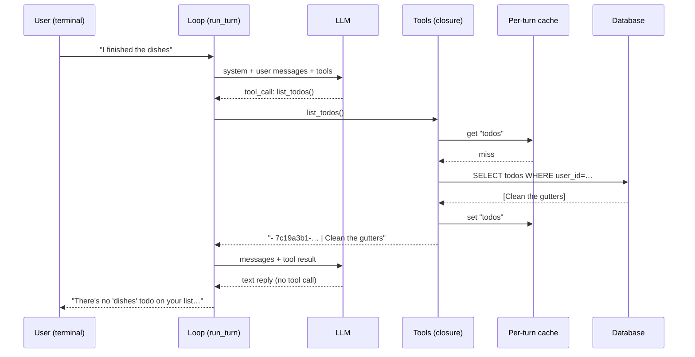

# Worked Example — A Todo Agent, End to End

[← Index](./README.md) · [Glossary](./glossary.md)

> _Companion to the main guide. Builds one complete agent — small enough to read in a sitting, real enough to fork into something useful. Cites the chapter behind each layer so you can dive deeper as you go._

## What we're building

A terminal-based todo assistant. The user sends a natural-language message ("remind me to clean the gutters next Tuesday"), the agent decides which tool to call, the database changes, and the agent streams a confirmation back to the terminal. Multiple users are supported through a `user_id` passed at startup. It's a full agent — tools, loop, state, prompt, streaming, reliability, observability, and an eval — in roughly 280 lines of Python.

This is the example the rest of the guide implies but never fully assembles in one place.

### What's in scope

| #   | Feature                                                                                                  | Chapter                                               |
| --- | -------------------------------------------------------------------------------------------------------- | ----------------------------------------------------- |
| 1   | 4 todo CRUD tools with strict schemas, validation, idempotency, clear error returns                      | [Ch 3](./03-tools.md)                                 |
| 2   | System prompt composed from named sections, with today's date injected                                   | [Ch 7](./07-prompts-as-code.md)                       |
| 3   | Three kinds of state — todos in Postgres, message history in session state, conversation state in memory | [Ch 8](./08-three-kinds-of-state.md)                  |
| 4   | Cache-friendly prompt layout (stable prefix → dynamic tail)                                              | [Ch 9](./09-context-and-cache-engineering.md)         |
| 5   | Per-turn cache so repeated `list_todos` calls hit memory, not Postgres                                   | [Ch 16](./16-shared-state.md)                         |
| 6   | Token streaming to stdout via LangGraph's `stream_mode="messages"`                                       | [Ch 17](./17-streaming.md)                            |
| 7   | Reliability — recursion limit, validation, retry on idempotent ops                                       | [Ch 19](./19-reliability.md)                          |
| 8   | User scoping at the tool layer; the model never sees auth tokens                                         | [Ch 20](./20-guardrails-prompt-injection-security.md) |
| 9   | Per-turn structured log line                                                                             | [Ch 22](./22-observability.md)                        |
| 10  | One YAML eval case + the harness from Chapter 23                                                         | [Ch 23](./23-evals-and-regression-testing.md)         |

### What's out of scope (and where to find it)

Listed at the end in [What you'd add next](#what-youd-add-next) — long-term memory, MCP packaging, multi-agent split, HITL approval gates, checkpointing. Each one is mentioned with the chapter that covers it.

---

## Setup — step by step

This section is the linear path from "I'm reading this markdown" to "I have a running agent in my terminal." Five steps. The example uses **SQLite** by default (no database to install) and **auto-creates a local user** on first run (no UUIDs to copy around), so neither needs your attention until you're ready to make them production-shaped.

**Before you start**, you need two things on your machine:

- **Python 3.11 or newer** — check with `python3 --version`. If you don't have it, install via [python.org](https://www.python.org/downloads/), `pyenv`, or your package manager.
- **An OpenAI API key** — get one at [platform.openai.com](https://platform.openai.com/api-keys). Any tier works for this example; the agent uses `gpt-4o`.

### Step 1 — Materialize the project files

The code for this example lives in five files that you could copy from the blocks below by hand, but there's a scaffolder script next to this markdown that does it for you. It reads every labeled code block in this file and writes each one to its declared path.

First, **navigate to the directory containing this `worked-example.md` and the `scaffold.py` next to it.**

```bash
cd path/to/the/guide/
```

Then run the scaffolder, telling it where you want the project to live. The argument is any path you like — relative or absolute, existing or not (it'll be created):

```bash
python scaffold.py ./todo-agent
```

You should see five lines confirming each file was written, followed by a "Next steps" block telling you what to run next. After this step you have a `todo-agent/` directory containing `db.py`, `tools.py`, `prompts.py`, `agent.py`, and `evals/cases.yaml` — anywhere you chose to put it.

The scaffolder is ~80 lines of stdlib-only Python with no third-party dependencies. If you'd rather see what it does before running it, open `scaffold.py` first — it's a normal Python file, no magic. The markdown is the single source of truth: if you edit a block here and re-run the scaffolder, the files update to match.

### Step 2 — Enter the project and create a virtual environment

`cd` into wherever you scaffolded the project in Step 1, then create and activate a Python virtual environment:

```bash
cd ~/todo-agent     # the path you passed to scaffold.py
python3 -m venv .venv
source .venv/bin/activate
```

A virtual environment isolates this project's dependencies from the rest of your system. After activating it, your shell prompt should show `(.venv)` at the start.

### Step 3 — Install the three runtime dependencies

```bash
pip install langchain-openai langgraph "sqlalchemy>=2.0"
```

These are everything the agent needs at runtime — `langchain-openai` for the OpenAI client, `langgraph` for the agent loop and streaming, `sqlalchemy` for the database layer. No other dependencies; nothing else to install.

### Step 4 — Set your OpenAI API key

```bash
export OPENAI_API_KEY=sk-...
```

(Replace `sk-...` with your real key.) The agent reads this from the environment; it never appears in the code. The export only lasts for the current shell session — if you open a new terminal you'll need to set it again, or add the line to your shell profile.

### Step 5 — Run the agent

```bash
python3 agent.py
```

The first run does three things automatically: creates `todos.db` in the current directory, creates a default local user, and starts the agent's REPL. You'll see a styled banner (`Todo Agent · local user <8 chars>`) followed by the prompt `you ›`. Type a message and press Enter; press Enter on a blank line to exit. Subsequent runs reuse the same database and user.

That's it — you have a running agent.

### Troubleshooting

- **`ModuleNotFoundError: No module named 'sqlalchemy'`** (or any other dep) even though `pip install` succeeded — your shell's `python` is resolving to a different interpreter than the venv's. Common with pyenv shims, Homebrew, or shell aliases. Run `python3 agent.py` (already what Step 5 uses) or `./.venv/bin/python agent.py` instead. `which python` and `which python3` will tell you which interpreter is which.
- **A long Pydantic v1 deprecation warning at startup** — already silenced inside `agent.py` via `warnings.filterwarnings(...)`. If you still see it, you're on a LangChain version that emits it under a different message — open `agent.py` and broaden the filter.
- **`OPENAI_API_KEY` errors** — confirm the variable is actually set in the *current* shell with `echo $OPENAI_API_KEY`. The export only persists for that terminal session; new tabs need it again.
- **The output looks colorless or shows literal `\033[...m` characters** — your terminal doesn't support ANSI colors, or you're piping stdout. The example auto-disables colors when not on a TTY. Set `NO_COLOR=1` to force them off explicitly.

### Variations

- **Copying the files by hand** instead of using the scaffolder: the code blocks below are presented in dependency order (`db.py` → `tools.py` → `prompts.py` → `agent.py` → `evals/cases.yaml`). Create each file yourself with the contents shown, then start from Step 2.
- **Using Postgres instead of SQLite**: install Postgres locally (`brew install postgresql` on macOS, or run it in Docker), create a database, and `export DATABASE_URL=postgresql://you@localhost/todos` before Step 5. The example reads `DATABASE_URL` if set and falls back to SQLite if not. No code changes required.
- **Passing an explicit user UUID** instead of using the auto-created one: `python agent.py <user-uuid>`. Useful for testing the multi-user scoping by hand.
- **Wiping and starting over**: delete `todos.db` (SQLite) or drop the database (Postgres). The schema rebuilds on next run.

If you're an intermediate Python developer, Steps 2–4 are standard project setup and you can skim them. The one thing worth reading carefully is Step 1, since the scaffolder convention (path-comment-as-first-line) is something you might want to steal for your own multi-file tutorials.

---

## Project layout

```
todo-agent/
├── db.py              # SQLAlchemy models for User, Todo
├── tools.py           # The 4 todo tools, with validation + scoping + cache
├── prompts.py         # Composed system prompt
├── agent.py           # LangGraph loop, streaming, observability, entry point
└── evals/
    ├── cases.yaml     # Golden set
    └── run.py         # Eval harness (per Chapter 23)
```

Three runtime deps: `langgraph`, `langchain-openai`, `sqlalchemy`. One database: Postgres.

---

## Layer 1 — The database (Ch 8)

Two tables: `users` and `todos`. The agent's tools are clients of this schema, never the source of truth — direct UI actions could write here too without going through the agent. This is the "structured DB as the canonical store" pattern from [Chapter 8](./08-three-kinds-of-state.md).

```python
# db.py
from datetime import date, datetime, timezone
from sqlalchemy import create_engine, ForeignKey, String, Date, DateTime, Boolean
from sqlalchemy.orm import DeclarativeBase, Mapped, mapped_column, sessionmaker
from uuid import UUID, uuid4
import os

# Postgres if DATABASE_URL is set; otherwise local SQLite for zero-setup runs.
DATABASE_URL = os.environ.get("DATABASE_URL", "sqlite:///todos.db")
engine = create_engine(DATABASE_URL, echo=False)
SessionLocal = sessionmaker(bind=engine, expire_on_commit=False)


class Base(DeclarativeBase):
    pass


class User(Base):
    __tablename__ = "users"
    id: Mapped[UUID] = mapped_column(primary_key=True, default=uuid4)
    email: Mapped[str] = mapped_column(String, unique=True)


class Todo(Base):
    __tablename__ = "todos"
    id: Mapped[UUID] = mapped_column(primary_key=True, default=uuid4)
    user_id: Mapped[UUID] = mapped_column(ForeignKey("users.id"), index=True)
    title: Mapped[str] = mapped_column(String)
    due_date: Mapped[date | None] = mapped_column(Date, nullable=True)
    completed: Mapped[bool] = mapped_column(Boolean, default=False)
    created_at: Mapped[datetime] = mapped_column(
        DateTime(timezone=True), default=lambda: datetime.now(timezone.utc)
    )


Base.metadata.create_all(engine)
```

Two design choices worth naming: the `user_id` foreign key is indexed (every query will filter by it), and the `created_at` timestamp uses UTC (always). Neither is agent-specific — they're just sane defaults that prevent the agent from being the cause of bugs that originate in the schema.

---

## Layer 2 — The tools (Ch 3, 19, 20)

Four tools: `list_todos`, `create_todo`, `complete_todo`, `update_todo`. They're built by a factory function that closes over the user's `Config` (so the model never sees the user_id or any auth context) and a per-turn `cache` dict (so repeated reads don't re-hit Postgres).

```python
# tools.py
from dataclasses import dataclass
from datetime import date
from uuid import UUID
from langchain_core.tools import tool
from sqlalchemy import select
from db import SessionLocal, Todo


@dataclass(frozen=True)
class Config:
    """Immutable per-request config. The LLM never sees this."""
    user_id: UUID


def _is_valid_uuid(value: str) -> bool:
    try:
        UUID(value)
        return True
    except (ValueError, TypeError):
        return False


def make_tools(config: Config, cache: dict):
    """Factory: tools close over config + per-turn cache. (Ch 3, 16, 20)"""

    def _invalidate():
        cache.pop("todos", None)

    @tool
    def list_todos() -> str:
        """List the current user's pending todos.

        USE WHEN: you need to find a todo's UUID before completing or updating it,
        OR when the user asks what's on their list.
        """
        if "todos" in cache:
            return cache["todos"]
        with SessionLocal() as s:
            rows = s.scalars(
                select(Todo)
                .where(Todo.user_id == config.user_id, Todo.completed == False)
                .order_by(Todo.due_date.is_(None), Todo.due_date)
            ).all()
        if not rows:
            result = "No pending todos."
        else:
            result = "\n".join(
                f"- {t.id} | {t.title}" + (f" (due {t.due_date})" if t.due_date else "")
                for t in rows
            )
        cache["todos"] = result
        return result

    @tool
    def create_todo(title: str, due_date: str | None = None) -> str:
        """Create a new todo for the user.

        Args:
            title: Short description of the task.
            due_date: ISO date (YYYY-MM-DD), or null if no specific date.
                DO NOT make up dates. If the user didn't specify, pass null.
        """
        parsed_due = None
        if due_date:
            try:
                parsed_due = date.fromisoformat(due_date)
            except ValueError:
                return f"ERROR: due_date '{due_date}' is not ISO format (YYYY-MM-DD)."
        with SessionLocal() as s:
            todo = Todo(user_id=config.user_id, title=title.strip(), due_date=parsed_due)
            s.add(todo)
            s.commit()
            s.refresh(todo)
        _invalidate()
        return f"Created todo {todo.id}: {todo.title}"

    @tool
    def complete_todo(todo_id: str) -> str:
        """Mark a todo as completed. Idempotent — calling twice is safe.

        Args:
            todo_id: Full UUID copied verbatim from list_todos. Looks like
                '550e8400-e29b-41d4-a716-446655440000'. DO NOT make up UUIDs.
        """
        if not _is_valid_uuid(todo_id):
            return (
                f"ERROR: '{todo_id}' is not a valid UUID. Call list_todos to fetch "
                f"real IDs and retry. DO NOT make up UUIDs."
            )
        with SessionLocal() as s:
            todo = s.get(Todo, UUID(todo_id))
            if not todo or todo.user_id != config.user_id:
                return f"ERROR: no pending todo with id '{todo_id}' for this user."
            if todo.completed:
                return f"Already completed: {todo.title}"  # idempotent
            todo.completed = True
            s.commit()
        _invalidate()
        return f"Completed: {todo.title}"

    @tool
    def update_todo(todo_id: str, title: str | None = None, due_date: str | None = None) -> str:
        """Update a todo's title or due date. Idempotent.

        Args:
            todo_id: Full UUID copied verbatim from list_todos.
            title: New title, or null to leave unchanged.
            due_date: New ISO date, or null to leave unchanged.
        """
        if not _is_valid_uuid(todo_id):
            return f"ERROR: '{todo_id}' is not a valid UUID. Call list_todos first."
        if title is None and due_date is None:
            return "ERROR: nothing to update — pass at least title or due_date."
        parsed_due = None
        if due_date:
            try:
                parsed_due = date.fromisoformat(due_date)
            except ValueError:
                return f"ERROR: due_date '{due_date}' is not ISO format."
        with SessionLocal() as s:
            todo = s.get(Todo, UUID(todo_id))
            if not todo or todo.user_id != config.user_id:
                return f"ERROR: no todo with id '{todo_id}' for this user."
            if title is not None:
                todo.title = title.strip()
            if due_date is not None:
                todo.due_date = parsed_due
            s.commit()
        _invalidate()
        return f"Updated todo {todo.id}."

    return [list_todos, create_todo, complete_todo, update_todo]
```

Things to notice — each is a chapter principle in code:

- **Per-tool ownership check** (`todo.user_id != config.user_id`) — the tool layer is the trust boundary, not the model. The user_id never appears in the prompt. ([Ch 20](./20-guardrails-prompt-injection-security.md))
- **UUID validation with helpful error string** — when the model hallucinates an ID, the tool tells it exactly what to do next instead of throwing. ([Ch 3](./03-tools.md), [Ch 19](./19-reliability.md))
- **Idempotency on `complete_todo` and `update_todo`** — calling twice is safe; the second call returns "already completed" instead of erroring. ([Ch 19](./19-reliability.md))
- **Per-turn cache** — `list_todos` is cached on first call, invalidated on every write. A turn that does `list → complete → list` hits Postgres twice (first list, then the post-write list), not three times. ([Ch 16](./16-shared-state.md))
- **Strict args via type hints + docstrings** — LangChain's `@tool` will derive the JSON schema from the type hints; with `strict: True` on the underlying model the args are guaranteed to match. ([Ch 3](./03-tools.md))
- **Negative examples in docstrings** — every docstring says _don't_ in addition to _do_. ([Ch 3](./03-tools.md), [Ch 28](./28-tips-and-tricks.md))

---

## Layer 3 — The prompt (Ch 7, 9)

The system prompt is built from named sections. Today's date is injected dynamically — the model has no concept of "tomorrow" otherwise. Notice the layout: the stable parts come first (role, rules, examples) so the prompt prefix is cache-friendly per [Chapter 9](./09-context-and-cache-engineering.md), and the dynamic date sits _after_ them rather than woven in.

```python
# prompts.py
from datetime import date

ROLE = """You are Todo, a precise personal task assistant. Your only job is to
help the user manage their todo list. You have four tools: list_todos,
create_todo, complete_todo, update_todo. Use them to fulfill the user's request
exactly, and reply briefly when done."""

RULES = """## Rules
- Do EXACTLY what the user asked. Do not invent tasks they didn't mention.
- If you need a todo's UUID to complete or update it, call list_todos first.
- NEVER make up UUIDs. Copy them verbatim from list_todos output.
- If the user gives a relative date ("next Tuesday"), resolve it to ISO format
  using the date in the Date Context section below.
- After successfully creating, completing, or updating a todo, reply to the
  user — do not call more tools."""

EXAMPLES = """## Examples
User: "remind me to clean the gutters next Tuesday"
Assistant: [calls create_todo(title="Clean the gutters", due_date="2026-04-14")]
Reply: "Added 'Clean the gutters' for Tuesday."

User: "I finished the dishes"
Assistant: [calls list_todos to find the dishes todo]
Assistant: [calls complete_todo(todo_id="<the real uuid>")]
Reply: "Marked the dishes done."
"""

STYLE = """## Style
Reply in one short sentence. No preamble, no apology, no follow-up questions
unless something is genuinely ambiguous."""


def build_system_prompt(today: date) -> str:
    date_section = (
        f"## Date Context\n"
        f"Today is {today.strftime('%A')}, {today.isoformat()}. "
        f"Use this to resolve relative references like 'tomorrow', 'next week'."
    )
    # STABLE prefix first (cache-friendly), then dynamic date section.
    return "\n\n".join([ROLE, RULES, EXAMPLES, STYLE, date_section])
```

The cache-prefix discipline is the reason `date_section` is appended _last_, not interpolated into `ROLE`. With `ROLE`, `RULES`, `EXAMPLES`, `STYLE` byte-identical across every call, the front of the prompt is cacheable; only the date section and the messages list change between turns.

---

## Layer 4 — The agent loop (Ch 5, 17, 19)

The standard ReAct loop, expressed as a LangGraph graph. Two nodes (agent, tools), one conditional edge, recursion limit set to 6. Streaming via `stream_mode="messages"` so tokens appear in real time.

```python
# agent.py
import asyncio
import json
import sys
import time
from datetime import date
from uuid import UUID, uuid4
from contextvars import ContextVar
from sqlalchemy import select
from langchain_openai import ChatOpenAI
from langchain_core.messages import HumanMessage, SystemMessage, AIMessage, ToolMessage
from langgraph.graph import StateGraph, START, END, MessagesState
from langgraph.prebuilt import ToolNode

from db import SessionLocal, User
from prompts import build_system_prompt
from tools import Config, make_tools

current_turn_id: ContextVar[str] = ContextVar("turn_id", default="")

# ---------------------------------------------------------------------------
# Pretty terminal output
# ---------------------------------------------------------------------------
# We label every line written to the terminal so a beginner reading the
# transcript can immediately tell *who* produced it: the SYSTEM prompt, the
# USER, the AI, a TOOL call/result, or the structured LOG line at the end of
# a turn. No colors — just clear ASCII banners that survive any terminal,
# pipe, or log file.

BANNER_WIDTH = 72


def _banner(label: str, *, opening: bool = True) -> str:
    """Return a delimiter line like ============ SYSTEM ============.

    The closing variant uses a leading slash (========/SYSTEM========) so
    grep-ing a transcript for `/SYSTEM` finds section ends unambiguously.
    """
    tag = f" {label} " if opening else f" /{label} "
    pad = max(BANNER_WIDTH - len(tag), 4)
    left = pad // 2
    right = pad - left
    return ("=" * left) + tag + ("=" * right)


def section(label: str, body: str) -> None:
    """Print a labeled block. Single-line bodies get a compact one-liner
    (``LABEL │ content``); multi-line bodies get full open/close banners.
    Best practice: don't spend 4 lines of vertical space on 1 line of text."""
    body = body.rstrip()
    if "\n" not in body and len(body) + len(label) + 3 <= BANNER_WIDTH:
        print(f"{label:<11} │ {body}")
        return
    print(_banner(label))
    print(body)
    print(_banner(label, opening=False))
    print()


def build_graph(tools):
    model = ChatOpenAI(model="gpt-4o", temperature=0).bind_tools(tools)

    def agent_node(state: MessagesState) -> dict:
        return {"messages": [model.invoke(state["messages"])]}

    def route(state: MessagesState):
        return "tools" if state["messages"][-1].tool_calls else END

    builder = StateGraph(MessagesState)
    builder.add_node("agent", agent_node)
    builder.add_node("tools", ToolNode(tools))
    builder.add_edge(START, "agent")
    builder.add_conditional_edges("agent", route, ["tools", END])
    builder.add_edge("tools", "agent")
    return builder.compile()


async def run_turn(user_id: UUID, user_message: str) -> dict:
    """Run one turn end-to-end: build the per-turn config + cache, run the
    graph, stream output to stdout, return per-turn telemetry."""
    turn_id = str(uuid4())
    current_turn_id.set(turn_id)
    t0 = time.time()
    tool_calls = 0
    error = None

    config = Config(user_id=user_id)
    cache: dict = {}
    tools = make_tools(config, cache)
    graph = build_graph(tools)

    system_prompt = build_system_prompt(date.today())
    messages = [
        SystemMessage(content=system_prompt),
        HumanMessage(content=user_message),
    ]

    # Echo the USER message. The SYSTEM prompt is static — it's printed once
    # at startup, not on every turn, to keep the transcript readable.
    section("USER", user_message)

    # We buffer streamed AI text per-message and flush it through section()
    # so single-line replies stay on one line. Token-level streaming would
    # break that compact format — for a teaching example, consistency in the
    # transcript matters more than watching tokens arrive live.
    ai_buffer: list[str] = []

    def _flush_ai() -> None:
        if ai_buffer:
            section("AI", "".join(ai_buffer))
            ai_buffer.clear()

    try:
        async for chunk, _ in graph.astream(
            {"messages": messages},
            config={"recursion_limit": 6},
            stream_mode="messages",
        ):
            if isinstance(chunk, AIMessage):
                if chunk.content:
                    ai_buffer.append(chunk.content)
                if chunk.tool_calls:
                    _flush_ai()
                    for tc in chunk.tool_calls:
                        section(
                            "TOOL CALL",
                            f"{tc['name']}({_brief(tc['args'])})",
                        )
                        tool_calls += 1
            elif isinstance(chunk, ToolMessage):
                _flush_ai()
                preview = (chunk.content or "").splitlines()[0][:200]
                section("TOOL RESULT", f"{chunk.name}: {preview}")
        _flush_ai()
    except Exception as e:
        _flush_ai()
        error = f"{type(e).__name__}: {e}"
        section("ERROR", error)

    return _log_turn(turn_id, user_id, t0, tool_calls, error)


def _brief(args: dict) -> str:
    return ", ".join(f"{k}={v!r}" for k, v in list(args.items())[:2])


def _log_turn(turn_id: str, user_id: UUID, t0: float, tool_calls: int, error: str | None) -> dict:
    record = {
        "turn_id": turn_id,
        "user_id": str(user_id),
        "duration_ms": int((time.time() - t0) * 1000),
        "tool_calls": tool_calls,
        "status": "error" if error else "ok",
        "error": error,
    }
    # Human-readable LOG block for the terminal: aligned key/value pairs are
    # easier to skim than a single-line JSON dump.
    width = max(len(k) for k in record)
    pretty = "\n".join(f"  {k.ljust(width)} : {v}" for k, v in record.items())
    section("LOG", pretty)

    # Structured JSON for log aggregators — but only when stderr is being
    # piped/redirected. If stderr is a TTY it would just duplicate the LOG
    # block above and clutter the screen.
    if not sys.stderr.isatty():
        print(json.dumps(record), file=sys.stderr)
    return record


def _get_or_create_default_user() -> UUID:
    """Beginner path: no UUID to copy. First run creates a local user;
    every subsequent run reuses it. Pass an explicit UUID on argv to
    override (useful for multi-user testing)."""
    with SessionLocal() as s:
        user = s.scalar(select(User).where(User.email == "you@example.com"))
        if user is None:
            user = User(email="you@example.com")
            s.add(user)
            s.commit()
            s.refresh(user)
        return user.id


if __name__ == "__main__":
    if len(sys.argv) > 1:
        user_id = UUID(sys.argv[1])  # python agent.py <user-uuid>
    else:
        user_id = _get_or_create_default_user()
        print(f"(local user: {user_id})")
    print("Todo agent. Type a message, blank line to exit.\n")
    # Print the SYSTEM prompt once so the reader can see it without it
    # repeating on every turn.
    section("SYSTEM", build_system_prompt(date.today()))
    while True:
        try:
            msg = input("you › ").strip()
        except (EOFError, KeyboardInterrupt):
            print()
            break
        if not msg:
            break
        asyncio.run(run_turn(user_id, msg))
```

Things worth pointing out:

- **`recursion_limit=6`** — caps the loop. A real runaway tool loop will be aborted instead of running forever or exhausting tokens. ([Ch 5](./05-execution-loop.md), [Ch 19](./19-reliability.md))
- **One graph per turn** — this is a deliberate simplification for the example. In production you'd build the graph once at startup; here the per-turn rebuild is cheap and keeps the code linear.
- **Tools and cache are scoped to the turn** — `Config` and `cache` are constructed inside `run_turn`, never global. Two concurrent users would naturally get isolated state. ([Ch 16](./16-shared-state.md))
- **Streaming uses `stream_mode="messages"`** — the `AIMessage` chunks carry text deltas; tool calls and tool results print as inline `[brackets]` and `→ arrows`. This is exactly the LangGraph streaming pattern from Chapter 17, just terminating in stdout instead of SSE. ([Ch 17](./17-streaming.md))
- **`_log_turn` writes one structured JSON line to stderr** — the canonical observability pattern from [Chapter 22](./22-observability.md). Stderr is separate from the user-facing stdout stream; pipe it to a log file in production.
- **Top-level error handling** — any exception in the graph becomes a stderr line and a non-zero return record, never a crash. Per [Chapter 19](./19-reliability.md).

---

## Layer 5 — The eval (Ch 23)

One YAML case file. The runner is the harness from [Chapter 23](./23-evals-and-regression-testing.md) — copied verbatim with no modifications, since the chapter put it in canonical form for exactly this reason.

```yaml
# evals/cases.yaml
- name: "complete via list_todos lookup, never makes up UUIDs"
  input: "I finished the dishes"
  expect:
    tool_calls_min: 2 # list_todos, then complete_todo
    tool_args_match:
      todo_id: "^[0-9a-f]{8}-[0-9a-f]{4}-[0-9a-f]{4}-[0-9a-f]{4}-[0-9a-f]{12}$"
    response_must_not_contain: ["uuid-here", "todo-id-here", "<id>"]

- name: "create todo without inventing a date when none given"
  input: "remind me to call mom"
  expect:
    tool_calls_min: 1
    tool_args_match:
      due_date: "^(null|None)?$" # must be null/absent

- name: "polite chat does not call any tools"
  input: "thanks!"
  expect:
    tool_calls_min: 0
    tool_calls_max: 0
```

Three cases, three things they protect against — the regression that the agent makes up UUIDs, the regression that the agent makes up due dates, and the regression that the agent calls tools on small talk. Every one of these has bitten a real agent at least once. The eval suite grows by one entry every time it bites again.

Run with `python evals/run.py evals/cases.yaml` (using the harness from Chapter 23). Wire it into CI so any prompt edit runs the suite before merge.

---

## One turn, end to end

Before looking at sample output, here's what actually flows through the system on a single turn — specifically the third turn from the sample run below, where the user says _"I finished the dishes"_ and the agent correctly **doesn't** invent a UUID. The diagram shows the cache and database interactions that aren't visible from reading the code linearly.



Four things to notice in the diagram that the prose doesn't make obvious:

- **Two LLM calls per turn** — one to decide on the tool, one to interpret the result and reply. Beginners often think the loop is one call; it isn't.
- **The cache miss is normal on the first call of a turn** — `cache` is constructed fresh inside `run_turn`, so the first `list_todos` of every turn always misses. The cache pays off on the _second_ read in the same turn (e.g., a `list_todos → complete_todo → list_todos` sequence).
- **`user_id` flows from `Config` into the DB query** without ever passing through the LLM. The trust boundary is the tool, not the model. ([Ch 20](./20-guardrails-prompt-injection-security.md))
- **The model decides not to act** on the tool result — it sees no matching todo and responds with a clarifying question instead of fabricating a UUID. This is exactly what the eval case for "complete via list_todos lookup" is locking in.

## A run

Each message type has its own visual treatment so the conversation stays scannable as it grows:

- **`you ›`** (cyan) — your input line
- **`· tool_name(args)`** (yellow, indented 2) — a tool call the model decided to make
- **`→ result preview`** (dim, indented 4) — what the tool returned
- **agent reply text** (green, indented 2) — what the model says back, streamed token by token
- **`· 1.7s · 1 tool · ok`** (dim, on stderr) — the per-turn summary, printed at the end of each turn

Colors are auto-disabled when stdout isn't a real terminal (e.g. piping the chat to a file, running under CI), so the same code produces clean ASCII in those contexts. Set `NO_COLOR=1` to force-disable even in a terminal.

The summary line goes to **stderr**, not stdout — so you can `python3 agent.py > chat.log` to capture only the chat content while the per-turn summaries stay visible in your terminal. If you want full structured JSON logs in addition to the human summary (for piping into log aggregation), set `LOG_JSON=1` before running.

```
$ python3 agent.py
Todo Agent · local user 550e8400
Type a message, blank line to exit. Set LOG_JSON=1 for full structured logs.

you › remind me to clean the gutters next tuesday

  · create_todo(title='Clean the gutters', due_date='2026-04-14')
    → Created todo 7c19a3b1-…: Clean the gutters

  Added "Clean the gutters" for Tuesday.
  · 1.7s · 1 tool · ok

you › what's on my list?

  · list_todos()
    → - 7c19a3b1-… | Clean the gutters (due 2026-04-14)

  You have one: clean the gutters, due Tuesday.
  · 0.9s · 1 tool · ok

you › I finished the dishes

  · list_todos()
    → No pending todos.

  There's no "dishes" todo on your list — want me to add one and immediately mark it done?
  · 1.1s · 1 tool · ok

you ›
$
```

Notice what's happening on the third turn: the agent calls `list_todos`, sees that "dishes" doesn't exist, and _doesn't_ hallucinate a UUID. The eval case for "complete via list_todos lookup" exists specifically to keep this behavior locked in across prompt and model changes.

---

## What you'd add next

The example deliberately stops here. Each of the following is a real thing you'd add when a real symptom appeared:

- **Long-term memory (Ch 10).** When the user's preferences (`I like Eisenhower-matrix prioritization`, `I always batch chores on Saturdays`) need to survive across sessions. Add a vector store, scope by `user_id`, recall at the start of relevant turns.
- **MCP packaging (Ch 4).** When the same tool surface should be reachable from Cursor, Claude Code, or another harness — turn `tools.py` into an MCP server so any client can use it.
- **HITL approval gates (Ch 18).** If you add a `delete_todo` tool, gate it on user confirmation. The current example doesn't include destructive operations precisely because gates would be premature.
- **Routing / multi-agent split (Ch 13–14).** When the agent grows beyond todos — notes, calendar, documents — and the prompt starts conflicting with itself. _Not before._
- **Checkpointing (Ch 12).** When a turn might span minutes (waiting on a webhook, a long tool, a human) instead of seconds.
- **Real guardrails layer (Ch 20).** Input/output classifiers in front of and behind the model, separate from the model itself. The current example has the _minimum_ security posture (per-tool scoping); a public-facing version would want the rest.
- **Cost engineering (Ch 21).** Once you have real traffic, profile per-turn token cost, set up prompt caching on the stable system prompt, and route trivial inputs to a cheap-tier model.
- **Long-running / background variants (Ch 12, Ch 29).** A "remind me on Tuesday morning" feature implies a scheduled wake-up, which is the durable-execution pattern from Chapter 12 plus the heartbeat shape from Chapter 29.

Each one is a single-chapter incremental change starting from this skeleton. None of them require rewriting what's already here — they layer on top.

---

## How this maps back to the guide

If you've read the guide and want to verify the example covers what it claims:

| Chapter                                                                       | Where it appears                                                                        |
| ----------------------------------------------------------------------------- | --------------------------------------------------------------------------------------- |
| [Ch 3 — Tools](./03-tools.md)                                                 | `tools.py` — strict-style schemas, validation, idempotency, negative-example docstrings |
| [Ch 5 — Execution loop](./05-execution-loop.md)                               | `agent.py` `build_graph()` — the canonical 2-node ReAct shape                           |
| [Ch 6 — State and messages](./06-state-and-messages.md)                       | `MessagesState`, the append-only message list passed to the graph                       |
| [Ch 7 — Prompts as code](./07-prompts-as-code.md)                             | `prompts.py` — composed from named constants by `build_system_prompt()`                 |
| [Ch 8 — Three kinds of state](./08-three-kinds-of-state.md)                   | Postgres = structured DB, MessagesState = conversation state, no long-term memory yet   |
| [Ch 9 — Context & cache engineering](./09-context-and-cache-engineering.md)   | Stable prefix first in `build_system_prompt()`; dynamic date last                       |
| [Ch 16 — Shared state](./16-shared-state.md)                                  | Per-turn `cache` dict closed over by tool factory, invalidated on writes                |
| [Ch 17 — Streaming](./17-streaming.md)                                        | `astream(stream_mode="messages")` in `run_turn()`                                       |
| [Ch 19 — Reliability](./19-reliability.md)                                    | Recursion limit, UUID validation, idempotent tools, error returns as strings            |
| [Ch 20 — Guardrails & security](./20-guardrails-prompt-injection-security.md) | Per-tool ownership check; `Config` never exposed to the LLM                             |
| [Ch 22 — Observability](./22-observability.md)                                | `_log_turn()` writes one structured JSON line per turn to stderr                        |
| [Ch 23 — Evals](./23-evals-and-regression-testing.md)                         | `evals/cases.yaml` + the harness from Ch 23                                             |

That's the smallest agent that genuinely earns the name. Fork it, change the domain, swap in your tools, extend it as your symptoms demand.

[← Index](./README.md) · [Glossary](./glossary.md)
